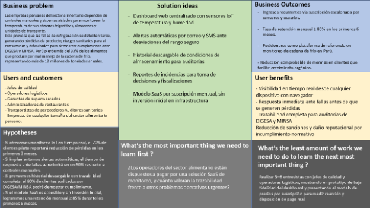

  

    

  <strong>Universidad Peruana de Ciencias Aplicadas</strong>

   

  <strong>Facultad de Ingeniería</strong>

   

  Ingeniería de Software

     

  <strong>Aplicaciones Web - 1ASI0730-2610-12190</strong>

     

  <strong>Profesor: Hugo Allan Mori Paiva</strong>

    

  "Informe de Trabajo Final"

     

  Startup:

    

  “FrostGuard”

    

  Producto:

    

  “FrostWatch”

     

  U202414054 – Jean Pool Alexander Arias Tasayco

    

  U202410093 – Mauricio Luis Pajes Leon

    

  U202321020 – Leonardo Sebastian Delgado Arriola

    

  U20 –

    

  U20 –

    

  U20 –

     

  Abril 2026-10

## Registro de Versiones del Informe

| Versión | Fecha | Autor | Descripción de modificación |
| ------- | ----- | ----- | --------------------------- |
| 0.1     | 05/04 |       |                             |

## Project Report Collaboration Insights

- **Repositorio del informe del proyecto**
- **El informe del proyecto se encuentra alojado en el siguiente repositorio de la organización de GitHub del equipo:**
- **Enlace del repositorio:** [AplicacionesWeb-Grupo-2/informe-del-proyecto](https://github.com/AplicacionesWeb-Grupo-2/informe-del-proyecto)
- **Enlace de la organización:** [AplicacionesWeb-Grupo-2](https://github.com/AplicacionesWeb-Grupo-2)
- **TB1:**
- **¿Qué problema se encontró?**
- **¿Cómo se resolverá?**

## Contenido

- [Registro de Versiones del Informe](#registro-de-versiones-del-informe)
- [Project Report Collaboration Insights](#project-report-collaboration-insights)
- [Student Outcome](#student-outcome)
- [Capítulo I: Introduction](#capítulo-i-introduction)
  - [1.1 Startup Profile](#11-startup-profile)
  - [1.2 Solution Profile](#12-solution-profile)
  - [1.3 Segmento Objetivo](#13-segmento-objetivo)
- [Capítulo II: Requirements Elicitation & Analysis](#capítulo-ii-requirements-elicitation--analysis)
  - [2.1 Competidores](#21-competidores)
  - [2.2 Entrevistas](#22-entrevistas)
  - [2.3 Needfinding](#23-needfinding)
  - [2.4 Big Picture Event Storming](#24-big-picture-event-storming)
  - [2.5 Ubiquitous Language](#25-ubiquitous-language)
- [Capítulo III: Requirements Specification](#capítulo-iii-requirements-specification)
  - [3.1 User Stories](#31-user-stories)
  - [3.2 Impact Mapping](#32-impact-mapping)
  - [3.3 Product Backlog](#33-product-backlog)
- [Capítulo IV: Product Design](#capítulo-iv-product-design)
- [Capítulo V: Product Implementation, Validation & Deployment](#capítulo-v-product-implementation-validation--deployment)
- [Conclusiones](#conclusiones)
- [Bibliografía](#bibliografía)
- [Anexos](#anexos)

## Student Outcome

| Criterio específico | Acciones realizadas | Conclusiones |
| --- | --- | --- |
| Trabaja en equipo para proporcionar liderazgo en forma conjunta | ----------AV1---------- | ----------AV1---------- |
| Crea un entorno colaborativo e inclusivo, establece metas, planifica tareas y cumple objetivos. | ----------AV1---------- | ----------AV1---------- |

## Capítulo I: Introduction

### 1.1 Startup Profile

#### 1.1.1 Descripción de la Startup

FrostGuard es una startup tecnológica que pone a disposición de la industria alimentaria FrostWatch, una plataforma web de monitoreo inteligente que garantiza la integridad de la cadena de frío en cada etapa del almacenamiento y la distribución de alimentos. A través de sensores IoT de temperatura y humedad instalados en cámaras frigoríficas, almacenes y unidades de transporte refrigerado, FrostWatch conecta todos los puntos críticos de la cadena logística en un dashboard centralizado accesible desde cualquier dispositivo con navegador. Supermercados, restaurantes, empresas de transporte de alimentos y almacenes cuentan con visibilidad en tiempo real sobre el estado de sus activos refrigerados, reciben alertas automáticas ante cualquier falla de refrigeración, acceden al historial de condiciones de almacenamiento para fines de trazabilidad y generan reportes detallados de incidencias, previniendo pérdidas económicas y respaldando el cumplimiento de las normativas sanitarias nacionales e internacionales.

**Misión**

Nuestra misión es proteger la calidad e inocuidad de los alimentos en cada etapa de su almacenamiento y distribución, ofreciendo a las empresas del sector una herramienta digital accesible, confiable y fácil de usar que les permita reaccionar a tiempo ante cualquier falla en refrigeración. Queremos empoderar a operadores logísticos, jefes de calidad y administradores de establecimientos con información en tiempo real, para que cada decisión esté respaldada por datos precisos y la cadena de frío nunca vuelva a ser un punto ciego en sus operaciones.

**Visión**

Nuestra visión es convertirnos en la plataforma de referencia en monitoreo de cadena de frío en Latinoamérica, liderando la transformación digital del sector alimentario a través de innovación tecnológica responsable y escalable. Buscamos que FrostWatch sea el estándar que adopten las empresas de la región para reducir el desperdicio alimentario, mejorar su eficiencia operativa y responder con agilidad a las exigencias sanitarias de un mercado cada vez más regulado, contribuyendo a un sistema alimentario más seguro, sostenible y confiable para todos.

#### 1.1.2 Perfiles de integrantes del equipo

| Foto de perfil | Nombre completo                    | Carrera                | Acerca de                                                                                                                                                                             | Habilidades                    |
| -------------- | ---------------------------------- | ---------------------- | ------------------------------------------------------------------------------------------------------------------------------------------------------------------------------------- | ------------------------------ |
|  | Leonardo Sebastian Delgado Arriola | Ingeniería de Software | Me interesa mucho el mundo del desarrollo de software y el trabajo en equipo entorno a ello, tengo un fuerte deseo de seguir aprendiendo gracias a la UPC y mis compañeros de equipo. | C++, HTML, CSS, JS, Vue, MySQL |
|                |                                    |                        |                                                                                                                                                                                       |                                |
|                |                                    |                        |                                                                                                                                                                                       |                                |
|                |                                    |                        |                                                                                                                                                                                       |                                |
|                |                                    |                        |                                                                                                                                                                                       |                                |

### 1.2 Solution Profile

En el Perú, las deficiencias en la cadena de frío generan pérdidas anuales de más de 12 millones de toneladas de alimentos, casi la mitad del total disponible en el país (FAO, 2021, párr. 1). Según Agraria.pe (2019), el país pierde más del 33% de los alimentos que produce por el mal uso de la refrigeración en almacenes, mercados y transporte (Agraria.pe, 2019, párr. 2). Pese a que el mercado de almacenes en frío alcanzó los US$ 510 millones en 2025 (Gestión, 2025, párr. 1), la mayoría de operadores aún depende de controles manuales sin conectividad en tiempo real.

Para atender esta situación, FrostGuard ofrece FrostWatch, una plataforma web de monitoreo inteligente que conecta sensores IoT de temperatura y humedad en cámaras frigoríficas, almacenes y unidades de transporte a un dashboard centralizado accesible desde cualquier dispositivo con navegador, ayudando a supermercados, restaurantes, empresas de transporte y almacenes a prevenir pérdidas, garantizar la inocuidad alimentaria y cumplir la normativa de DIGESA y MINSA.

Para hacer uso de la plataforma, los usuarios pueden:

- Registrar sus instalaciones y configurar los rangos seguros de temperatura y humedad para cada tipo de alimento o producto refrigerado.
- Monitorear en tiempo real el estado de sus cámaras frigoríficas, almacenes y unidades de transporte desde cualquier dispositivo con navegador.
- Recibir alertas automáticas vía correo electrónico o SMS cuando se detecte una desviación del rango seguro de temperatura o humedad.
- Consultar el historial de condiciones de almacenamiento para fines de trazabilidad y auditoría sanitaria.
- Generar reportes detallados de incidencias y pérdidas para la toma de decisiones operativas y el respaldo ante fiscalizaciones de DIGESA o MINSA.

Para su funcionamiento, FrostGuard establece alianzas con proveedores de hardware IoT e integradores logísticos, y opera bajo un modelo de suscripción mensual (SaaS) accesible para empresas de cualquier tamaño.

#### 1.2.1 Antecedentes y problemática

**Antecedentes**

Según la FAO (2021), “más de 12 millones de toneladas de alimentos se pierden a lo largo de la cadena productiva en el Perú”, casi la mitad del total disponible en el país (FAO, 2021, párr. 1). Agraria.pe (2019) precisa que “el Perú pierde más del 33% de los alimentos que produce por mal uso de la cadena de frío”, por fallas en refrigeración durante el almacenamiento y la distribución (Agraria.pe, 2019, párr. 2). Según Gestión (2025), el sector de almacenes en frío “crecerá a US$ 510 millones en 2025”, impulsado por el agroexport y el retail moderno; sin embargo, la mayoría de los operadores aún depende de registros manuales sin conectividad en tiempo real (Gestión, 2025, párr. 1-2).

Ante ello, se propone FrostWatch, una plataforma web de monitoreo inteligente de cadena de frío orientada a supermercados, restaurantes, empresas de transporte y almacenes de alimentos. A continuación, se describe la problemática mediante las preguntas derivadas de las 5W y 2H.

**Problemática**

1. **What (Qué)**
   **¿Cuál es el problema?**
   La ausencia de monitoreo continuo de temperatura y humedad en almacenes, cámaras y transporte de alimentos, lo que provoca que las fallas en refrigeración se detecten de forma tardía, generando pérdidas de producto, riesgos sanitarios y dificultades para demostrar trazabilidad ante DIGESA y MINSA.
2. **When (Cuándo)**
   **¿Cuándo sucede el problema?**
   De forma continua durante todo el año, con mayor incidencia en verano, feriados de alta demanda y rutas largas de transporte refrigerado.
   
   **¿Cuándo utilizará el cliente el producto?**
   Las 24 horas del día, los 7 días de la semana, para supervisar instalaciones en tiempo real, revisar alertas y generar reportes de trazabilidad.
3. **Where (Dónde)**
   **¿Dónde está el cliente cuando usa el producto?**
   En cualquier ubicación con acceso a internet: oficina, almacén, piso de ventas o en tránsito. FrostWatch funciona desde cualquier navegador, sin instalación adicional.
   
   **¿Dónde surge el problema?**
   En cámaras frigoríficas de supermercados, almacenes de restaurantes, centros de distribución y unidades de transporte refrigerado.
4. **Who (Quién)**
   **¿Quiénes están involucrados?**
   Jefes de calidad, operadores logísticos, administradores de supermercados y restaurantes, transportistas de productos perecederos y auditores sanitarios.
   
   **¿A quiénes les sucede el problema?**
   A las empresas del sector alimentario que sufren mermas económicas, sanciones sanitarias y daño reputacional, y en última instancia, a los consumidores expuestos a productos en mal estado.
   
   **¿Quién utilizará FrostWatch?**
   Principalmente jefes de calidad y operadores logísticos en supermercados, restaurantes y empresas de transporte; también gerentes que necesiten visibilidad remota sobre sus activos refrigerados.
5. **Why (Por qué)**
   **¿Cuál es la causa del problema?**
   Dependencia de controles manuales propensos a error, brechas en infraestructura de refrigeración y ausencia de sistemas de alerta temprana ante desviaciones de temperatura.

**Las 2H**

1. **How (Cómo)**
   **¿Cómo afecta este problema?**
   Pérdidas económicas por merma de productos perecederos, riesgos sanitarios para consumidores, sanciones de DIGESA o MINSA por incumplimiento de normas de inocuidad, y daño reputacional para las empresas.
2. **How Much (Cuánto)**
   **¿Qué datos respaldan la problemática?**
   Según la FAO (2021), “más de 12 millones de toneladas de alimentos se pierden a lo largo de la cadena productiva en el Perú”, lo que representa casi la mitad del total de alimentos disponibles en el país (FAO, 2021, párr. 1).

   De acuerdo con Agraria.pe (2019), “el Perú pierde más del 33% de los alimentos que produce por mal uso de la cadena de frío”. Esta cifra podría reducirse significativamente si los operadores contaran con sistemas de alerta temprana y monitoreo continuo (Agraria.pe, 2019, párr. 2).

#### 1.2.2 Lean UX Process

##### 1.2.2.1 Lean UX Problem Statements

En la industria alimentaria del Perú, empresas de todos los tamaños, como supermercados, restaurantes, empresas de transporte y almacenes, dependen de sistemas manuales o aislados para controlar las condiciones de refrigeración de sus productos. Esta dependencia provoca que las fallas en la cadena de frío pasen inadvertidas hasta que el daño ya es irreversible, generando pérdidas económicas por merma de producto, riesgos sanitarios para los consumidores y dificultades para demostrar cumplimiento normativo ante DIGESA y MINSA. Aunque existe conciencia sobre la importancia del control de temperatura, los operadores carecen de una plataforma digital accesible que integre monitoreo en tiempo real, alertas automáticas e historial de trazabilidad en un mismo lugar.

Ante esta situación, surge nuestra pregunta de negocio:

¿Cómo podemos brindar a las empresas del sector alimentario una herramienta digital de monitoreo en tiempo real que les permita detectar y responder de forma inmediata a cualquier falla en la cadena de frío, reduciendo pérdidas económicas y garantizando la inocuidad de sus productos?

##### 1.2.2.2 Lean UX Assumptions

**Business Assumptions**

- Existencia de demanda: Suponemos que supermercados, restaurantes y empresas logísticas están dispuestos a adoptar una solución SaaS de monitoreo si demuestra reducir pérdidas por fallas de refrigeración.
- Disposición a pagar: Suponemos que los operadores del sector alimentario valoran la trazabilidad y el cumplimiento normativo lo suficiente como para suscribirse mensualmente a una plataforma de monitoreo.
- Alianzas estratégicas: Suponemos que los proveedores de hardware IoT e integradores logísticos están interesados en aliarse con FrostGuard para ampliar su oferta de valor al cliente.

**Business Outcomes**

- Generación de ingresos sostenibles mediante suscripciones mensuales escalonadas según el número de sensores y usuarios activos por empresa.
- Posicionamiento de FrostWatch como plataforma de referencia en monitoreo de cadena de frío en el sector alimentario peruano y, a futuro, en Latinoamérica.
- Reducción comprobable de la tasa de pérdida de alimentos refrigerados en los clientes, lo que valida el valor del producto y facilita la retención y el crecimiento orgánico.

**User Benefits**

- Visibilidad en tiempo real del estado de cámaras frigoríficas, almacenes y unidades de transporte desde cualquier dispositivo con navegador, sin necesidad de estar físicamente en el lugar.
- Alertas automáticas vía correo electrónico o SMS ante desviaciones de temperatura o humedad, que permiten actuar antes de que se produzcan pérdidas de producto.
- Historial de condiciones de almacenamiento que respalda la trazabilidad y facilita el cumplimiento normativo ante auditorías de DIGESA y MINSA, reduciendo el riesgo de sanciones.

##### 1.2.2.3 Lean UX Hypothesis Statements

- Creemos que, al ofrecer monitoreo en tiempo real de temperatura y humedad mediante sensores IoT, sabremos que hemos tenido éxito cuando al menos el 70% de nuestros clientes piloto reporten una reducción en pérdidas de producto por fallas de refrigeración durante los primeros 3 meses de uso.
- Creemos que, al implementar alertas automáticas vía correo electrónico y SMS ante desviaciones del rango seguro, sabremos que hemos tenido éxito cuando el tiempo promedio de respuesta ante fallas de refrigeración se reduzca en un 60% respecto a los controles manuales previos al uso de la plataforma.
- Creemos que, al proveer un historial descargable de condiciones de almacenamiento con trazabilidad completa, sabremos que hemos tenido éxito cuando al menos el 80% de los clientes que enfrenten auditorías de DIGESA o MINSA puedan demostrar cumplimiento normativo usando los reportes generados por FrostWatch.
- Creemos que, al ofrecer un modelo de suscripción SaaS accesible y escalable sin inversión inicial en infraestructura, sabremos que hemos tenido éxito cuando logremos una tasa de retención mensual de al menos el 85% durante los primeros 6 meses de operación comercial.

##### 1.2.2.4 Lean UX Canvas

*Figure 1: Lean UX Canvas*

### 1.3 Segmento Objetivo

Pendiente de completar.

## Capítulo II: Requirements Elicitation & Analysis

### 2.1 Competidores

#### 2.1.1 Análisis Competitivo

**Competitive Analysis Landscape**

**¿Por qué llevar a cabo este análisis?**

Pendiente de completar.

| Categoría | Criterio | FrostGuard | Competidor 1 | Competidor 2 | Competidor 3 |
| --- | --- | --- | --- | --- | --- |
| Perfil | Overview |  |  |  |  |
| Perfil | Ventaja competitiva: ¿qué valor ofrece a los clientes? |  |  |  |  |
| Perfil de marketing | Mercado objetivo |  |  |  |  |
| Perfil de marketing | Estrategias de marketing |  |  |  |  |
| Perfil de producto | Productos y servicios |  |  |  |  |
| Perfil de producto | Precios y costos |  |  |  |  |
| Perfil de producto | Canales de distribución (web y/o móvil) |  |  |  |  |
| Análisis SWOT | Fortalezas |  |  |  |  |
| Análisis SWOT | Debilidades |  |  |  |  |
| Análisis SWOT | Oportunidades |  |  |  |  |
| Análisis SWOT | Amenazas |  |  |  |  |

#### 2.1.2 Estrategia y tácticas frente a competidores

Pendiente de completar.

### 2.2 Entrevistas

#### 2.2.1 Diseño de entrevistas

Pendiente de completar.

#### 2.2.2 Registro de entrevista

Pendiente de completar.

#### 2.2.3 Análisis de entrevista

Pendiente de completar.

### 2.3 Needfinding

#### 2.3.1 User Personas

Pendiente de completar.

#### 2.3.2 User Task Matrix

Pendiente de completar.

#### 2.3.3 User Journey Mapping

Pendiente de completar.

#### 2.3.4 Empathy Mapping

Pendiente de completar.

### 2.4 Big Picture Event Storming

Pendiente de completar.

### 2.5 Ubiquitous Language

Pendiente de completar.

## Capítulo III: Requirements Specification

### 3.1 User Stories

| Epic ID | Título |
| --- | --- |
| EP-01 | ComoQuiero Para |

| Story ID | Título | Descripción | Criterios de aceptación | Epic ID |
| --- | --- | --- | --- | --- |
| US-01 |  | ComoQuiero Para | Escenario 1: Dado / Cuando / Entonces | EP-01 |

### 3.2 Impact Mapping

Pendiente de completar.

### 3.3 Product Backlog

| # Orden | User Story ID | Título | Descripción | Story Point |
| --- | --- | --- | --- | --- |
| 1 | US-01 | AAA | Como Deseo para | 1/2/3/5/8 |

## Capítulo IV: Product Design

### 4.1 Style Guidelines

#### 4.1.1 General Style Guidelines

Pendiente de completar.

#### 4.1.2 Web Style Guidelines

Pendiente de completar.

### 4.2 Information Architecture

#### 4.2.1 Organization Systems

Pendiente de completar.

#### 4.2.2 Labeling Systems

Pendiente de completar.

#### 4.2.3 SEO Tags and Meta Tags

Pendiente de completar.

#### 4.2.4 Searching Systems

Pendiente de completar.

#### 4.2.5 Navigation Systems

Pendiente de completar.

### 4.3 Landing Page UI Design

#### 4.3.1 Landing Page Wireframe

Pendiente de completar.

#### 4.3.2 Landing Page Mock-up

Pendiente de completar.

### 4.4 Web Applications UX/UI Design

#### 4.4.1 Web Applications Wireframes

Pendiente de completar.

#### 4.4.2 Web Applications Wireflow Diagrams

Pendiente de completar.

#### 4.4.2 Web Applications Mock-ups

Pendiente de completar.

#### 4.4.3 Web Applications User Flow Diagrams

Pendiente de completar.

### 4.5 Web Applications Prototyping

Pendiente de completar.

### 4.6 Domain-Driven Software Architecture

#### 4.6.1 Design-Level Event Storming

Pendiente de completar.

#### 4.6.2 Software Architecture Context Diagram

Pendiente de completar.

#### 4.6.3 Software Architecture Container Diagrams

Pendiente de completar.

#### 4.6.4 Software Architecture Components Diagrams

Pendiente de completar.

### 4.7 Software Object-Oriented Design

#### 4.7.1 Class Diagrams

Pendiente de completar.

### 4.8 Database Design

#### 4.8.1 Database Diagrams

Pendiente de completar.

## Capítulo V: Product Implementation, Validation & Deployment

### 5.1 Software Configuration Management

#### 5.1.1 Software Development Environment Configuration

Pendiente de completar.

#### 5.1.2 Source Code Management

Pendiente de completar.

#### 5.1.3 Source Code Style Guide & Conventions

Pendiente de completar.

#### 5.1.4 Software Deployment Configuration

Pendiente de completar.

### 5.2 Landing Page, Services & Applications Implementation

#### 5.2.X Sprint n

Pendiente de completar.

#### 5.2.X.1 Sprint Planning n

| Campo | Valor |
| --- | --- |
| Sprint # | Sprint N |
| Sprint Planning Background |  |
| Date |  |
| Time |  |
| Location |  |
| Prepared By |  |
| Attendees (to planning meeting) |  |
| Sprint N-1 Review Summary |  |
| Sprint N-1 Retrospective Summary |  |
| Sprint N Goal |  |
| Sprint N Velocity |  |
| Sum of Story Points |  |

**Ejemplos de Sprint Goal incluidos en el Word original**

- **Example #1 Context:** The CatchUp Product Team decided to add a new feature: To offer users the option to favorite news sources, for showing news from that sources in the new options “favorites”.
- **Sprint Goal:** “Our focus is on offering a more customized experience to the current CatchUp user community. We believe it delivers rapid access to news from frequent news sources to users of the app. This will be confirmed when users access news from news sources they previously marked as favorite ones in the app, with a Session Length of 10-minute or more.”
- **Example #2 Context:** The ACME Learning Center Product Team decided to include plan information in the platform website, and allow students of the learning platform to cancel a previously requested enrollment. They also will implement a set of endpoints in order to allow frontend and mobile app developers the possibility of implementing student enrollment transaction features in their apps through the API.
- **Sprint Goal:** “Our focus is on offering more detailed information to new visitors, providing an enhanced enrollment process to students, and incrementing new feature possibilities to the development team members. We believe it delivers an easier plan selection to visitors, more flexibility on enrollment to students, and opportunities for implementing more enrollment-related features in the Learning Center ecosystem to development team. This will be confirmed when visitors can subscribe directly with and specific plan in no more than three steps, students can cancel previously requested enrollments without intervention of support staff, and developers implement new features related to enrollments using the implemented endpoints without intervention of backend development team.”

#### 5.2.X.2 Aspect Leaders and Collaborators

| Team Member | GitHub Username | Aspect Name 1 | Aspect Name 2 | Aspect Name 3 | Aspect Name n |
| --- | --- | --- | --- | --- | --- |
|  |  |  |  |  |  |

#### 5.2.X.3 Sprint Backlog n

| User Story ID | User Story Title | Task ID | Task Title | Description | Estimation | Assigned To | Status |
| --- | --- | --- | --- | --- | --- | --- | --- |
|  |  |  |  |  |  |  |  |

#### 5.2.X.4 Development Evidence for Sprint Review

| Repository | Branch | Commit Id | Commit Message | Commit Message Body | Committed on |
| --- | --- | --- | --- | --- | --- |
|  |  |  |  |  |  |

#### 5.2.X.5 Execution Evidence for Sprint Review

Pendiente de completar.

#### 5.2.X.6 Services Documentation Evidence for Sprint Review

Pendiente de completar.

#### 5.2.X.7 Software Deployment Evidence for Sprint Review

Pendiente de completar.

#### 5.2.X.8 Team Collaboration Insights during Sprint

Pendiente de completar.

### 5.3 Validation Interviews

#### 5.3.1 Diseño de Entrevistas

Pendiente de completar.

#### 5.3.2 Registro de Entrevistas

Pendiente de completar.

#### 5.3.3 Evaluaciones según heurísticas

Pendiente de completar.

### 5.4 Video About-the-Product

Pendiente de completar.

## Conclusiones

### Conclusiones y recomendaciones

Pendiente de completar.

### Video About-the-Team

Pendiente de completar.

## Bibliografía

- Agraria.pe. (2019, junio 26). *Perú pierde más del 33% de los alimentos que produce por mal uso de la cadena de frío*. Agraria. https://www.agraria.pe/noticias/peru-pierde-mas-del-33-de-los-alimentos-que-produce-por-mal--19324
- FAO. (2021). *Más de 12 millones de toneladas de alimentos se pierden a lo largo de la cadena productiva en el Perú*. Organización de las Naciones Unidas para la Alimentación y la Agricultura. https://www.fao.org/peru/noticias/detail-events/en/c/1712376/
- Gestión. (2025, septiembre 21). *Mercado de almacenes en frío en Perú crecerá a US$ 510 millones en 2025: ¿qué lo impulsa?* Gestión. https://gestion.pe/economia/empresas/mercado-de-almacenes-en-frio-en-peru-crecera-a-us-510-millones-en-2025-que-lo-impulsa-noticia/

## Anexos

Pendiente de completar.
