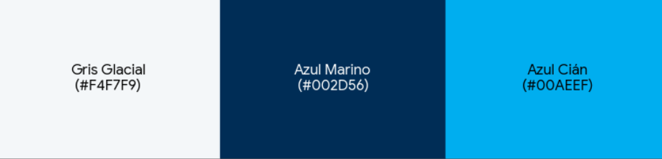

# CAPÍTULO IV. PRODUCT UX/UI DESIGN

## 4.1. Style Guidelines.

### 4.1.1. General Style Guidelines.

**Brand Overview** 

Se ha seleccionado la propuesta basada en un escudo térmico como logo definitivo. Esta elección responde a una estrategia de marca diseñada para transmitir seguridad alimentaria y protección. El isotipo fusiona un escudo (protección), la inicial "F" con trazos fluidos (logística) y ondas internas que simbolizan los datos de los sensores IoT y el flujo de aire frío.

**Typography**  
Se utiliza una tipografía Sans-Serif geométrica la elegida es Poppins en peso Bold para títulos, comunicando modernidad y eliminando ambigüedad en alertas críticas. Para el cuerpo de texto, se emplea una fuente de alta legibilidad en pantallas Inter o Roboto, optimizando la lectura de tablas de trazabilidad e informes en el dashboard.

**Colors**

La paleta evoca el entorno industrial del frío y la fiabilidad tecnológica. 

Azul Cián (Primario): Representa la tecnología, el frío y la  claridad de los datos en tiempo real. 

Azul Marino (Secundario): Aporta solidez corporativa,  autoridad y seguridad para los gerentes logísticos. 

Gris Glacial (Contraste): Utilizado en fondos de interfaz para  permitir que los datos de temperatura resalten sin generar  fatiga visual.

| **Color**    | **Código HEX** | **Significado**                                                                                                  |
| ------------ | -------------- | ---------------------------------------------------------------------------------------------------------------- |
| Gris Glacial | `[#F4F7F9]`    | Utilizado en fondos de interfaz para  permitir que los datos de temperatura resalten sin generar  fatiga visual. |
| Azul Marino  | `[#002d56]`    | Aporta solidez corporativa,  autoridad y seguridad para los gerentes logísticos.                                 |
| Azul Cián    | `[#00AEEF]`    | Representa la tecnología, el frío y la  claridad de los datos en tiempo real.                                    |

**Visual Style**  





---

### 4.1.2. Web Style Guidelines.

Se definen los estándares visuales y de interacción específicos para la plataforma web FrostWatch, asegurando una experiencia de usuario coherente en interfaces responsive. 

Responsive Design: La interfaz se adapta dinámicamente a diversos dispositivos (Desktop y Mobile Web Browser). Se garantiza que los elementos críticos, como las alertas de temperatura y el dashboard centralizado, mantengan su jerarquía visual independientemente del tamaño de la pantalla. 

UIComponents:  Siguiendo los requerimientos tecnológicos del curso, el diseño de los componentes está basado en Material Design, utilizando la biblioteca PrimeVue para asegurar una interacción estandarizada y moderna. 

Visual Consistency: Se mantiene una coherencia estética absoluta entre el Landing Page promocional y la Web Application operativa. Los botones de llamada a la acción (Call-to-Action) utilizan el azul cián primario para destacar y guiar al usuario eficientemente hacia las funcionalidades de monitoreo. 

Accessibility (a11y): La guía web integra características de accesibilidad mediante el uso correcto de atributos ARIA y contrastes de color validados, asegurando que la plataforma sea inclusiva para todos los operadores de la cadena logística.

---

## 4.2. Information Architecture.

[contenido pendiente]

---

### 4.2.1. Organization Systems.

**Tipo de organización usada:**

[pendiente]

---

**Organización de la Landing Page:**

*Encabezado (Header):*  
[pendiente]

*Sección Introductoria (Hero):*  
[pendiente]

*Beneficios:*
- [pendiente]

*Cómo Funciona:*  
[pendiente]

*Casos de uso:*  
[pendiente]

*Pie de Página (Footer):*  
[pendiente]

---

**Organización de la Aplicación Web (por rol)**

-[Rol 1]

[pendiente]

-[Rol 2]

[pendiente]

---

### 4.2.2. Labeling Systems.

[contenido pendiente]

**1. Etiquetas Textuales (Text Labels):**

- [pendiente]

**2. Etiquetas de Encabezado (Headings):**

[pendiente]

**3. Etiquetas Icónicas (Iconic Labels):**

- [pendiente]

**4. Tooltips:**

- [pendiente]

---

### 4.2.3. SEO Tags and Meta Tags

```html
<title>[pendiente]</title>

<meta name="description" content="[pendiente]">

<meta name="keywords" content="[pendiente]">

<meta name="viewport" content="width=device-width, initial-scale=1.0">

<meta name="author" content="[pendiente]">

<meta name="copyright" content="[pendiente]">
```

### 4.2.4. Searching Systems.

[contenido pendiente]

- **[Tipo de búsqueda 1]:**  
  [pendiente]

- **[Tipo de búsqueda 2]:**  
  [pendiente]

---

### 4.2.5. Navigation Systems.

[contenido pendiente]

**Flujo principal:**  
[pendiente]

---

## 4.3. Landing Page UX/UI Design

### 4.3.1. Landing Page Wireframe.

[contenido pendiente]

[imágenes de wireframes pendientes]

---

### 4.3.2. Landing Page Mock-up.

[contenido pendiente]

[imágenes de mockups pendientes]

---

## 4.4. Web Applications UX/UI Design.

### 4.4.1. Web Applications Wireframes.

Los wireframes de la aplicación web fueron diseñados para definir la estructura funcional de las principales pantallas del sistema. En esta etapa se identificaron los elementos clave de interacción, como paneles de control, visualización de datos, navegación entre secciones y componentes necesarios para la gestión del sistema. Estos wireframes permiten validar la distribución de información antes de la implementación visual, asegurando que las funcionalidades respondan a las necesidades del usuario. 

Wireframe Landing Page: En este wireframe vemos la organización de los elementos que se le presentarían al usuario inicialmente al entrar a la página. 
<p align="center">
  
</p>

Wireframe Landing Page Mobile: Organización de elementos para el landing page en entorno de móviles 
<p align="center">
  
</p>

Wireframes Pantallas: Aqui vemos la organización de secciones individuales que componen las distintas pantallas de la página web. 
<p align="center">
  
</p>
<p align="center">
  
</p>
<p align="center">
  
</p>
<p align="center">
  
</p>
<p align="center">
  
</p>
<p align="center">
  
</p>
<p align="center">
  
</p>
<p align="center">
  
</p>

---

### 4.4.2. Web Applications Wireflow Diagrams.

Los wireflow diagrams representan el flujo de interacción del usuario dentro de la aplicación, mostrando la navegación entre pantallas y las acciones que el usuario puede realizar en cada etapa. Estos diagramas permiten entender el recorrido del usuario (user flow), facilitando la identificación de puntos clave de interacción y mejorando la experiencia general del sistema. 

<p align="center">
  
</p>

---

### 4.4.3. Web Applications Mock-ups.

En esta sección se presentan los Mock-ups de alta fidelidad de la plataforma FrostWart. Estos diseños han sido elaborados en la plataforma Figma, siguiendo un sistema de diseño consistente que prioriza la legibilidad de datos críticos y la eficiencia operativa en entornos de logística y salud.


Dashboard Principal (Panel de Control): Es el nodo central de la aplicación. Utiliza un diseño de cuadrícula (Grid) que organiza la información mediante Tarjetas de KPI (indicadores clave de desempeño) que muestran el resumen de sensores activos, alertas pendientes y estados de flota. Los gráficos de líneas integrados permiten una visualización inmediata de las tendencias térmicas.


Detalle del Activo y Gráficos en Vivo: Pantalla dedicada al análisis profundo. Destaca un gráfico de área de alta precisión que muestra la fluctuación de temperatura y humedad en tiempo real. El diseño incluye paneles laterales con especificaciones técnicas del sensor y el historial de incidencias del activo seleccionado.


Gestión de Activos y Lista de Sensores: Presenta una interfaz de tabla avanzada con indicadores de estado codificados por colores (Verde: Estable / Rojo: Alerta). Permite acciones rápidas de filtrado y búsqueda, facilitando la administración de grandes volúmenes de dispositivos de telemetría.


Módulos de Gestión (Transporte y Formularios): Vistas diseñadas para la entrada de datos. Los formularios de "Registro de Unidad" y "Verificación de Calibración" siguen un flujo paso a paso para evitar la sobrecarga cognitiva, asegurando que el operador complete la documentación y firma digital sin errores.


Modulo de Alertas e Incidencias: Presenta una lista priorizada de eventos térmicos y operativos. En la parte superior se visualizan filtros por estado: Abiertas, Reconocidas, Cerradas y Todas, permitiendo al usuario segmentar rápidamente los registros. La tabla principal muestra columnas de Severidad, Incidencia, Activo, Inicio, Asignado a, Estado y Acciones, brindando una visión clara del estado de cada alerta. Los registros con estado ABIERTA se resaltan en rojo para captar la atención del usuario de forma inmediata. Adicionalmente, se incluye un botón de Exportar en la esquina superior derecha y una barra de búsqueda global en el encabezado, facilitando la gestión y trazabilidad de incidencias.


Modulo Reportes y Cumplimiento: En la parte superior se presentan cuatro tarjetas de acceso rápido: Bitácora diaria, Cumplimiento sanitario, Mensual y Paquete auditoría, cada una con su respectiva acción principal (Generar, Exportar, Descargar o Preparar paquete). A continuación, se muestra una sección de Hallazgos automáticos de cumplimiento, donde el sistema detecta y notifica inconsistencias como lecturas faltantes, calibraciones vencidas o bitácoras sin firma, con la opción de resolverlas directamente. En la parte inferior, una tabla filtrable por tipo de reporte (Bitácoras, Sanitarios, Mensuales, Auditoría, Hallazgos) lista los documentos generados con sus columnas de Reporte, Tipo, Período, Generado, Tamaño y Acciones, permitiendo al usuario visualizar o descargar cada documento. Un botón "+ Generar reporte" en la esquina superior derecha facilita la creación de nuevos reportes de forma inmediata.


Portal de Autenticación (Login / Sign Up): Interfaces simplificadas y centradas en el usuario. El diseño minimiza las distracciones para asegurar un inicio de sesión rápido. Incluye validaciones visuales en tiempo real y flujos claros para el manejo de errores o recuperación de credenciales.

---

### 4.4.4. Web Applications User Flow Diagrams.

En esta sección se presenta la narrativa detallada de los diagramas de flujo de usuario (User Flows) diseñados para la plataforma FrostWart. Estos recorridos definen la lógica de interacción, los nodos de decisión y la arquitectura de navegación, garantizando una experiencia fluida desde el acceso inicial hasta la gestión operativa de los activos térmicos.

### User Flow 1 : Login or Sing Up


1. Ciclo de Autenticación y Control de Acceso 

El flujo inicia en la Landing Page, donde el usuario ejecuta el disparador de "Iniciar Sesión". Al ingresar sus credenciales, el sistema activa un nodo de decisión crítico para la validación de identidad: 

- Validación Exitosa (Happy Path): El usuario es autenticado y redirigido inmediatamente al Dashboard Principal, permitiendo el acceso total a las herramientas de monitoreo. 
- Falla de Validación: Ante credenciales incorrectas, el sistema proporciona retroalimentación visual mediante un mensaje de error. En este punto, el usuario puede optar por el flujo de Manejo de Excepciones seleccionando "Olvidé mi contraseña". 

2. Protocolo de Recuperación de Cuenta 

El subflujo de recuperación garantiza la continuidad de la experiencia del usuario (UX) ante la pérdida de acceso. Este proceso requiere el ingreso de un correo electrónico válido, tras lo cual el sistema confirma el envío de un enlace de recuperación. Una vez completado este ciclo de seguridad, el flujo converge nuevamente en el acceso al Dashboard Principal, restaurando la operatividad del usuario. 

3. Proceso de Onboarding y Registro Empresarial 

Como parte de la arquitectura de información para nuevos usuarios o perfiles incompletos, se contempla un flujo de Completado de Datos. Este segmento guía al usuario a través de un formulario de registro y la configuración de datos de la empresa. Este paso es mandatorio para establecer la jerarquía de activos dentro de la aplicación y finaliza con la transición al Dashboard Principal, asegurando que el entorno de trabajo esté debidamente personalizado antes de iniciar el monitoreo en vivo.

### User Flow 2 : Monitores En Vivo


1. Segmento de Acceso y Supervisión General 

El flujo inicia en el Dashboard Principal, el cual funciona como el centro de control del Web Service. Desde este punto, el usuario navega hacia el módulo de Monitoreo en Vivo, donde se despliega la lista global de sensores vinculados. Este nodo permite una supervisión constante de la telemetría enviada por el hardware. 

2. Lógica de Control y Detección de Anomalías 

El núcleo del flujo presenta un nodo de decisión crítico basado en el estado del sensor: 

- Estado "Dentro de Rango": El sistema mantiene al sensor en la lista de monitoreo pasivo, permitiendo al usuario continuar con la supervisión de otros activos. 

- Estado "Fuera de Rango" (Alerta): Si el sensor detecta una desviación térmica, el usuario es dirigido a la Vista de Información Específica del Activo. Este paso es fundamental para la trazabilidad, ya que proporciona el contexto necesario antes de cualquier intervención técnica. 

3. Protocolo de Atención y Calibración 

Una vez identificado el activo en crisis, se activa el flujo de mantenimiento correctivo: 

- Inicio de Verificación: El usuario selecciona la opción "Verificar Calibración". 
- Recolección de Datos: Se procede al llenado de un formulario técnico donde se ingresan las métricas actuales. 
- Revisión de Desviación: El sistema procesa los datos y permite al usuario validar la desviación detectada. 
- Firma y Documentación: Para garantizar el cumplimiento normativo (compliance), el usuario completa el registro de firma digital y adjunta la documentación pertinente. 
- Cierre del Ciclo: El flujo concluye con una Confirmación de Calibración Verificada, notificando al sistema que el activo ha vuelto a un estado operativo seguro y retornando al usuario al monitoreo general.

### User Flow 3 : Transporte


1. Acceso y Visibilidad Logística 

El recorrido del usuario inicia en el Dashboard Principal, desde donde navega hacia el menú dedicado de Transporte. Al ingresar, el sistema despliega una vista de lista que consolida todas las unidades de transporte activas. Este nodo es un punto de control vital, ya que presenta de inmediato el Estado de Rango (telemetría térmica) de cada vehículo, permitiendo al usuario evaluar la salud de la cadena de frío de un vistazo. 

2. Bifurcación de Acciones 

Desde la lista principal de transporte, el flujo se divide en dos caminos operativos principales, dependiendo de la necesidad del usuario: 

- Camino A: Registro de Nueva Unidad (Alta de Activos): Si la flota se expande, el usuario selecciona la acción para registrar una nueva unidad. El flujo lo dirige a un formulario estructurado donde completa los datos técnicos del nuevo activo. Al guardar, el sistema procesa la información, incorpora el vehículo a la base de datos general de activos y retorna al usuario a la lista actualizada, brindando retroalimentación de éxito. 

- Camino B: Supervisión de Unidad Existente (Inspección Detallada): Si el usuario requiere auditar un vehículo específico (por ejemplo, un camión refrigerado que muestra alertas o requiere control de rutina), hace clic sobre el elemento en la lista. Esta acción lo redirige automáticamente a la vista de Detalles en Activos, donde se expone la información específica, gráficos e historial del vehículo seleccionado.

---

## 4.5. Web Applications Prototyping.

[contenido pendiente]

[imagen del prototipo pendiente]

[link al video demostrativo pendiente]

---

## 4.6. Domain-Driven Software Architecture.

### 4.6.1. Design-Level Event Storming.

[diagrama de bounded contexts pendiente]

## 1. Bounded Context: [pendiente]
### Explicación
[pendiente]

### Justificación
[pendiente]


## 2. Bounded Context: [pendiente]

### Explicación
[pendiente]

### Justificación
[pendiente]


## Problemas Identificados y Relación con Contextos

- [pendiente] → [BC pendiente]

### Justificación General
[pendiente]


### 4.6.2. Software Architecture Context Diagram.

El diagrama de contexto de ColdTrace muestra la plataforma como sistema central y presenta sus relaciones con los actores principales, los dispositivos IoT y los servicios externos necesarios para operar la solución. A partir de las user stories documentadas en el Capítulo III y de la delimitación realizada en el Design-Level Event Storming de la sección 4.6.1, se definen los siguientes bounded contexts: **Autenticación y gestión de cuenta**, **Gestión de Sensores**, **Monitoreo**, **Alertas**, **Reportes** y **Auditoría**.

Las user stories se reflejan en el diagrama de la siguiente manera:

- **Visitante:** consulta la landing page, revisa funcionalidades, planes y solicita una demo.
- **Dueño o encargado de negocio:** monitorea activos, revisa lecturas, atiende alertas e incidencias.
- **Responsable de operaciones, calidad o logística:** administra activos, sensores, gateways, rangos, mantenimiento, reportes y evidencia de cumplimiento.
- **Administrador de organización:** gestiona cuentas, perfiles, permisos y parámetros operativos.
- **Auditor sanitario o responsable externo:** recibe reportes, bitácoras y evidencia exportable para sustentar cumplimiento.
- **Sensores IoT y gateways:** envían lecturas de temperatura, humedad, conectividad y datos sincronizados después de periodos sin conexión.
- **Servicios externos de correo, push, mensajería y pagos:** permiten recuperación de contraseña, confirmaciones comerciales, alertas críticas, escalamiento de incidencias y procesamiento de suscripciones.

<p align="center">
  
</p>

<p align="center">
  <em>Figura 4.6.2. Context Diagram del sistema ColdTrace para la aplicación web.</em>
</p>

> El código fuente del diagrama en PlantUML se encuentra en `assets/chapter-04/contextdiagram/contextdiagram.puml`.

### 4.6.3. Software Architecture Container Diagrams.

El diagrama de contenedores muestra cómo ColdTrace se divide en sus principales aplicaciones, servicios y bases de datos. En esta vista se identifican la Landing Page, la Web Application, el API Gateway, el Telemetry Ingestion API, los servicios internos alineados a bounded contexts, sus repositorios de datos y los servicios externos requeridos por los flujos descritos en las user stories del Capítulo III y por las responsabilidades identificadas en el Design-Level Event Storming.

Para esta propuesta, la arquitectura mantiene los bounded contexts definidos para ColdTrace en la sección 4.6.1 y adapta los contenedores a la tecnología proyectada del curso: aplicación web con Vue.js y PrimeVue, servicios internos con ASP.NET Core y C#, y documentación de servicios mediante OpenAPI/Swagger.

Cada bounded context mantiene su propia base de datos MySQL. Cuando un contexto necesita información de otro, la obtiene mediante APIs internas o eventos de integración, evitando que dos microservicios dependan directamente de las mismas tablas. Además, la evidencia hacia auditoría se centraliza a través del contexto de Auditoría, en lugar de exponer varios servicios internos directamente al actor externo.

<p align="center">
  
</p>

<p align="center">
  <em>Figura 4.6.3. Container Diagram del sistema ColdTrace.</em>
</p>

> El código fuente del diagrama en PlantUML se encuentra en `assets/chapter-04/containerdiagram/containerdiagram.puml`.

### 4.6.4. Software Architecture Components Diagrams.

En esta sección se presenta la vista de componentes de ColdTrace por bounded context. Cada diagrama descompone el contenedor interno definido en la vista de contenedores y toma como base la separación de responsabilidades establecida en el Design-Level Event Storming. Además, muestra controladores, servicios de aplicación, servicios de dominio, repositorios, publicadores o consumidores de eventos y adaptadores externos.

Los diagramas mantienen la misma regla arquitectónica definida para la vista de contenedores: cada bounded context es dueño de su propia base de datos MySQL y las dependencias entre contextos se realizan mediante APIs internas o eventos de integración.

- **Component Diagram - Account & Access Context:** muestra los componentes encargados de registro, inicio de sesión, recuperación de contraseña, perfil, roles, permisos y estado de suscripción.

<p align="center">
  
  <br>
  <em>Figura 4.6.4.1. Component Diagram del Account & Access Context.</em>
</p>

> El código fuente en PlantUML se encuentra en `assets/chapter-04/diagramcomponents/component-account-access.puml`.

- **Component Diagram - Sensor Management Context:** muestra los componentes encargados de activos, cámaras frigoríficas, unidades de transporte, sensores, gateways físicos, calibración, rangos y mantenimiento.

<p align="center">
  
  <br>
  <em>Figura 4.6.4.2. Component Diagram del Sensor Management Context.</em>
</p>

> El código fuente en PlantUML se encuentra en `assets/chapter-04/diagramcomponents/component-sensor-management.puml`.

- **Component Diagram - Monitoring Context:** muestra los componentes que reciben telemetría, validan lecturas, almacenan series de tiempo, consultan histórico y publican eventos hacia alertas y reportes.

<p align="center">
  
  <br>
  <em>Figura 4.6.4.3. Component Diagram del Monitoring Context.</em>
</p>

> El código fuente en PlantUML se encuentra en `assets/chapter-04/diagramcomponents/component-monitoring.puml`.

- **Component Diagram - Alerts Context:** muestra los componentes encargados de incidencias térmicas, alertas críticas, reconocimiento, escalamiento, acciones correctivas y notificaciones externas.

<p align="center">
  
  <br>
  <em>Figura 4.6.4.4. Component Diagram del Alerts Context.</em>
</p>

> El código fuente en PlantUML se encuentra en `assets/chapter-04/diagramcomponents/component-alerts.puml`.

- **Component Diagram - Reports Context:** muestra los componentes responsables de bitácoras, reportes diarios o mensuales, historial consolidado, exportación de archivos y entrega de datos al contexto de Auditoría.

<p align="center">
  
  <br>
  <em>Figura 4.6.4.5. Component Diagram del Reports Context.</em>
</p>

> El código fuente en PlantUML se encuentra en `assets/chapter-04/diagramcomponents/component-reports.puml`.

- **Component Diagram - Audit Context:** muestra los componentes responsables de verificar cumplimiento, detectar faltantes, preparar evidencia y entregar paquetes exportables al auditor externo.

<p align="center">
  
  <br>
  <em>Figura 4.6.4.6. Component Diagram del Audit Context.</em>
</p>

> El código fuente en PlantUML se encuentra en `assets/chapter-04/diagramcomponents/component-audit.puml`.

---

## 4.7. Software Object-Oriented Design.

### 4.7.1. Class Diagrams.

#### Etapa 1: Diagrama de clases con enfoque DDD

En esta primera etapa se modela el dominio de ColdTrace con enfoque **DDD** y nomenclatura orientada a la futura implementación en C#. El objetivo es identificar las entidades, value objects conceptuales, clases abstractas, interfaces y tipos enumerados principales sin introducir detalles de infraestructura como repositorios, controladores, adapters o DTOs. A diferencia de la etapa 2, esta vista todavía no agrupa las clases dentro de paquetes por bounded context; solo presenta el modelo de clases y sus relaciones de dominio.

Para mantener coherencia con la arquitectura de microservicios definida en la sección 4.6, las relaciones entre bounded contexts se representan mediante identificadores tipados como `OrganizationId`, `UserId`, `AssetId`, `SensorId`, `MeasurementId`, `AlertId`, `ReportId` y `AuditCaseId`, no como composiciones directas entre agregados de contextos distintos. Estos identificadores se tratan como value objects que envuelven valores `Guid`, manteniendo una nomenclatura compatible con la implementación proyectada en C#. Por ejemplo, `Alert` conserva `assetId`, `sensorId` y `measurementId`, mientras que `AlertRule` evalúa un `MeasurementEvaluationSnapshot`. Del mismo modo, `Report` consolida `ReadingSummary`, `AlertSummary` e `IncidentSummary` en lugar de consultar directamente objetos del contexto de Monitoreo o Alertas.

Principales decisiones aplicadas en esta etapa:

- **Account & Access:** concentra `Organization`, `User`, `Role`, `Permission`, `Session`, `Subscription`, `SubscriptionPlan`, `PaymentRecord` y `NotificationPreference`.
- **Sensor Management:** modela `Asset`, `Location`, `Sensor`, `EdgeGateway`, `CalibrationRecord`, `TemperatureRange`, `HumidityRange`, `OperatingParameter`, `MaintenanceSchedule`, `ServiceTicket` y `ServiceIntervention`.
- **Monitoring:** separa las mediciones en la clase abstracta `Measurement` y las especializaciones `TemperatureReading` y `HumidityReading`; además incluye `ConnectivitySnapshot`, `RangeEvaluation` y `OfflineSyncBatch`.
- **Alerts:** modela `MeasurementEvaluationSnapshot`, `AlertRule`, `Alert`, `ThermalIncident`, `CorrectiveAction`, `Notification`, `EscalationPolicy` y la interfaz `NotificationChannel` con canales de email, push y mensajería.
- **Reports:** evita acoplarse a las bases de datos de otros contextos mediante `ReadingSummary`, `AlertSummary` e `IncidentSummary`; sobre esa información genera `Report`, `DailyLog`, `MonthlyReport`, `ComplianceReport`, `ReportExport`, `Dashboard` y `Widget`.
- **Audit:** centraliza la preparación de auditoría mediante `AuditCase`, `ComplianceCriterion`, `ComplianceFinding`, `EvidencePackage` y `EvidenceItem`.

Se corrigieron inconsistencias del modelo base y de las historias de usuario: el gateway físico del dominio se denomina `EdgeGateway` para no confundirlo con el `API Gateway` ni con el `Telemetry Ingestion API`; cualquier referencia aislada a otro nombre de producto se interpreta como ColdTrace; `Asset` conserva `internalCode` y capacidad porque las historias de registro validan duplicados y capacidad; `Sensor` puede existir sin `assetId` ni `edgeGatewayId` antes de la vinculación; el contexto de alertas trabaja con snapshots de evaluación; el contexto de reportes no depende directamente de `Measurement` ni de `ThermalIncident`, sino de snapshots propios; y auditoría recibe paquetes de evidencia preparados, no reportes directos desde múltiples servicios internos.

Para mejorar la legibilidad del diagrama, los tipos enumerados se mantienen como tipos de atributos, pero no se expanden como cajas independientes. Así se evita que estados como `AlertStatus`, `SensorStatus` o `ReportStatus` generen ruido visual y oculten las relaciones principales entre entidades, value objects, clases abstractas e interfaces.

Todas las clases quedan conectadas dentro de la vista general. Cuando la relación pertenece al mismo agregado se usa asociación o composición; cuando cruza responsabilidades entre contextos se usa una dependencia punteada rotulada con el identificador o snapshot correspondiente, por ejemplo `sensorId`, `organizationId`, `measurementId snapshot` o `copied from event`.

<p align="center">
  
  <br>
  <em>Figura 4.7.1.1. Etapa 1 - Diagrama de clases con enfoque DDD.</em>
</p>

> El código fuente en PlantUML se encuentra en `assets/chapter-04/classdiagram/classdiagram-etapa1-ddd.puml`.

#### Etapa 2: Agrupar las clases en Bounded Context

En esta segunda etapa se agrupan las clases identificadas en la etapa 1 según el bounded context que las posee. A diferencia de una vista simplificada de paquetes, este diagrama conserva atributos y métodos en cada clase, pero los organiza por ownership para mostrar fronteras, dependencias y puntos de integración entre contextos.

Agrupamiento aplicado en el diagrama:

- **Account & Access Context:** concentra `Organization`, `User`, `Session`, `Role`, `Permission`, `SubscriptionPlan`, `Subscription`, `PaymentRecord` y `NotificationPreference`.
- **Sensor Management Context:** concentra `Asset`, `Location`, `Sensor`, `EdgeGateway`, `CalibrationRecord`, `TemperatureRange`, `HumidityRange`, `OperatingParameter`, `MaintenanceSchedule`, `ServiceTicket` y `ServiceIntervention`.
- **Monitoring Context:** concentra la clase abstracta `Measurement`, sus especializaciones `TemperatureReading` y `HumidityReading`, además de `ConnectivitySnapshot`, `RangeEvaluation` y `OfflineSyncBatch`.
- **Alerts Context:** concentra `MeasurementEvaluationSnapshot`, `AlertRule`, `Alert`, `ThermalIncident`, `CorrectiveAction`, `Notification`, `EscalationPolicy` y la interfaz `NotificationChannel` con sus canales concretos.
- **Reports Context:** concentra `Report`, `DailyLog`, `MonthlyReport`, `ComplianceReport`, `ReadingSummary`, `AlertSummary`, `IncidentSummary`, `ReportExport`, `Dashboard` y `Widget`.
- **Audit Context:** concentra `AuditCase`, `ComplianceCriterion`, `ComplianceFinding`, `EvidencePackage` y `EvidenceItem`.

Las relaciones internas de cada bounded context se representan con asociaciones, agregaciones, composiciones o herencia dentro del paquete correspondiente. Las relaciones que cruzan fronteras mantienen el mismo criterio de la etapa 1: apuntan a clases concretas, no al paquete completo del bounded context, y se muestran como dependencias punteadas rotuladas con el identificador tipado, snapshot o evento de integración que sostiene esa comunicación. De este modo, el diagrama mantiene la regla definida para la arquitectura: cada contexto conserva su propio modelo y no navega directamente agregados internos de otro contexto.

<p align="center">
  
  <br>
  <em>Figura 4.7.1.2. Etapa 2 - Agrupar las clases en Bounded Context.</em>
</p>

> El código fuente en PlantUML se encuentra en `assets/chapter-04/classdiagram/classdiagram-etapa2-bc.puml`.

#### Etapa 3: Identificación de Value Object, Entity y Aggregate

En esta tercera etapa se toma el modelo de clases ya definido y se clasifica cada clase según su rol táctico dentro de DDD: **Aggregate**, **Entity** o **Value Object**. Para mantener consistencia con las etapas anteriores, no se agregan clases nuevas; solo se separa el modelo por bounded context y se marca el tipo correspondiente en cada clase.

**Account & Access Context.** Aggregates → `Organization`, `User`, `Role` y `SubscriptionPlan`, porque son raíces con identidad propia y controlan reglas principales de cuenta, acceso, permisos y planes. Entities → `Session`, `Subscription`, `PaymentRecord` y `NotificationPreference`, ya que tienen identidad y ciclo de vida dentro del contexto. Value Object → `Permission`, porque representa una combinación de `resource` y `action` sin identidad independiente.

<p align="center">
  
  <br>
  <em>Figura 4.7.1.3.1. Etapa 3 - Account & Access Context.</em>
</p>

> Código PlantUML: `assets/chapter-04/classdiagram/classdiagram-etapa3-bc-account-access.puml`.

**Sensor Management Context.** Aggregates → `Asset`, `Sensor`, `EdgeGateway` y `ServiceTicket`, porque cada uno controla un ciclo de vida relevante del dominio: activos monitoreados, sensores físicos, gateways de borde y tickets de servicio. Entities → `CalibrationRecord`, `OperatingParameter`, `MaintenanceSchedule` y `ServiceIntervention`, porque tienen identidad propia pero dependen del ciclo de vida de una raíz. Value Objects → `Location`, `TemperatureRange` y `HumidityRange`, porque describen valores reutilizables sin identidad propia.

<p align="center">
  
  <br>
  <em>Figura 4.7.1.3.2. Etapa 3 - Sensor Management Context.</em>
</p>

> Código PlantUML: `assets/chapter-04/classdiagram/classdiagram-etapa3-bc-sensor-management.puml`.

**Monitoring Context.** Aggregates → `Measurement` y `OfflineSyncBatch`. `Measurement` funciona como raíz abstracta de las lecturas recibidas y `OfflineSyncBatch` agrupa registros sincronizados desde un gateway después de operar sin conexión. Entities → `TemperatureReading`, `HumidityReading`, `ConnectivitySnapshot` y `RangeEvaluation`, porque conservan identidad o comportamiento propio dentro del proceso de monitoreo. En este bounded context no se modela una clase explícita como value object; las referencias externas se mantienen como identificadores tipados en atributos.

<p align="center">
  
  <br>
  <em>Figura 4.7.1.3.3. Etapa 3 - Monitoring Context.</em>
</p>

> Código PlantUML: `assets/chapter-04/classdiagram/classdiagram-etapa3-bc-monitoring.puml`.

**Alerts Context.** Aggregates → `AlertRule`, `Alert` y `EscalationPolicy`, porque concentran reglas de evaluación, ciclo de vida de alertas y escalamiento. Entities → `ThermalIncident`, `CorrectiveAction` y `Notification`, porque poseen identidad y dependen del ciclo de atención de una alerta o incidencia. Value Object → `MeasurementEvaluationSnapshot`, ya que copia información de una medición para evaluar reglas sin acoplarse al modelo interno de Monitoreo. `NotificationChannel`, `EmailChannel`, `PushChannel` y `MessagingChannel` se marcan como servicios de dominio o estrategias de entrega, no como aggregates.

<p align="center">
  
  <br>
  <em>Figura 4.7.1.3.4. Etapa 3 - Alerts Context.</em>
</p>

> Código PlantUML: `assets/chapter-04/classdiagram/classdiagram-etapa3-bc-alerts.puml`.

**Reports Context.** Aggregates → `Report`, `MonthlyReport`, `ComplianceReport`, `DailyLog` y `Dashboard`, porque son raíces para generación, consolidación o visualización de información. Entities → `ReportExport` y `Widget`, ya que tienen identidad y dependen de reportes o dashboards. Value Objects → `ReadingSummary`, `AlertSummary` e `IncidentSummary`, porque son snapshots de información proveniente de otros contextos y evitan depender directamente de sus agregados.

<p align="center">
  
  <br>
  <em>Figura 4.7.1.3.5. Etapa 3 - Reports Context.</em>
</p>

> Código PlantUML: `assets/chapter-04/classdiagram/classdiagram-etapa3-bc-reports.puml`.

**Audit Context.** Aggregates → `AuditCase` y `ComplianceCriterion`, porque el primero gobierna el caso de auditoría y el segundo representa una regla de cumplimiento reutilizable. Entities → `ComplianceFinding`, `EvidencePackage` y `EvidenceItem`, porque poseen identidad dentro del proceso de auditoría y trazabilidad. En este bounded context no se agrega un value object explícito; los tipos de cumplimiento y referencias externas permanecen como atributos del modelo.

<p align="center">
  
  <br>
  <em>Figura 4.7.1.3.6. Etapa 3 - Audit Context.</em>
</p>

> Código PlantUML: `assets/chapter-04/classdiagram/classdiagram-etapa3-bc-audit.puml`.

---

## 4.8. Database Design.

### 4.8.1. Database Diagrams.

El diagrama de base de datos de ColdTrace se define como una sola base de datos lógica en MySQL, alineada con los bounded contexts trabajados en los diagramas C4 y de clases: **Account & Access**, **Sensor Management**, **Monitoring**, **Alerts**, **Reports** y **Audit**. Aunque en la arquitectura de contenedores se separan responsabilidades por contexto, en este diagrama informacional todas las tablas pertenecen al mismo modelo relacional. Los colores solo ayudan a identificar a qué contexto pertenece cada entidad.

El diseño se mantiene normalizado hasta **Tercera Forma Normal (3FN)**. Para ello, el modelo no replica cada clase como una tabla de manera mecánica. Los value objects simples se almacenan como columnas dependientes de su entidad dueña cuando no requieren identidad propia, por ejemplo los rangos operativos dentro de `operating_parameters` o la ubicación dentro de `asset_locations`. Las relaciones muchos-a-muchos se separan en tablas puente, como `user_roles`, `role_permissions` y `notification_preference_channels`.

También se evitó introducir ciclos lógicos o dependencias transitivas innecesarias. Por ejemplo, `alerts` se relaciona estructuralmente con `alert_rules`; el `measurement_id` se conserva como referencia de negocio, pero no se dibuja como una segunda ruta de dependencia que forme un bucle con `sensors`, `measurements` y `alert_rules`. Del mismo modo, las tablas de resumen de reportes conservan identificadores de origen, pero dependen estructuralmente de `daily_logs` para no crear ciclos entre reportes, mediciones, alertas e incidencias. Las relaciones dibujadas forman un grafo conectado y acíclico entre tablas concretas.

<p align="center">
  
  <br>
  <em>Figura 4.8.1. Database Diagram del sistema ColdTrace.</em>
</p>

> El código fuente en PlantUML se encuentra en `assets/chapter-04/databasediagram/databasediagram.puml`.
