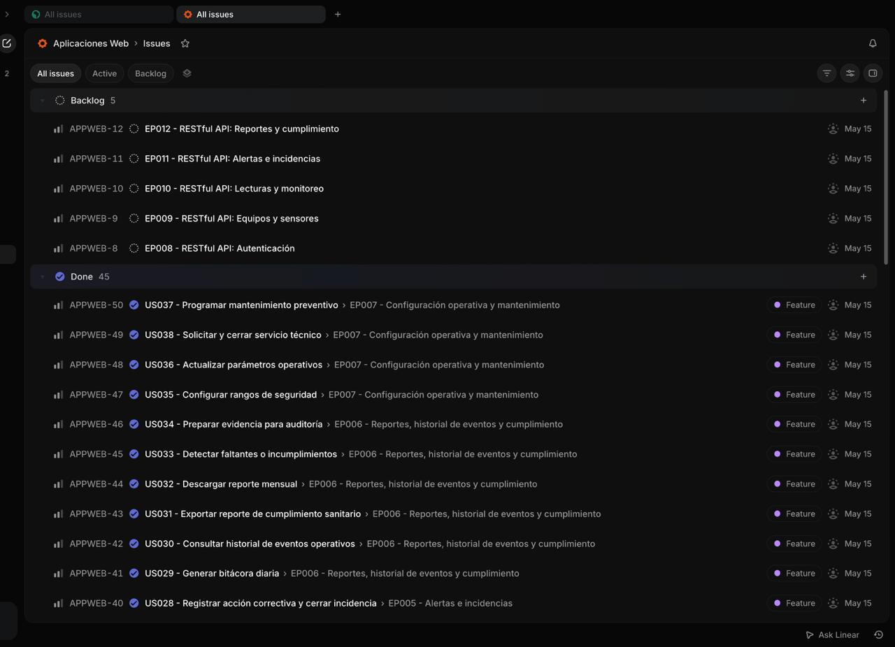
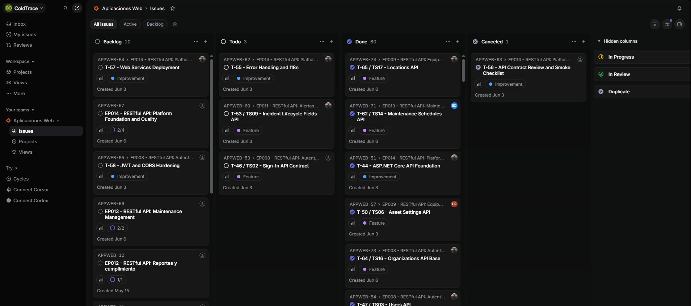
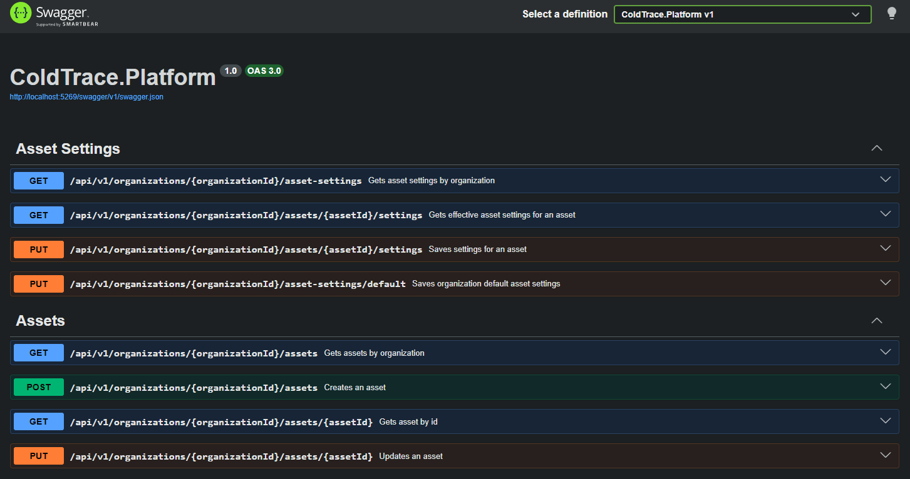
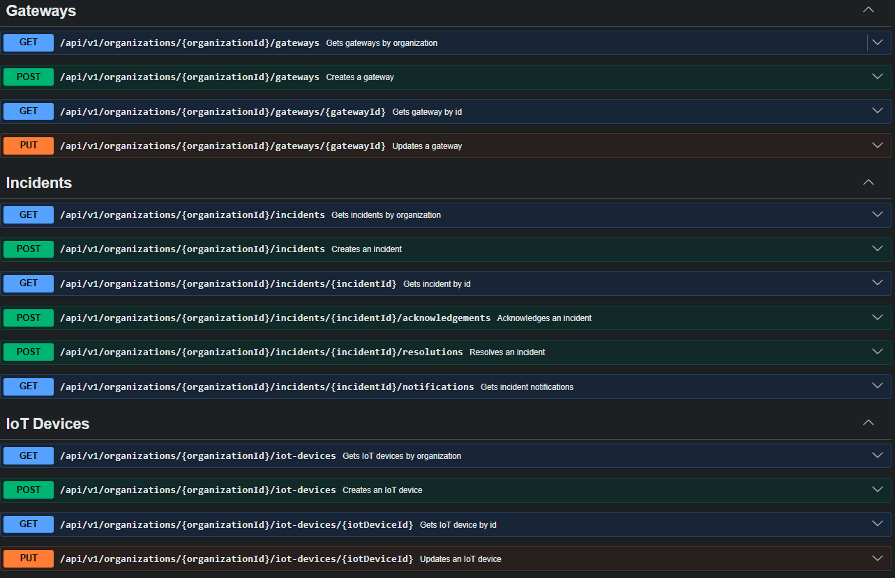
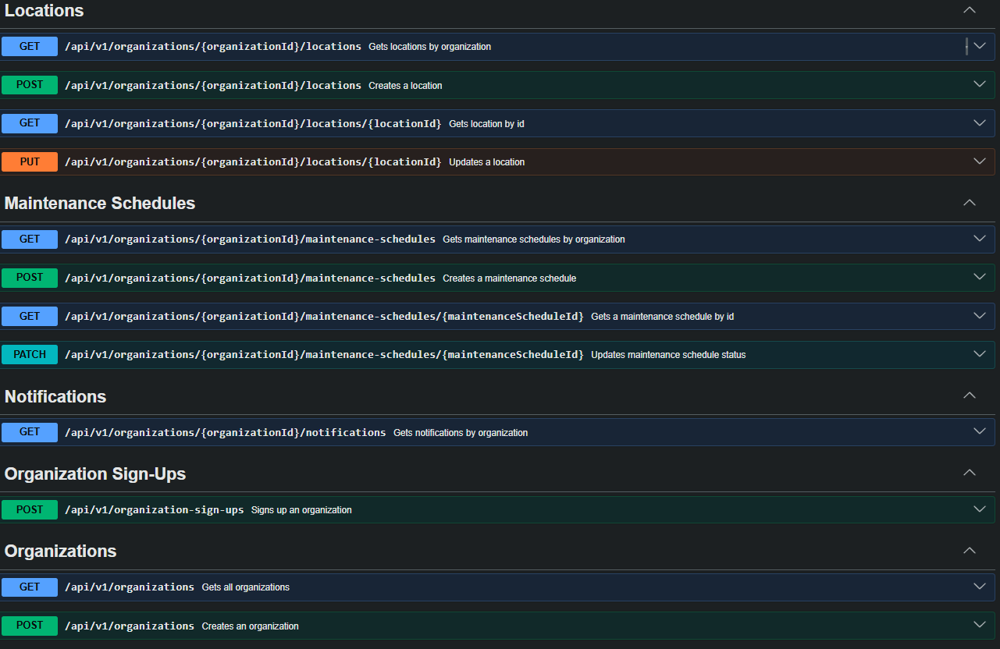
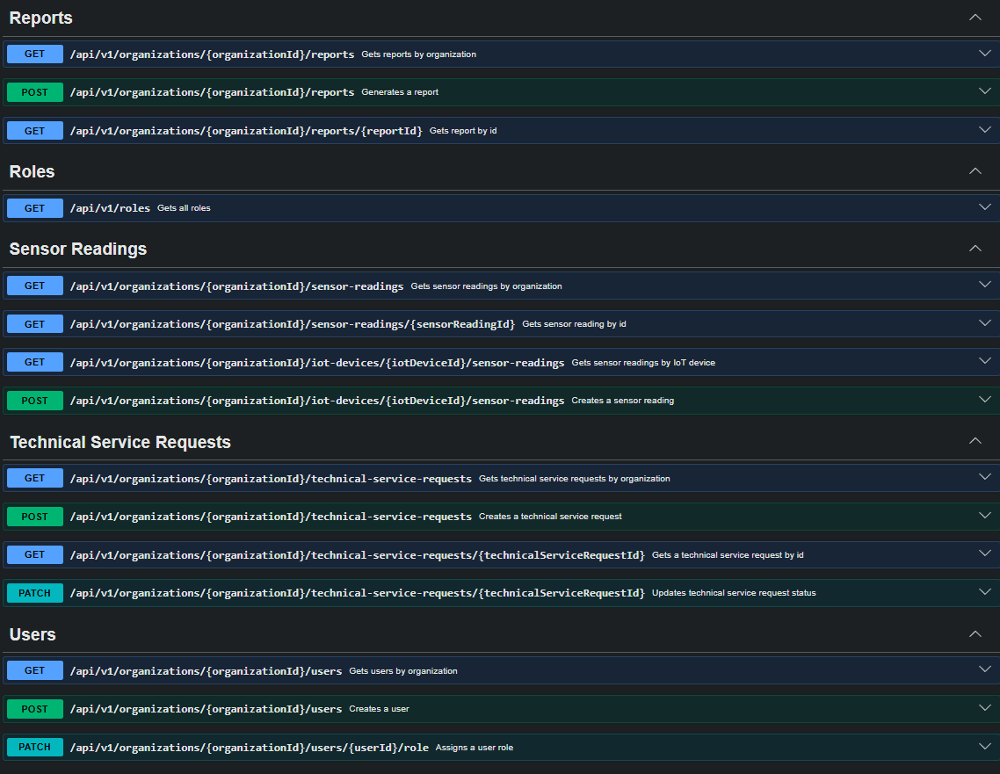
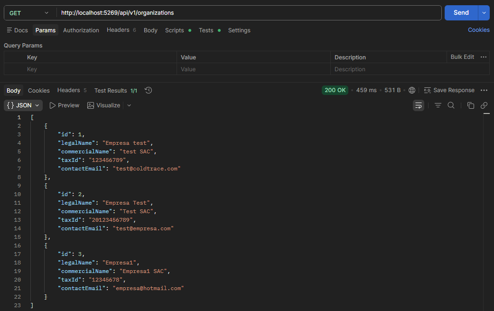
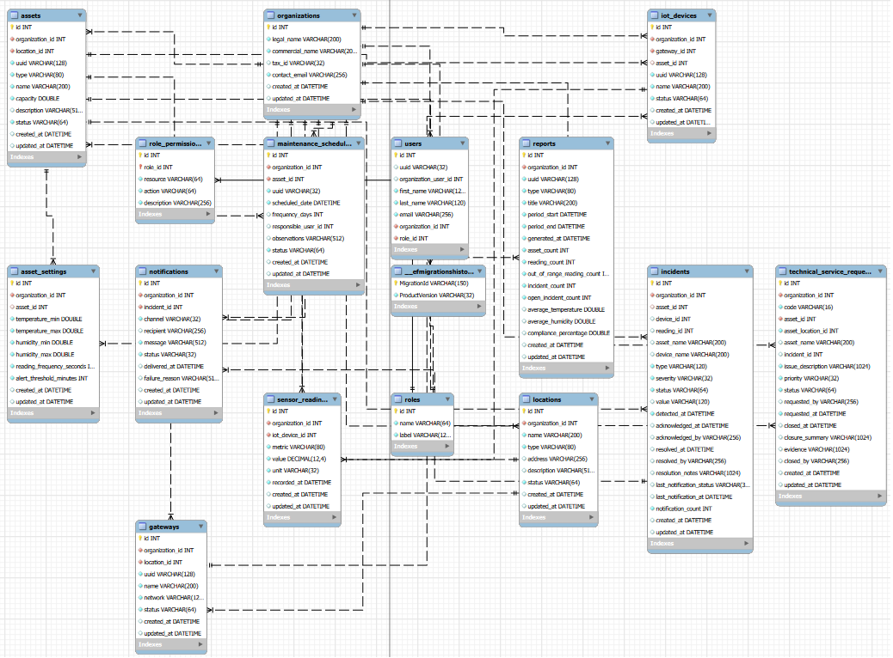
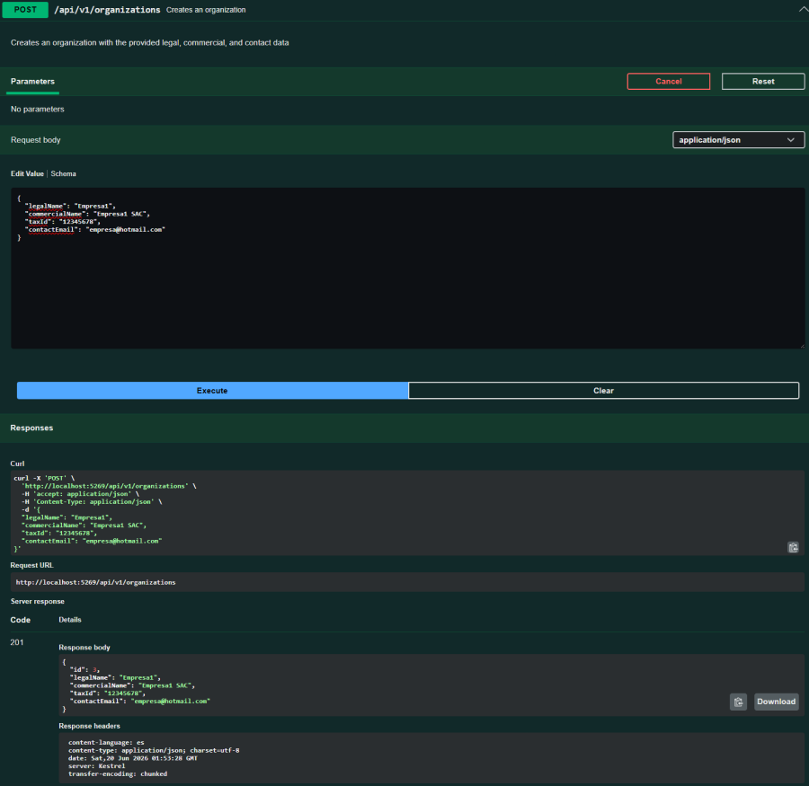
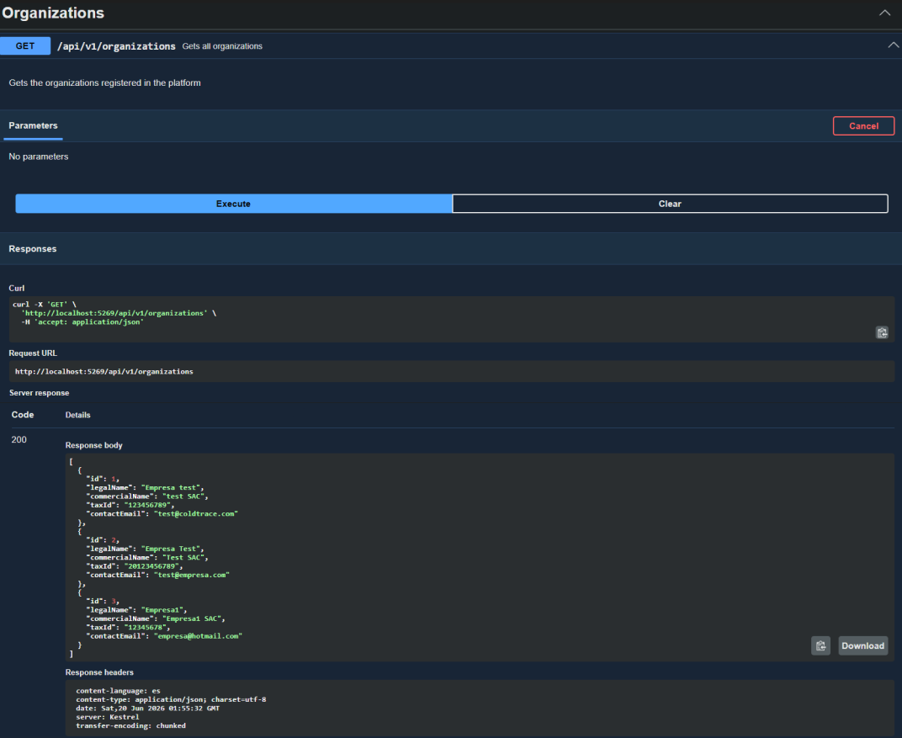

# Capítulo V: Product Implementation, Validation & Deployment

## 5.1. Software Configuration Management

### 5.1.1. Software Development Environment Configuration

Para asegurar la homogeneidad y evitar conflictos de compatibilidad entre los desarrolladores del equipo, considerando que el proyecto está construido con tecnologías web nativas, se ha estandarizado la siguiente pila tecnológica y entorno de desarrollo:

### Sistema Operativo

Windows 10/11, macOS o distribuciones Linux basadas en Debian/Ubuntu.

[Windows 10/11](https://www.microsoft.com/es-es/software-download/windows10%20)
[MacOs](https://www.apple.com/la/os/macos/)
[Ubuntu](https://ubuntu.com/download)


### Tecnologias Base

HTML5, CSS3 y JavaScript (ES6+ puro / Vanilla JS). El proyecto no depende de marcos de trabajo (_frameworks_) ni librerías externas complejas para la interfaz de usuario, priorizando el rendimiento nativo.

[HTML5](https://lenguajehtml.com/)
[JavaScript](https://lenguajejs.com/javascript/)


### Gestor de Paquetes

**npm** (Node Package Manager). Se utiliza para administrar dependencias del entorno de desarrollo (como herramientas de formateo) definidas en el archivo `package.json`.

[npm](https://www.npmjs.com/)


### Sistema de Control de Versiones

Git (versión 2.30 o superior) instalado localmente para el control de cambios distribuidos.

[Git](https://git-scm.com/)


### 5.1.2. Source Code Management

Para la gestión del código fuente, el equipo utiliza **Git** de forma local y **GitHub** como repositorio remoto.

Los repositorios usados fueron:

- Repositorio del proyecto: [https://github.com/AplicacionesWeb-Grupo-2/informe-del-proyecto.git](https://github.com/AplicacionesWeb-Grupo-2/informe-del-proyecto.git)
- Repositorio de la landing page: [https://github.com/mauricio-pajes/landing-page-test](https://www.google.com/search?q=https://github.com/mauricio-pajes/landing-page-test)

### Workflow de Control de Versiones

Se ha seleccionado el flujo de trabajo **GitFlow**, el cual permite aislar el desarrollo de nuevas funcionalidades y mantener una versión estable del software en producción.

### Convenciones de Ramas

Las ramas identificadas en el repositorio son:

- **main**: Contiene el código fuente en estado de producción. Cada integración (_merge_) en esta rama representa una versión estable.
- **develop:** Rama principal de integración donde se consolida el código nuevo antes de pasar a producción.
- **feature/**: Ramas temporales para desarrollar características específicas de forma aislada (ej. `feature/thermal-monitoring`).
- **hotfix/:** Ramas de emergencia para solucionar fallos críticos en producción.

### Conventional Commits

Se adoptó el estándar de _Conventional Commits_ para mantener un historial de cambios legible:

- **feat:** Una nueva funcionalidad para el usuario.
- **fix:** Corrección de un error en el código.
- **docs:** Cambios únicamente en la documentación.
- **chore:** Tareas de mantenimiento o cambios en herramientas de desarrollo.

### 5.1.3. Source Code Style Guide & Conventions

Para mantener un código limpio y escalable en el proyecto basado en Vanilla JS, se adoptan las siguientes guías de estilo:

#### Naming conventions

- **Archivos:** Convención `kebab-case` (ej. `scroll-reveal.js`).
- **Variables/Funciones:** Formato `camelCase` (ej. `getSensorData`).
- **Ejemplo del proyecto:** `const updateLanguage = (lang) => { ... }` en `i18n.js`.

#### CSS Style Guide

Se utiliza una arquitectura **CSS Modular**, dividiendo el diseño en archivos base (`reset.css`, `layout.css`) y específicos por componente (`hero.css`, `features.css`).

- **Variables CSS:** Centralizadas en `variables.css`.

```css
:root {
  --color-primary: #1a73e8;
  --color-secondary: #f8f9fa;
}
```

#### Internacionalización (i18n)

Los textos se gestionan externamente en formato JSON dentro de `/assets/locales/` usando códigos estándar.

- **Ejemplo (es-419.json):**

```json
{
  "HERO_TITLE": "Monitoreo Térmico Inteligente",
  "NAV_FEATURES": "Características"
}
```

### 5.1.4. Software Deployment Configuration

El despliegue (_deployment_) se realiza hacia **GitHub Pages** mediante un flujo automatizado.

### Configuración del despliegue de la Landing Page

El proceso se gestiona a través del archivo `.github/workflows/static.yml`, el cual automatiza las siguientes etapas:

1. **Carga de Artefactos:** El sistema identifica los archivos estáticos en la raíz y la carpeta `/assets`.

2. **Ejecución del Despliegue:** Utiliza la acción oficial `actions/deploy-pages` para publicar el sitio.

3. **Validación:** Se verifica la disponibilidad del sitio en la URL asignada por GitHub para confirmar la correcta carga de scripts y estilos.

## 5.2. Landing Page, Services & Applications Implementation

### 5.2.1. Sprint 1

En esta sección se presenta el Sprint Planning correspondiente al Sprint 1. Se describe la reunión inicial, los acuerdos del equipo, las responsabilidades asignadas y la evidencia generada durante la implementación de la primera versión del Landing Page de ColdTrace.

#### 5.2.1.1. Sprint Planning 1

<table border="1" cellpadding="6" cellspacing="0">
  <tr>
    <th>Sprint #</th>
    <td>Sprint 1</td>
  </tr>
  <tr>
    <th colspan="2">Sprint Planning Background</th>
  </tr>
  <tr>
    <td colspan="2">En este sprint nos reunimos para revisar el avance individual de cada integrante y el progreso del equipo en general. A partir de ello, identificamos oportunidades de mejora y definimos acciones para optimizar el trabajo.</td>
  </tr>
  <tr>
    <th>Date</th>
    <td>20/04/2026</td>
  </tr>
  <tr>
    <th>Time</th>
    <td>20:30</td>
  </tr>
  <tr>
    <th>Location</th>
    <td>Discord</td>
  </tr>
  <tr>
    <th>Prepared By</th>
    <td>Velasquez Laquihuanaco, Eduardo David</td>
  </tr>
  <tr>
    <th>Attendees (To planning meeting)</th>
    <td>Jean Pool Alexander Arias Tasayco<br>Mauricio Luis Pajes Leon<br>Leonardo Sebastian Delgado Arriola<br>Santiago Enrique Vargas Alarcon<br>Eduardo David Velasquez Laquihuanaco</td>
  </tr>
  <tr>
    <th>Sprint N-1 Review Summary</th>
    <td>Revisamos nuestros objetivos de negocio, analizamos las user stories y compartimos retroalimentación. También evaluamos los posibles riesgos que podrían surgir durante el desarrollo del producto. Finalmente, hicimos una revisión del avance individual y grupal.</td>
  </tr>
  <tr>
    <th>Sprint N-1 Retrospective Summary</th>
    <td>Como grupo debemos mejorar la comunicación entre todos los integrantes del equipo y planificar con mayor anticipación tanto las tareas individuales como grupales. También debemos evitar dejar las tareas para el último momento antes de finalizarlas.</td>
  </tr>
  <tr>
    <th colspan="2">Sprint Goal & User Stories</th>
  </tr>
  <tr>
    <th>Sprint 1 Goal</th>
    <td>Implementar una primera versión funcional del Landing Page de ColdTrace, incorporando estructura visual, secciones principales, contenido comercial y soporte responsive.</td>
  </tr>
  <tr>
    <th>Sprint 1 Velocity</th>
    <td>2</td>
  </tr>
  <tr>
    <th>Sum of Story Points</th>
    <td>5</td>
  </tr>
</table>

#### 5.2.1.2. Aspect Leaders and Collaborators

<table border="1" cellpadding="6" cellspacing="0">
  <tr>
    <th>Team Member</th>
    <th>GitHub Username</th>
    <th>Configuración del Repositorio y CI/CD<br>Leader (L) / Collaborator (C)</th>
    <th>Estructura Base del Landing Page<br>Leader (L) / Collaborator (C)</th>
    <th>Funcionalidades Interactivas<br>Leader (L) / Collaborator (C)</th>
    <th>Corrección de Contenido<br>Leader (L) / Collaborator (C)</th>
  </tr>
  <tr>
    <td>Leonardo Sebastian Delgado Arriola</td>
    <td>leodev77</td>
    <td>C</td>
    <td>C</td>
    <td>C</td>
    <td>L</td>
  </tr>
  <tr>
    <td>Jean Pool Alexander Arias Tasayco</td>
    <td>Jean-AT</td>
    <td>C</td>
    <td>C</td>
    <td>C</td>
    <td>L</td>
  </tr>
  <tr>
    <td>Mauricio Luis Pajes Leon</td>
    <td>mauricio-pajes</td>
    <td>L</td>
    <td>L</td>
    <td>L</td>
    <td>L</td>
  </tr>
  <tr>
    <td>Santiago Enrique Vargas Alarcon</td>
    <td>SanVargasAl</td>
    <td>C</td>
    <td>C</td>
    <td>C</td>
    <td>L</td>
  </tr>
  <tr>
    <td>Eduardo David Velasquez Laquihuanaco</td>
    <td>Edu-VLL</td>
    <td>C</td>
    <td>C</td>
    <td>C</td>
    <td>L</td>
  </tr>
</table>

#### 5.2.1.3. Sprint Backlog 1

En este primer sprint, el objetivo principal fue desarrollar la Landing Page de ColdTrace. Para ello, se organizaron las tareas según las historias de usuario y se asignaron responsables dentro del equipo. Además, se utilizó Trello para gestionar y ordenar el backlog.

<p align="center">
  
</p>

*Elaboración propia: https://trello.com/invite/b/69ee715ac059a9165aeb7b44/ATTIa04a3228ebb41415eaf9cc05e6420f33091876E9/sprint-backlog-1*

<table border="1" cellpadding="6" cellspacing="0" style="border-collapse: collapse; text-align: center;">
  <tr>
    <th>Sprint #</th>
    <td colspan="7">Sprint 1</td>
  </tr>
  <tr>
    <th colspan="2">User Story</th>
    <th colspan="6">Work-item / Task</th>
  </tr>
  <tr>
    <th>Id</th>
    <th>Title</th>
    <th>Id</th>
    <th>Title</th>
    <th>Description</th>
    <th>Estimation</th>
    <th>Assigned To</th>
    <th>Status</th>
  </tr>
  <tr>
    <td>US01</td>
    <td>Ver propuesta de valor en la landing page</td>
    <td>T1</td>
    <td>Maquetación de Hero Section</td>
    <td>Diseñar y estructurar el encabezado principal con el título impactante y el subtítulo de ColdTrace.</td>
    <td>3h</td>
    <td>Jean Pool Alexander Arias Tasayco</td>
    <td>Done</td>
  </tr>
  <tr>
    <td>US02</td>
    <td>Ver sección de funcionalidades</td>
    <td>T1</td>
    <td>Creación de servicios</td>
    <td>Desarrollar una cuadrícula con iconos y descripciones de las funciones clave de la plataforma.</td>
    <td>4h</td>
    <td>Mauricio Luis Pajes Leon</td>
    <td>Done</td>
  </tr>
  <tr>
    <td>US03</td>
    <td>Ver planes y precios</td>
    <td>T1</td>
    <td>Creación de sección de precios</td>
    <td>Diseñar e implementar tarjetas con los planes disponibles, sus beneficios y precios.</td>
    <td>3h</td>
    <td>Leonardo Sebastian Delgado Arriola</td>
    <td>Done</td>
  </tr>
  <tr>
    <td>US04</td>
    <td>Solicitar demo desde la landing page</td>
    <td>T1</td>
    <td>Creación de formulario de demo</td>
    <td>Implementar un formulario con campos básicos para solicitar una demo.</td>
    <td>3h</td>
    <td>Santiago Enrique Vargas Alarcon</td>
    <td>Done</td>
  </tr>
  <tr>
    <td>US05</td>
    <td>Navegar con menú fijo</td>
    <td>T1</td>
    <td>Implementación de navbar fijo</td>
    <td>Crear un menú de navegación visible durante el scroll, con enlaces a las secciones principales.</td>
    <td>2h</td>
    <td>Eduardo David Velasquez Laquihuanaco</td>
    <td>Done</td>
  </tr>
  <tr>
    <td>US06</td>
    <td>Ver landing page en dispositivo móvil</td>
    <td>T1</td>
    <td>Responsive design - estructura</td>
    <td>Adaptar el layout general de la landing page para pantallas móviles.</td>
    <td>3h</td>
    <td>Jean Pool Alexander Arias Tasayco</td>
    <td>Done</td>
  </tr>
  <tr>
    <td>US07</td>
    <td>Registrar una cuenta nueva</td>
    <td>T1</td>
    <td>Diseño de formulario de registro</td>
    <td>Crear el formulario de registro con campos de nombre, correo y contraseña.</td>
    <td>2h</td>
    <td>Leonardo Sebastian Delgado Arriola</td>
    <td>Doing</td>
  </tr>
  <tr>
    <td>US07</td>
    <td>Registrar una cuenta nueva</td>
    <td>T2</td>
    <td>Validaciones de registro</td>
    <td>Implementar validaciones de campos como formato de correo, contraseña mínima y campos vacíos.</td>
    <td>2h</td>
    <td>Santiago Enrique Vargas Alarcon</td>
    <td>Doing</td>
  </tr>
  <tr>
    <td>US08</td>
    <td>Iniciar sesión con correo y contraseña</td>
    <td>T1</td>
    <td>Diseño de formulario de login</td>
    <td>Crear el formulario de inicio de sesión con campos de correo y contraseña.</td>
    <td>2h</td>
    <td>Eduardo David Velasquez Laquihuanaco</td>
    <td>Doing</td>
  </tr>
  <tr>
    <td>US08</td>
    <td>Iniciar sesión con correo y contraseña</td>
    <td>T2</td>
    <td>Validaciones de login</td>
    <td>Validar que los campos no estén vacíos y mostrar mensajes de error según la respuesta.</td>
    <td>2h</td>
    <td>Jean Pool Alexander Arias Tasayco</td>
    <td>Doing</td>
  </tr>
  <tr>
    <td>US09</td>
    <td>Cerrar sesión</td>
    <td>T1</td>
    <td>Implementar botón de cierre de sesión</td>
    <td>Agregar un botón de logout visible en el navbar o menú de usuario.</td>
    <td>1h</td>
    <td>Leonardo Sebastian Delgado Arriola</td>
    <td>Doing</td>
  </tr>
  <tr>
    <td>US10</td>
    <td>Recuperar contraseña olvidada</td>
    <td>T1</td>
    <td>Diseño de formulario de recuperación</td>
    <td>Crear formulario donde el usuario ingresa su correo para recibir el enlace de recuperación.</td>
    <td>2h</td>
    <td>Eduardo David Velasquez Laquihuanaco</td>
    <td>Doing</td>
  </tr>
  <tr>
    <td>TS01</td>
    <td>Endpoint de registro de usuario</td>
    <td>T1</td>
    <td>Crear endpoint POST /register</td>
    <td>Implementar el endpoint que recibe los datos del usuario, valida y guarda la información.</td>
    <td>3h</td>
    <td>Por asignar</td>
    <td>To Do</td>
  </tr>
  <tr>
    <td>TS02</td>
    <td>Endpoint de inicio de sesión</td>
    <td>T1</td>
    <td>Crear endpoint POST /login</td>
    <td>Implementar el endpoint que verifica credenciales y retorna un token de autenticación.</td>
    <td>3h</td>
    <td>Por asignar</td>
    <td>To Do</td>
  </tr>
</table>

#### 5.2.1.4. Development Evidence for Sprint Review

| Repository | Branch | Commit Id | Commit Message | Commit Message Body | Committed on |
| :--- | :--- | :--- | :--- | :--- | :--- |
| AplicacionesWeb-Grupo-2/landing-page | main | 0d6f213 | Initial commit | Set up base repository structure | 2026-04-20 |
| AplicacionesWeb-Grupo-2/landing-page | main | bf8479e | chore: scaffold landing page base | Added responsive header and hero section layout | 2026-04-18 |
| AplicacionesWeb-Grupo-2/landing-page | main | 315c111 | feat: implement header and hero | Added responsive header and hero section layout | 2026-04-16 |
| AplicacionesWeb-Grupo-2/landing-page | main | 2644a85 | chore: complete locale dictionaries | Added ES/EN translation keys for all sections | 2026-04-20 |
| AplicacionesWeb-Grupo-2/landing-page | develop | ccac898 | fix: remove header hero placeholders | Removed temporary placeholder text and images | 2026-04-18 |
| AplicacionesWeb-Grupo-2/landing-page | main | bd3bc78 | Merge pull request #1 from AplicacionesWeb-Grupo-2/feature/header-hero | Merged header and hero section into main | 2026-04-19 |
| AplicacionesWeb-Grupo-2/landing-page | main | 8fee259 | feat: Add content on Landing Page | Added descriptive content across main sections | 2026-04-20 |
| AplicacionesWeb-Grupo-2/landing-page | main | b56f977 | Merge pull request #2 from AplicacionesWeb-Grupo-2/feature/app-features | Merged app features section into main | 2026-04-21 |
| AplicacionesWeb-Grupo-2/landing-page | main | 9d96977 | feat: Add index | Added main index.html entry point | 2026-04-24 |
| AplicacionesWeb-Grupo-2/landing-page | develop | 2518549 | Merge pull request #3 from AplicacionesWeb-Grupo-2/feature/app-features | Merged updated app features into develop | 2026-04-21 |
| AplicacionesWeb-Grupo-2/landing-page | main | 6745743 | feat: adding show-case and why sections | Added showcase cards and why-choose-us section | 2026-04-22 |
| AplicacionesWeb-Grupo-2/landing-page | main | 2299290 | Merge pull request #4 from AplicacionesWeb-Grupo-2/feature/showcase-why | Merged showcase and why sections into main | 2026-04-21 |
| AplicacionesWeb-Grupo-2/landing-page | main | 6745743 | feat: adding overview and signup sections | Added product overview and signup call-to-action | 2026-04-16 |
| AplicacionesWeb-Grupo-2/landing-page | main | 7bf4a06 | Merge pull request #5 from AplicacionesWeb-Grupo-2/feature/overview-signup | Merged overview and signup sections into main | 2026-04-18 |
| AplicacionesWeb-Grupo-2/landing-page | main | 64c9674 | feature: Add the footer style | Added footer layout and responsive styles | 2026-04-22 |
| AplicacionesWeb-Grupo-2/landing-page | main | af5932c | feature: Add the header & navigation.js | Added sticky header and navigation scroll logic | 2026-04-24 |
| AplicacionesWeb-Grupo-2/landing-page | main | eabf713 | Merge pull request #7 from AplicacionesWeb-Grupo-2/feature/footer | Merged footer styles into main | 2026-04-19 |
| AplicacionesWeb-Grupo-2/landing-page | main | 4383c34 | Merge pull request #8 from AplicacionesWeb-Grupo-2/feature/header | Merged header and navigation into main | 2026-04-20 |
| AplicacionesWeb-Grupo-2/landing-page | develop | 21553ae | adding pricing icon image | Added icon asset for pricing section | 2026-04-21 |
| AplicacionesWeb-Grupo-2/landing-page | main | 054db08 | Add GitHub Actions workflow for GitHub Pages deployment | Configured CI/CD pipeline for automated deployment | 2026-04-22 |

#### 5.2.1.5. Execution Evidence for Sprint Review

Al término del Sprint 1, el equipo logró implementar y desplegar satisfactoriamente la primera versión del Landing Page de ColdTrace. La página se encuentra disponible públicamente a través de GitHub Pages con dominio personalizado configurado mediante el archivo `CNAME`.

El Landing Page incluye las siguientes secciones:

- **Hero / Home:** sección principal de bienvenida que presenta el valor central de la plataforma: centralizar toda la infraestructura de almacenamiento en frío bajo un solo dashboard inteligente.
- **Features:** sección que describe las funcionalidades principales de ColdTrace: monitoreo en tiempo real, historial descargable, notificaciones automáticas y reportes listos para inspecciones.
- **Platform / Showcase:** sección visual que muestra capacidades del producto mediante vistas de monitoreo, alertas, historial e incidencias.
- **Reviews / Why ColdTrace:** sección de testimonios de usuarios representativos del segmento objetivo.
- **How ColdTrace works:** sección que explica el flujo de uso en tres pasos: configurar, monitorear y auditar.
- **Contact / Sign Up:** sección final con formulario de creación de cuenta.
- **Footer:** pie de página con el logo de ColdTrace y enlaces organizados por producto, soporte y recursos.

<p align="center">
  
</p>

#### 5.2.1.6. Services Documentation Evidence for Sprint Review

Durante el Sprint 1, el alcance de implementación se limitó exclusivamente al Landing Page estático. No se desarrollaron ni desplegaron Web Services o RESTful API en esta iteración, por lo que no aplica documentación de endpoints para este sprint. La documentación de servicios web se incorporará en un sprint posterior, conforme a lo planificado en el Product Backlog.

#### 5.2.1.7. Software Deployment Evidence for Sprint Review

Durante el Sprint 1, el equipo configuró y ejecutó el proceso de despliegue del Landing Page mediante GitHub Pages y un pipeline de integración continua con GitHub Actions.

El proceso de despliegue considera:

- Configuración del workflow en `.github/workflows/static.yml`.
- Publicación automática de la versión estable del Landing Page.
- Verificación de carga de estilos, scripts, imágenes y secciones principales.
- Validación del sitio desplegado desde el navegador.

#### 5.2.1.8. Team Collaboration Insights during Sprint

Durante el Sprint 1, todos los miembros del equipo participaron activamente en la implementación del Landing Page. El trabajo se distribuyó de manera colaborativa entre configuración del repositorio, estructura base, secciones visuales, funcionalidades interactivas y corrección de contenido.

La evidencia de colaboración se refleja en los commits registrados en el repositorio `landing-page`, así como en la distribución de responsabilidades documentada en las secciones de Aspect Leaders and Collaborators y Development Evidence.

### 5.2.2 Sprint 2

#### 5.2.2.1. Sprint Planning 2

El Sprint 2 tuvo como objetivo principal desplegar la primera versión funcional de la Frontend Web Application de ColdTrace, cubriendo los bounded contexts de Identity & Access Management, Asset Management, Monitoring y Reports. A continuación se presenta el resumen del Sprint Planning Meeting realizado al inicio de este sprint.

<table border="1" cellpadding="6" cellspacing="0">
  <tr>
    <th>Sprint #</th>
    <td>Sprint 2</td>
  </tr>
  <tr>
    <th colspan="2">Sprint Planning Background</th>
  </tr>
  <tr>
    <th>Date</th>
    <td>2026-05-07</td>
  </tr>
  <tr>
    <th>Time</th>
    <td>08:00 PM</td>
  </tr>
  <tr>
    <th>Location</th>
    <td>Reunión virtual vía Discord</td>
  </tr>
  <tr>
    <th>Prepared By</th>
    <td>Pajés León, Mauricio Luis</td>
  </tr>
  <tr>
    <th>Attendees (to planning meeting)</th>
    <td>Delgado Arriola, Leonardo Sebastian / Arias Tasayco, Jean Pool Alexander / Santiago Enrique Vargas Alarcon / Eduardo David Velasquez Laquihuanaco / Pajés León, Mauricio Luis</td>
  </tr>
  <tr>
    <th>Sprint 1 Review Summary</th>
    <td>En el Sprint 1 se completó una primera versión funcional de la landing page de ColdTrace desplegada en GitHub Pages, con secciones de hero, features, showcase, pricing y footer. Se implementaron además las vistas básicas de dashboard, monitoreo y alertas como prueba de concepto del sistema. El equipo logró cumplir con el Sprint Goal y asegurar la coherencia visual entre la landing y la aplicación web. El despliegue fue exitoso y la landing page quedó accesible públicamente.</td>
  </tr>
  <tr>
    <th>Sprint 1 Retrospective Summary</th>
    <td>El equipo identificó que la distribución de tareas en el Sprint 1 fue desigual y que la comunicación entre integrantes podría mejorar. Como acción de mejora para el Sprint 2 se acordó dividir el trabajo por épicas y bounded contexts, asignar un responsable por aspecto funcional, e incorporar a todos los integrantes en la implementación del frontend distribuida según las épicas del product backlog.</td>
  </tr>
  <tr>
    <th colspan="2">Sprint Goal & User Stories</th>
  </tr>
  <tr>
    <th>Sprint 2 Goal</th>
    <td>Nuestro objetivo es ofrecer una aplicación web frontend completamente navegable y desplegada para los operadores y administradores de ColdTrace. Creemos que proporcionara una experiencia digital útil para los gerentes de operaciones de la cadena de frío y el personal de control de calidad, permitiéndoles gestionar activos, monitorear las condiciones de temperatura y consultar informes operativos. Esto se confirmará cuando la aplicación sea accesible a través de su URL pública de Vercel y los usuarios puedan navegar sin problemas por los módulos de Autenticacion y Acceso, Gestión de sensores, Monitoreo y reportes.</td>
  </tr>
  <tr>
    <th>Sprint 2 Velocity</th>
    <td>40 Story Points</td>
  </tr>
  <tr>
    <th>Sum of Story Points</th>
    <td>40 Story Points</td>
  </tr>
</table>

#### 5.2.2.2. Aspect Leaders and Collaborators

Durante el Sprint 2, el equipo organizó el trabajo en torno a los principales aspectos funcionales de la Frontend Web Application de ColdTrace. Cada aspecto corresponde a una épica del product backlog o a un conjunto de features dentro de un bounded context. Se designó un líder (L) por aspecto para asegurar la coherencia técnica y la toma de decisiones dentro de cada módulo, y se asignaron colaboradores (C) entre los demás integrantes del equipo.

Los aspectos principales del Sprint 2 fueron los siguientes:

- **Gestion de usuarios y acceso (EP002):** Vistas de creación de cuenta, inicio de sesión, recuperación de contraseña y gestión de roles y permisos.
- **Gestion de equipos y sensores (EP003):** Registro de cámaras frigoríficas, unidades de transporte, vinculación de sensores, emparejamiento de gateways, calibración y configuración avanzada de activos.
- **Monitoreo de temperatura y humedad (EP004):** Dashboard operacional con telemetría en tiempo real, KPIs y estado de activos monitoreados (US039).
- **Alertas e incidencias (EP005):** Estructura de navegación y vistas base para el módulo de alertas e incidencias.
- **Reportes, historial de eventos y cumplimiento (EP006):** Vistas de bitácora diaria, historial de eventos operacionales, exportación de reportes sanitarios, descarga mensual, hallazgos de cumplimiento y evidencia de auditoría (US029–US034).
- **Configuracion operativa y mantenimiento (EP007):** Configuración de rangos de seguridad, parámetros operativos del monitoreo y flujos de mantenimiento preventivo (US035–US038).
- **Deployment & Infrastructure:** Configuración del pipeline CI/CD en Vercel, servidor JSON hospedado y configuración del entorno de producción.

<table border="1" cellpadding="6" cellspacing="0">
  <tr>
    <th>Team Member (Last Name, First Name)</th>
    <th>GitHub Username</th>
    <th>Authentication &amp; User Access (EP002)</th>
    <th>Asset Registration &amp; Configuration (EP003)</th>
    <th>Operational Monitoring Dashboard (EP004)</th>
    <th>Alerts &amp; Incidents UI (EP005)</th>
    <th>Reports &amp; Compliance (EP006)</th>
    <th>Operative Configuration (EP007)</th>
    <th>Deployment &amp; Infrastructure</th>
  </tr>
  <tr>
    <td>Delgado Arriola, Leonardo Sebastian</td>
    <td>leodev77</td>
    <td>C</td>
    <td>C</td>
    <td>C</td>
    <td>C</td>
    <td>L</td>
    <td>C</td>
    <td>C</td>
  </tr>
  <tr>
    <td>Arias Tasayco, Jean Pool Alexander</td>
    <td>Jean-AT</td>
    <td>C</td>
    <td>C</td>
    <td>C</td>
    <td>C</td>
    <td>C</td>
    <td>L</td>
    <td>C</td>
  </tr>
  <tr>
    <td>Vargas Alarcon, Santiago Enrique</td>
    <td>SanVargasAI</td>
    <td>C</td>
    <td>C</td>
    <td>L</td>
    <td>C</td>
    <td>C</td>
    <td>C</td>
    <td>C</td>
  </tr>
  <tr>
    <td>Pajés León, Mauricio Luis</td>
    <td>mauricio-pajes</td>
    <td>L</td>
    <td>L</td>
    <td>C</td>
    <td>C</td>
    <td>C</td>
    <td>C</td>
    <td>L</td>
  </tr>
  <tr>
    <td>Velasquez Laquihuanaco, Eduardo David</td>
    <td>Edu-VLL</td>
    <td>C</td>
    <td>C</td>
    <td>C</td>
    <td>L</td>
    <td>C</td>
    <td>C</td>
    <td>C</td>
  </tr>
</table>

#### 5.2.2.3. Sprint Backlog 2

El objetivo principal del Sprint 2 fue implementar y desplegar la primera versión completa de la Frontend Web Application de ColdTrace, habilitando los flujos de autenticación, gestión de activos, monitoreo operacional y consulta de reportes de cumplimiento. El equipo gestiono mediante el Sprint Backlog medinate Linear App, organizando las tareas por epica y bounded context.

A continuacion se presenta una captura del backlog gestionado en Linear App:


*Figura 5.2.2.3.1: Sprint Backlog del Sprint 2 en Linear App*


A continuacion se presenta la tabla del sprint.

<table border="1" cellpadding="6" cellspacing="0" style="border-collapse: collapse; text-align: center;">
  <tr>
    <th>Sprint #</th>
    <td colspan="7">Sprint 2</td>
  </tr>
  <tr>
    <th colspan="2">User Story</th>
    <th colspan="6">Work-Item / Task</th>
  </tr>
  <tr>
    <th>Id</th>
    <th>Title</th>
    <th>Id</th>
    <th>Title</th>
    <th>Description</th>
    <th>Estimation (Hours)</th>
    <th>Assigned To</th>
    <th>Status</th>
  </tr>

  <!-- EP002 - IDENTITY & ACCESS -->
  <tr>
    <td>US007</td>
    <td>Crear cuenta</td>
    <td>T-10</td>
    <td>Create Account UI</td>
    <td>Implementar formulario de creación de cuenta de usuario</td>
    <td>4</td>
    <td>Mauricio Luis Pajes Leon</td>
    <td>Done</td>
  </tr>
  <tr>
    <td>US008</td>
    <td>Iniciar sesión</td>
    <td>T-11</td>
    <td>Sign-In UI</td>
    <td>Implementar vista de inicio de sesión con validación de credenciales</td>
    <td>3</td>
    <td>Mauricio Luis Pajes Leon</td>
    <td>Done</td>
  </tr>
  <tr>
    <td>US009</td>
    <td>Recuperar contraseña</td>
    <td>T-12</td>
    <td>Password Recovery UI</td>
    <td>Implementar flujo de recuperación de contraseña por email</td>
    <td>3</td>
    <td>Mauricio Luis Pajes Leon</td>
    <td>Done</td>
  </tr>
  <tr>
    <td>US010</td>
    <td>Gestionar roles y permisos</td>
    <td>T-13</td>
    <td>Roles &amp; Permissions UI</td>
    <td>Implementar vista de administración de roles y permisos de usuario</td>
    <td>5</td>
    <td>Mauricio Luis Pajes Leon</td>
    <td>Done</td>
  </tr>

  <!-- EP003 - ASSET MANAGEMENT -->
  <tr>
    <td>US012</td>
    <td>Registrar cámara frigorífica</td>
    <td>T-14</td>
    <td>Cold Room Registration UI</td>
    <td>Implementar formulario de registro y listado de cámaras frigoríficas</td>
    <td>5</td>
    <td>Jean Pool Alexander Arias Tasayco</td>
    <td>Done</td>
  </tr>
  <tr>
    <td>US013</td>
    <td>Registrar unidad de transporte</td>
    <td>T-15</td>
    <td>Transport Unit UI</td>
    <td>Implementar registro de unidades de transporte refrigerado</td>
    <td>4</td>
    <td>Jean Pool Alexander Arias Tasayco</td>
    <td>Done</td>
  </tr>
  <tr>
    <td>US014</td>
    <td>Vincular sensor a activo</td>
    <td>T-16</td>
    <td>Sensor Linking UI</td>
    <td>Implementar flujo de vinculación de sensores IoT a activos registrados</td>
    <td>4</td>
    <td>Jean Pool Alexander Arias Tasayco</td>
    <td>Done</td>
  </tr>
  <tr>
    <td>US015</td>
    <td>Emparejar gateway</td>
    <td>T-17</td>
    <td>Gateway Pairing UI</td>
    <td>Implementar emparejamiento de gateway con la plataforma</td>
    <td>4</td>
    <td>Jean Pool Alexander Arias Tasayco</td>
    <td>Done</td>
  </tr>
  <tr>
    <td>US016</td>
    <td>Calibrar sensor</td>
    <td>T-18</td>
    <td>Sensor Calibration UI</td>
    <td>Implementar revisión y registro de calibración de sensores</td>
    <td>3</td>
    <td>Jean Pool Alexander Arias Tasayco</td>
    <td>Done</td>
  </tr>
  <tr>
    <td>US017</td>
    <td>Actualizar activo</td>
    <td>T-19</td>
    <td>Asset Update UI</td>
    <td>Implementar flujo de actualización de datos y estado de activos</td>
    <td>4</td>
    <td>Jean Pool Alexander Arias Tasayco</td>
    <td>Done</td>
  </tr>
  <tr>
    <td>US035</td>
    <td>Configurar parámetros de activo</td>
    <td>T-20</td>
    <td>Asset Settings &amp; IoT Params UI</td>
    <td>Implementar pantalla de configuración avanzada de activos y parámetros IoT</td>
    <td>5</td>
    <td>Jean Pool Alexander Arias Tasayco</td>
    <td>Done</td>
  </tr>

  <!-- EP004 - MONITORING -->
  <tr>
    <td>US018</td>
    <td>Visualizar temperatura en tiempo real</td>
    <td>T-21</td>
    <td>Real-Time Temperature View</td>
    <td>Implementar vista de monitoreo de temperatura en tiempo real por activo</td>
    <td>5</td>
    <td>Eduardo David Velasquez Laquihuanaco</td>
    <td>Done</td>
  </tr>
  <tr>
    <td>US019</td>
    <td>Visualizar humedad en tiempo real</td>
    <td>T-22</td>
    <td>Real-Time Humidity View</td>
    <td>Implementar vista de monitoreo de humedad en tiempo real por activo</td>
    <td>5</td>
    <td>Eduardo David Velasquez Laquihuanaco</td>
    <td>Done</td>
  </tr>
  <tr>
    <td>US020</td>
    <td>Consultar historial de lecturas</td>
    <td>T-23</td>
    <td>Readings History View</td>
    <td>Implementar vista de historial de lecturas de temperatura y humedad</td>
    <td>5</td>
    <td>Eduardo David Velasquez Laquihuanaco</td>
    <td>Done</td>
  </tr>
  <tr>
    <td>US021</td>
    <td>Detectar temperatura fuera de rango</td>
    <td>T-24</td>
    <td>Out-of-Range Detection View</td>
    <td>Implementar indicadores visuales de detección de temperatura fuera de rango seguro</td>
    <td>5</td>
    <td>Eduardo David Velasquez Laquihuanaco</td>
    <td>Done</td>
  </tr>
  <tr>
    <td>US022</td>
    <td>Visualizar estado de conectividad</td>
    <td>T-25</td>
    <td>Connectivity Status View</td>
    <td>Implementar vista del estado de conectividad de sensores y gateways</td>
    <td>4</td>
    <td>Eduardo David Velasquez Laquihuanaco</td>
    <td>Done</td>
  </tr>
  <tr>
    <td>US023</td>
    <td>Sincronizar datos almacenados offline</td>
    <td>T-26</td>
    <td>Offline Sync View</td>
    <td>Implementar vista de sincronización de datos almacenados sin conexión</td>
    <td>5</td>
    <td>Eduardo David Velasquez Laquihuanaco</td>
    <td>Done</td>
  </tr>
  <tr>
    <td>US039</td>
    <td>Visualizar dashboard operativo inicial</td>
    <td>T-27</td>
    <td>Operational Dashboard UI</td>
    <td>Implementar dashboard operacional con telemetría en vivo, KPIs y estado de activos monitoreados</td>
    <td>8</td>
    <td>Eduardo David Velasquez Laquihuanaco / Santiago Enrique Vargas Alarcon</td>
    <td>Done</td>
  </tr>

  <!-- EP005 - ALERTS -->
  <tr>
    <td>US024</td>
    <td>Crear incidencia térmica</td>
    <td>T-28</td>
    <td>Thermal Incident Creation UI</td>
    <td>Implementar vista de creación de incidencia térmica al detectar desviación</td>
    <td>4</td>
    <td>Santiago Enrique Vargas Alarcon</td>
    <td>Done</td>
  </tr>
  <tr>
    <td>US025</td>
    <td>Disparar notificaciones de alerta</td>
    <td>T-29</td>
    <td>Alert Notification UI</td>
    <td>Implementar vista de notificaciones de alerta automáticas</td>
    <td>4</td>
    <td>Santiago Enrique Vargas Alarcon</td>
    <td>In-Process</td>
  </tr>
  <tr>
    <td>US026</td>
    <td>Escalar alerta no atendida</td>
    <td>T-30</td>
    <td>Alert Escalation UI</td>
    <td>Implementar vista de escalamiento de alertas no atendidas</td>
    <td>4</td>
    <td>Santiago Enrique Vargas Alarcon</td>
    <td>To-do</td>
  </tr>
  <tr>
    <td>US027</td>
    <td>Reconocer alerta crítica</td>
    <td>T-31</td>
    <td>Critical Alert Acknowledgement UI</td>
    <td>Implementar vista de reconocimiento de alertas críticas</td>
    <td>4</td>
    <td>Santiago Enrique Vargas Alarcon</td>
    <td>Done</td>
  </tr>
  <tr>
    <td>US028</td>
    <td>Registrar acción correctiva y cerrar incidencia</td>
    <td>T-32</td>
    <td>Corrective Action UI</td>
    <td>Implementar vista de registro de acción correctiva y cierre de incidencia</td>
    <td>4</td>
    <td>Santiago Enrique Vargas Alarcon</td>
    <td>Done</td>
  </tr>

  <!-- EP006 - REPORTS -->
  <tr>
    <td>US029</td>
    <td>Generar bitácora diaria</td>
    <td>T-33</td>
    <td>Daily Log View</td>
    <td>Implementar vista de bitácora diaria de lecturas y eventos del sistema</td>
    <td>4</td>
    <td>Leonardo Sebastian Delgado Arriola</td>
    <td>Done</td>
  </tr>
  <tr>
    <td>US030</td>
    <td>Consultar historial de eventos</td>
    <td>T-34</td>
    <td>Operational History View</td>
    <td>Implementar vista de historial de eventos operacionales</td>
    <td>4</td>
    <td>Leonardo Sebastian Delgado Arriola</td>
    <td>Done</td>
  </tr>
  <tr>
    <td>US031</td>
    <td>Exportar reporte sanitario</td>
    <td>T-35</td>
    <td>Sanitary Compliance Export</td>
    <td>Implementar vista de exportación de reporte de cumplimiento sanitario</td>
    <td>4</td>
    <td>Leonardo Sebastian Delgado Arriola</td>
    <td>Done</td>
  </tr>
  <tr>
    <td>US032</td>
    <td>Descargar reporte mensual</td>
    <td>T-36</td>
    <td>Monthly Report Download</td>
    <td>Implementar descarga de reporte mensual consolidado</td>
    <td>4</td>
    <td>Leonardo Sebastian Delgado Arriola</td>
    <td>Done</td>
  </tr>
  <tr>
    <td>US033</td>
    <td>Detectar faltantes o incumplimientos</td>
    <td>T-37</td>
    <td>Compliance Findings View</td>
    <td>Implementar vista de hallazgos y faltantes de cumplimiento normativo</td>
    <td>4</td>
    <td>Leonardo Sebastian Delgado Arriola</td>
    <td>Done</td>
  </tr>
  <tr>
    <td>US034</td>
    <td>Preparar evidencia para auditoría</td>
    <td>T-38</td>
    <td>Audit Evidence View</td>
    <td>Implementar vista de evidencia de auditoría con registros descargables</td>
    <td>4</td>
    <td>Leonardo Sebastian Delgado Arriola</td>
    <td>Done</td>
  </tr>

  <!-- EP007 - OPERATIVE CONFIG -->
  <tr>
    <td>US035</td>
    <td>Configurar rangos de seguridad</td>
    <td>T-39</td>
    <td>Safety Range Settings UI</td>
    <td>Implementar vista de configuración de rangos seguros de temperatura y humedad por activo</td>
    <td>4</td>
    <td>Jean Pool Alexander Arias Tasayco</td>
    <td>Done</td>
  </tr>
  <tr>
    <td>US036</td>
    <td>Actualizar parámetros operativos</td>
    <td>T-40</td>
    <td>Operational Parameters UI</td>
    <td>Implementar vista de actualización de parámetros operativos del monitoreo</td>
    <td>4</td>
    <td>Santiago Enrique Vargas Alarcon</td>
    <td>Done</td>
  </tr>
  <tr>
    <td>US037</td>
    <td>Programar mantenimiento preventivo</td>
    <td>T-41</td>
    <td>Preventive Maintenance UI</td>
    <td>Implementar vista de programación y seguimiento de mantenimiento preventivo</td>
    <td>4</td>
    <td>Eduardo David Velasquez Laquihuanaco</td>
    <td>Done</td>
  </tr>
  <tr>
    <td>US038</td>
    <td>Solicitar y cerrar servicio técnico</td>
    <td>T-42</td>
    <td>Technical Service UI</td>
    <td>Implementar vista de solicitud y cierre de servicio técnico</td>
    <td>4</td>
    <td>Mauricio Luis Pajes Leon</td>
    <td>Done</td>
  </tr>

  <!-- DEPLOYMENT -->
  <tr>
    <td>-</td>
    <td>Despliegue continuo</td>
    <td>T-43</td>
    <td>Vercel CI/CD &amp; JSON Server Setup</td>
    <td>Configurar despliegue automático en Vercel con preview por branch y servidor JSON hospedado</td>
    <td>3</td>
    <td>Leonardo Sebastian Delgado Arriola</td>
    <td>Done</td>
  </tr>
</table>

#### 5.2.2.4. Development Evidence for Sprint Review

Durante el Sprint 2 se realizó la implementación completa de la Frontend Web Application de ColdTrace utilizando Vue Framework, aplicando la arquitectura de bounded contexts definida en el diseño de la solución. Todos los commits se realizaron en el repositorio [AplicacionesWeb-Grupo-2/coldtrace-frontend](https://github.com/AplicacionesWeb-Grupo-2/coldtrace-frontend/commits/develop), aplicando Conventional Commits y GitFlow con ramas `feature/` por cada User Story.

<table border="1" cellpadding="6" cellspacing="0" style="border-collapse: collapse;">
  <tr>
    <th>Repository</th>
    <th>Branch</th>
    <th>Commit Id</th>
    <th>Commit Message</th>
    <th>Commit Message Body</th>
    <th>Committed on (Date)</th>
  </tr>
  <tr>
    <td><a href="https://github.com/AplicacionesWeb-Grupo-2/coldtrace-frontend">AplicacionesWeb-Grupo-2/coldtrace-frontend</a></td>
    <td><a href="https://github.com/AplicacionesWeb-Grupo-2/coldtrace-frontend/commits/develop">develop</a></td>
    <td><a href="https://github.com/AplicacionesWeb-Grupo-2/coldtrace-frontend/commit/3dcccff">3dcccff</a></td>
    <td><a href="https://github.com/AplicacionesWeb-Grupo-2/coldtrace-frontend/commit/3dcccff">Initial commit</a></td>
    <td>Set up base project structure with Vue 3, Vite and initial routing configuration.</td>
    <td>14/05/2026</td>
  </tr>
  <tr>
    <td><a href="https://github.com/AplicacionesWeb-Grupo-2/coldtrace-frontend">AplicacionesWeb-Grupo-2/coldtrace-frontend</a></td>
    <td><a href="https://github.com/AplicacionesWeb-Grupo-2/coldtrace-frontend/commits/feature/indentity-access">feature/indentity-access</a></td>
    <td><a href="https://github.com/AplicacionesWeb-Grupo-2/coldtrace-frontend/commit/710190b">710190b</a></td>
    <td><a href="https://github.com/AplicacionesWeb-Grupo-2/coldtrace-frontend/commit/710190b">feat(indentity-access): Implementing the sign up page and users creation logic</a></td>
    <td>Added sign-up form view, user entity, assembler and POST endpoint integration for new account registration.</td>
    <td>14/05/2026</td>
  </tr>
  <tr>
    <td><a href="https://github.com/AplicacionesWeb-Grupo-2/coldtrace-frontend">AplicacionesWeb-Grupo-2/coldtrace-frontend</a></td>
    <td><a href="https://github.com/AplicacionesWeb-Grupo-2/coldtrace-frontend/commits/develop">develop</a></td>
    <td><a href="https://github.com/AplicacionesWeb-Grupo-2/coldtrace-frontend/commit/ddfbfa8">ddfbfa8</a></td>
    <td><a href="https://github.com/AplicacionesWeb-Grupo-2/coldtrace-frontend/commit/ddfbfa8">Merge pull request #1 from AplicacionesWeb-Grupo-2/feature/indentity-access</a></td>
    <td>Merged sign-up implementation into develop branch.</td>
    <td>14/05/2026</td>
  </tr>
  <tr>
    <td><a href="https://github.com/AplicacionesWeb-Grupo-2/coldtrace-frontend">AplicacionesWeb-Grupo-2/coldtrace-frontend</a></td>
    <td><a href="https://github.com/AplicacionesWeb-Grupo-2/coldtrace-frontend/commits/feature/indentity-access">feature/indentity-access</a></td>
    <td><a href="https://github.com/AplicacionesWeb-Grupo-2/coldtrace-frontend/commit/a88797e">a88797e</a></td>
    <td><a href="https://github.com/AplicacionesWeb-Grupo-2/coldtrace-frontend/commit/a88797e">feat(indentity-access): Implementing the sign in page and users authentication logic</a></td>
    <td>Added sign-in view with credential validation, session persistence via localStorage and redirect to dashboard on success.</td>
    <td>14/05/2026</td>
  </tr>
  <tr>
    <td><a href="https://github.com/AplicacionesWeb-Grupo-2/coldtrace-frontend">AplicacionesWeb-Grupo-2/coldtrace-frontend</a></td>
    <td><a href="https://github.com/AplicacionesWeb-Grupo-2/coldtrace-frontend/commits/feature/indentity-access">feature/indentity-access</a></td>
    <td><a href="https://github.com/AplicacionesWeb-Grupo-2/coldtrace-frontend/commit/ebfceac">ebfceac</a></td>
    <td><a href="https://github.com/AplicacionesWeb-Grupo-2/coldtrace-frontend/commit/ebfceac">feat(indentity-acces): adding the list all users by organization</a></td>
    <td>Implemented user list filtered by organization ID, including table view and GET endpoint consumption.</td>
    <td>14/05/2026</td>
  </tr>
  <tr>
    <td><a href="https://github.com/AplicacionesWeb-Grupo-2/coldtrace-frontend">AplicacionesWeb-Grupo-2/coldtrace-frontend</a></td>
    <td><a href="https://github.com/AplicacionesWeb-Grupo-2/coldtrace-frontend/commits/feature/indentity-access">feature/indentity-access</a></td>
    <td><a href="https://github.com/AplicacionesWeb-Grupo-2/coldtrace-frontend/commit/2791042">2791042</a></td>
    <td><a href="https://github.com/AplicacionesWeb-Grupo-2/coldtrace-frontend/commit/2791042">feat(indentity-acces): adding role management and creation of new users for the organization</a></td>
    <td>Added roles and permissions management view, role assignment per user and new user creation form scoped to organization.</td>
    <td>14/05/2026</td>
  </tr>
  <tr>
    <td><a href="https://github.com/AplicacionesWeb-Grupo-2/coldtrace-frontend">AplicacionesWeb-Grupo-2/coldtrace-frontend</a></td>
    <td><a href="https://github.com/AplicacionesWeb-Grupo-2/coldtrace-frontend/commits/develop">develop</a></td>
    <td><a href="https://github.com/AplicacionesWeb-Grupo-2/coldtrace-frontend/commit/2e4127a">2e4127a</a></td>
    <td><a href="https://github.com/AplicacionesWeb-Grupo-2/coldtrace-frontend/commit/2e4127a">Merge pull request #2 from AplicacionesWeb-Grupo-2/feature/indentity-access</a></td>
    <td>Merged complete identity and access bounded context into develop.</td>
    <td>14/05/2026</td>
  </tr>
  <tr>
    <td><a href="https://github.com/AplicacionesWeb-Grupo-2/coldtrace-frontend">AplicacionesWeb-Grupo-2/coldtrace-frontend</a></td>
    <td><a href="https://github.com/AplicacionesWeb-Grupo-2/coldtrace-frontend/commits/feature/asset-management">feature/asset-management</a></td>
    <td><a href="https://github.com/AplicacionesWeb-Grupo-2/coldtrace-frontend/commit/0ebdcda">0ebdcda</a></td>
    <td><a href="https://github.com/AplicacionesWeb-Grupo-2/coldtrace-frontend/commit/0ebdcda">feat(asset-management): adding the creation and list of assets (cold rooms and transports).</a></td>
    <td>Implemented cold room and transport unit registration forms and list views with status indicators and organization filtering.</td>
    <td>14/05/2026</td>
  </tr>
  <tr>
    <td><a href="https://github.com/AplicacionesWeb-Grupo-2/coldtrace-frontend">AplicacionesWeb-Grupo-2/coldtrace-frontend</a></td>
    <td><a href="https://github.com/AplicacionesWeb-Grupo-2/coldtrace-frontend/commits/feature/asset-management">feature/asset-management</a></td>
    <td><a href="https://github.com/AplicacionesWeb-Grupo-2/coldtrace-frontend/commit/53b293c">53b293c</a></td>
    <td><a href="https://github.com/AplicacionesWeb-Grupo-2/coldtrace-frontend/commit/53b293c">feat(asset-management): adding IoT devices and its creation</a></td>
    <td>Added IoT device entity, assembler, API endpoint and creation form with device type, model and linked asset fields.</td>
    <td>14/05/2026</td>
  </tr>
  <tr>
    <td><a href="https://github.com/AplicacionesWeb-Grupo-2/coldtrace-frontend">AplicacionesWeb-Grupo-2/coldtrace-frontend</a></td>
    <td><a href="https://github.com/AplicacionesWeb-Grupo-2/coldtrace-frontend/commits/feature/asset-management">feature/asset-management</a></td>
    <td><a href="https://github.com/AplicacionesWeb-Grupo-2/coldtrace-frontend/commit/3d44b2e">3d44b2e</a></td>
    <td><a href="https://github.com/AplicacionesWeb-Grupo-2/coldtrace-frontend/commit/3d44b2e">feat(asset-management): adding lists and creation of gateways</a></td>
    <td>Implemented gateway registration form and list view with connectivity status, network type and location fields.</td>
    <td>14/05/2026</td>
  </tr>
  <tr>
    <td><a href="https://github.com/AplicacionesWeb-Grupo-2/coldtrace-frontend">AplicacionesWeb-Grupo-2/coldtrace-frontend</a></td>
    <td><a href="https://github.com/AplicacionesWeb-Grupo-2/coldtrace-frontend/commits/feature/asset-management">feature/asset-management</a></td>
    <td><a href="https://github.com/AplicacionesWeb-Grupo-2/coldtrace-frontend/commit/37fd202">37fd202</a></td>
    <td><a href="https://github.com/AplicacionesWeb-Grupo-2/coldtrace-frontend/commit/37fd202">feat(asset-management): create settings to the paramaters of the IoT devices and assets</a></td>
    <td>Added asset settings view with configurable temperature range, humidity threshold, calibration frequency and unit preferences per organization.</td>
    <td>14/05/2026</td>
  </tr>
  <tr>
    <td><a href="https://github.com/AplicacionesWeb-Grupo-2/coldtrace-frontend">AplicacionesWeb-Grupo-2/coldtrace-frontend</a></td>
    <td><a href="https://github.com/AplicacionesWeb-Grupo-2/coldtrace-frontend/commits/develop">develop</a></td>
    <td><a href="https://github.com/AplicacionesWeb-Grupo-2/coldtrace-frontend/commit/133c396">133c396</a></td>
    <td><a href="https://github.com/AplicacionesWeb-Grupo-2/coldtrace-frontend/commit/133c396">Merge pull request #3 from AplicacionesWeb-Grupo-2/feature/asset-management</a></td>
    <td>Merged complete asset management bounded context into develop.</td>
    <td>14/05/2026</td>
  </tr>
  <tr>
    <td><a href="https://github.com/AplicacionesWeb-Grupo-2/coldtrace-frontend">AplicacionesWeb-Grupo-2/coldtrace-frontend</a></td>
    <td><a href="https://github.com/AplicacionesWeb-Grupo-2/coldtrace-frontend/commits/feature/alerts">feature/alerts</a></td>
    <td><a href="https://github.com/AplicacionesWeb-Grupo-2/coldtrace-frontend/commit/15c2e4f">15c2e4f</a></td>
    <td><a href="https://github.com/AplicacionesWeb-Grupo-2/coldtrace-frontend/commit/15c2e4f">feat: Implement the alerts BoundedContext</a></td>
    <td>Implemented alerts domain model, store, API endpoint and base UI views for incident creation, acknowledgement and corrective action registration.</td>
    <td>15/05/2026</td>
  </tr>
  <tr>
    <td><a href="https://github.com/AplicacionesWeb-Grupo-2/coldtrace-frontend">AplicacionesWeb-Grupo-2/coldtrace-frontend</a></td>
    <td><a href="https://github.com/AplicacionesWeb-Grupo-2/coldtrace-frontend/commits/feature/monitoring">feature/monitoring</a></td>
    <td><a href="https://github.com/AplicacionesWeb-Grupo-2/coldtrace-frontend/commit/f573eba">f573eba</a></td>
    <td><a href="https://github.com/AplicacionesWeb-Grupo-2/coldtrace-frontend/commit/f573eba">feat(monitoring): sotre application implementation</a></td>
    <td>Added monitoring application store with reactive state for sensor readings, asset status and telemetry data loading methods.</td>
    <td>15/05/2026</td>
  </tr>
  <tr>
    <td><a href="https://github.com/AplicacionesWeb-Grupo-2/coldtrace-frontend">AplicacionesWeb-Grupo-2/coldtrace-frontend</a></td>
    <td><a href="https://github.com/AplicacionesWeb-Grupo-2/coldtrace-frontend/commits/feature/maintenance-management">feature/maintenance-management</a></td>
    <td><a href="https://github.com/AplicacionesWeb-Grupo-2/coldtrace-frontend/commit/c4edebe">c4edebe</a></td>
    <td><a href="https://github.com/AplicacionesWeb-Grupo-2/coldtrace-frontend/commit/c4edebe">feat(maintenance-management): Maintenance manegement domain update</a></td>
    <td>Updated maintenance domain entities and enums to align with db.json structure for schedules and technical service requests.</td>
    <td>15/05/2026</td>
  </tr>
  <tr>
    <td><a href="https://github.com/AplicacionesWeb-Grupo-2/coldtrace-frontend">AplicacionesWeb-Grupo-2/coldtrace-frontend</a></td>
    <td><a href="https://github.com/AplicacionesWeb-Grupo-2/coldtrace-frontend/commits/feature/reports">feature/reports</a></td>
    <td><a href="https://github.com/AplicacionesWeb-Grupo-2/coldtrace-frontend/commit/980b38e">980b38e</a></td>
    <td><a href="https://github.com/AplicacionesWeb-Grupo-2/coldtrace-frontend/commit/980b38e">feat: add report domain entities</a></td>
    <td>Added Report entity class with id, organizationId, type, title, status and generatedAt fields.</td>
    <td>15/05/2026</td>
  </tr>
  <tr>
    <td><a href="https://github.com/AplicacionesWeb-Grupo-2/coldtrace-frontend">AplicacionesWeb-Grupo-2/coldtrace-frontend</a></td>
    <td><a href="https://github.com/AplicacionesWeb-Grupo-2/coldtrace-frontend/commits/feature/reports">feature/reports</a></td>
    <td><a href="https://github.com/AplicacionesWeb-Grupo-2/coldtrace-frontend/commit/8e41ae2">8e41ae2</a></td>
    <td><a href="https://github.com/AplicacionesWeb-Grupo-2/coldtrace-frontend/commit/8e41ae2">feat: add supporting domain models and enums</a></td>
    <td>Added ReportType and ReportStatus enums to support domain model classification for all report categories.</td>
    <td>15/05/2026</td>
  </tr>
  <tr>
    <td><a href="https://github.com/AplicacionesWeb-Grupo-2/coldtrace-frontend">AplicacionesWeb-Grupo-2/coldtrace-frontend</a></td>
    <td><a href="https://github.com/AplicacionesWeb-Grupo-2/coldtrace-frontend/commits/feature/reports">feature/reports</a></td>
    <td><a href="https://github.com/AplicacionesWeb-Grupo-2/coldtrace-frontend/commit/60a2453">60a2453</a></td>
    <td><a href="https://github.com/AplicacionesWeb-Grupo-2/coldtrace-frontend/commit/60a2453">feat: add reports application store</a></td>
    <td>Implemented reactive reports store with loadReports method and organization-scoped filtering.</td>
    <td>15/05/2026</td>
  </tr>
  <tr>
    <td><a href="https://github.com/AplicacionesWeb-Grupo-2/coldtrace-frontend">AplicacionesWeb-Grupo-2/coldtrace-frontend</a></td>
    <td><a href="https://github.com/AplicacionesWeb-Grupo-2/coldtrace-frontend/commits/feature/reports">feature/reports</a></td>
    <td><a href="https://github.com/AplicacionesWeb-Grupo-2/coldtrace-frontend/commit/9859d2e">9859d2e</a></td>
    <td><a href="https://github.com/AplicacionesWeb-Grupo-2/coldtrace-frontend/commit/9859d2e">feat: implement reports API and assembler for report</a></td>
    <td>Added ReportsApiEndpoint and ReportAssembler to map JSON server responses to Report domain entities.</td>
    <td>15/05/2026</td>
  </tr>
  <tr>
    <td><a href="https://github.com/AplicacionesWeb-Grupo-2/coldtrace-frontend">AplicacionesWeb-Grupo-2/coldtrace-frontend</a></td>
    <td><a href="https://github.com/AplicacionesWeb-Grupo-2/coldtrace-frontend/commits/feature/reports">feature/reports</a></td>
    <td><a href="https://github.com/AplicacionesWeb-Grupo-2/coldtrace-frontend/commit/fac9cd1">fac9cd1</a></td>
    <td><a href="https://github.com/AplicacionesWeb-Grupo-2/coldtrace-frontend/commit/fac9cd1">feat: add reports UI views and routing</a></td>
    <td>Added six report views (daily log, operational history, sanitary export, monthly download, compliance findings, audit evidence) and registered their routes.</td>
    <td>15/05/2026</td>
  </tr>
  <tr>
    <td><a href="https://github.com/AplicacionesWeb-Grupo-2/coldtrace-frontend">AplicacionesWeb-Grupo-2/coldtrace-frontend</a></td>
    <td><a href="https://github.com/AplicacionesWeb-Grupo-2/coldtrace-frontend/commits/develop">develop</a></td>
    <td><a href="https://github.com/AplicacionesWeb-Grupo-2/coldtrace-frontend/commit/ec92480">ec92480</a></td>
    <td><a href="https://github.com/AplicacionesWeb-Grupo-2/coldtrace-frontend/commit/ec92480">Merge pull request #7 from AplicacionesWeb-Grupo-2/feature/reports</a></td>
    <td>Merged complete reports and compliance bounded context into develop.</td>
    <td>15/05/2026</td>
  </tr>
  <tr>
    <td><a href="https://github.com/AplicacionesWeb-Grupo-2/coldtrace-frontend">AplicacionesWeb-Grupo-2/coldtrace-frontend</a></td>
    <td><a href="https://github.com/AplicacionesWeb-Grupo-2/coldtrace-frontend/commits/feature/monitoring">feature/monitoring</a></td>
    <td><a href="https://github.com/AplicacionesWeb-Grupo-2/coldtrace-frontend/commit/b7679b8">b7679b8</a></td>
    <td><a href="https://github.com/AplicacionesWeb-Grupo-2/coldtrace-frontend/commit/b7679b8">feat(monitoring): full domain model monitoring implementation</a></td>
    <td>Completed monitoring domain with SensorReading entity, IoTDevice and Gateway domain models and their respective enums.</td>
    <td>15/05/2026</td>
  </tr>
  <tr>
    <td><a href="https://github.com/AplicacionesWeb-Grupo-2/coldtrace-frontend">AplicacionesWeb-Grupo-2/coldtrace-frontend</a></td>
    <td><a href="https://github.com/AplicacionesWeb-Grupo-2/coldtrace-frontend/commits/feature/maintenance-management">feature/maintenance-management</a></td>
    <td><a href="https://github.com/AplicacionesWeb-Grupo-2/coldtrace-frontend/commit/e7132d2">e7132d2</a></td>
    <td><a href="https://github.com/AplicacionesWeb-Grupo-2/coldtrace-frontend/commit/e7132d2">feat(maintenance-management): Functionality design and link to domain</a></td>
    <td>Linked maintenance UI components to domain entities and defined core interactions for schedule creation and service request flows.</td>
    <td>15/05/2026</td>
  </tr>
  <tr>
    <td><a href="https://github.com/AplicacionesWeb-Grupo-2/coldtrace-frontend">AplicacionesWeb-Grupo-2/coldtrace-frontend</a></td>
    <td><a href="https://github.com/AplicacionesWeb-Grupo-2/coldtrace-frontend/commits/feature/maintenance-management">feature/maintenance-management</a></td>
    <td><a href="https://github.com/AplicacionesWeb-Grupo-2/coldtrace-frontend/commit/ce9881f">ce9881f</a></td>
    <td><a href="https://github.com/AplicacionesWeb-Grupo-2/coldtrace-frontend/commit/ce9881f">feat(maintenance-management): Domain file appearence correction</a></td>
    <td>Fixed naming and formatting inconsistencies in maintenance domain files to match project conventions.</td>
    <td>15/05/2026</td>
  </tr>
  <tr>
    <td><a href="https://github.com/AplicacionesWeb-Grupo-2/coldtrace-frontend">AplicacionesWeb-Grupo-2/coldtrace-frontend</a></td>
    <td><a href="https://github.com/AplicacionesWeb-Grupo-2/coldtrace-frontend/commits/feature/maintenance-management">feature/maintenance-management</a></td>
    <td><a href="https://github.com/AplicacionesWeb-Grupo-2/coldtrace-frontend/commit/bf30ad5">bf30ad5</a></td>
    <td><a href="https://github.com/AplicacionesWeb-Grupo-2/coldtrace-frontend/commit/bf30ad5">feat(maintenance-management): User's interactive elements design</a></td>
    <td>Added interactive UI elements for maintenance scheduling and technical service request views including status toggles and date pickers.</td>
    <td>15/05/2026</td>
  </tr>
  <tr>
    <td><a href="https://github.com/AplicacionesWeb-Grupo-2/coldtrace-frontend">AplicacionesWeb-Grupo-2/coldtrace-frontend</a></td>
    <td><a href="https://github.com/AplicacionesWeb-Grupo-2/coldtrace-frontend/commits/feature/maintenance-management">feature/maintenance-management</a></td>
    <td><a href="https://github.com/AplicacionesWeb-Grupo-2/coldtrace-frontend/commit/ccf641c">ccf641c</a></td>
    <td><a href="https://github.com/AplicacionesWeb-Grupo-2/coldtrace-frontend/commit/ccf641c">feat(maintenance-management): Maintanance Management API implementation</a></td>
    <td>Implemented MaintenanceApiEndpoint and assemblers for maintenance schedules and technical service requests consuming json-server endpoints.</td>
    <td>15/05/2026</td>
  </tr>
  <tr>
    <td><a href="https://github.com/AplicacionesWeb-Grupo-2/coldtrace-frontend">AplicacionesWeb-Grupo-2/coldtrace-frontend</a></td>
    <td><a href="https://github.com/AplicacionesWeb-Grupo-2/coldtrace-frontend/commits/feature/monitoring">feature/monitoring</a></td>
    <td><a href="https://github.com/AplicacionesWeb-Grupo-2/coldtrace-frontend/commit/4ff7687">4ff7687</a></td>
    <td><a href="https://github.com/AplicacionesWeb-Grupo-2/coldtrace-frontend/commit/4ff7687">feat(monitoring): monitoring infrastructure implementation</a></td>
    <td>Added monitoring API endpoint, assembler for sensor readings and base-api-endpoint integration for telemetry data consumption.</td>
    <td>15/05/2026</td>
  </tr>
  <tr>
    <td><a href="https://github.com/AplicacionesWeb-Grupo-2/coldtrace-frontend">AplicacionesWeb-Grupo-2/coldtrace-frontend</a></td>
    <td><a href="https://github.com/AplicacionesWeb-Grupo-2/coldtrace-frontend/commits/feature/monitoring">feature/monitoring</a></td>
    <td><a href="https://github.com/AplicacionesWeb-Grupo-2/coldtrace-frontend/commit/900bbd9">900bbd9</a></td>
    <td><a href="https://github.com/AplicacionesWeb-Grupo-2/coldtrace-frontend/commit/900bbd9">feat(monitoring):visual monitoring components implementation</a></td>
    <td>Implemented TemperatureChart, IncidentsChart, StorageDistribution, RecentAlerts, MaintenanceList and StatCard dashboard components.</td>
    <td>15/05/2026</td>
  </tr>
  <tr>
    <td><a href="https://github.com/AplicacionesWeb-Grupo-2/coldtrace-frontend">AplicacionesWeb-Grupo-2/coldtrace-frontend</a></td>
    <td><a href="https://github.com/AplicacionesWeb-Grupo-2/coldtrace-frontend/commits/develop">develop</a></td>
    <td><a href="https://github.com/AplicacionesWeb-Grupo-2/coldtrace-frontend/commit/eaa91ad">eaa91ad</a></td>
    <td><a href="https://github.com/AplicacionesWeb-Grupo-2/coldtrace-frontend/commit/eaa91ad">Merge pull request #8 from AplicacionesWeb-Grupo-2/feature/monitoring</a></td>
    <td>Merged complete monitoring bounded context into develop.</td>
    <td>15/05/2026</td>
  </tr>
  <tr>
    <td><a href="https://github.com/AplicacionesWeb-Grupo-2/coldtrace-frontend">AplicacionesWeb-Grupo-2/coldtrace-frontend</a></td>
    <td><a href="https://github.com/AplicacionesWeb-Grupo-2/coldtrace-frontend/commits/develop">develop</a></td>
    <td><a href="https://github.com/AplicacionesWeb-Grupo-2/coldtrace-frontend/commit/ab5acb0">ab5acb0</a></td>
    <td><a href="https://github.com/AplicacionesWeb-Grupo-2/coldtrace-frontend/commit/ab5acb0">Merge pull request #6 from AplicacionesWeb-Grupo-2/feature/maintenance-management</a></td>
    <td>Merged complete maintenance management bounded context into develop.</td>
    <td>15/05/2026</td>
  </tr>
  <tr>
    <td><a href="https://github.com/AplicacionesWeb-Grupo-2/coldtrace-frontend">AplicacionesWeb-Grupo-2/coldtrace-frontend</a></td>
    <td><a href="https://github.com/AplicacionesWeb-Grupo-2/coldtrace-frontend/commits/feature/documentation">feature/documentation</a></td>
    <td><a href="https://github.com/AplicacionesWeb-Grupo-2/coldtrace-frontend/commit/08b793a">08b793a</a></td>
    <td><a href="https://github.com/AplicacionesWeb-Grupo-2/coldtrace-frontend/commit/08b793a">feat(docs): adding documentatin of user stories and class diagram</a></td>
    <td>Added user stories documentation file and updated class diagram reflecting bounded context architecture for Sprint Review.</td>
    <td>15/05/2026</td>
  </tr>
  <tr>
    <td><a href="https://github.com/AplicacionesWeb-Grupo-2/coldtrace-frontend">AplicacionesWeb-Grupo-2/coldtrace-frontend</a></td>
    <td><a href="https://github.com/AplicacionesWeb-Grupo-2/coldtrace-frontend/commits/develop">develop</a></td>
    <td><a href="https://github.com/AplicacionesWeb-Grupo-2/coldtrace-frontend/commit/209f78d">209f78d</a></td>
    <td><a href="https://github.com/AplicacionesWeb-Grupo-2/coldtrace-frontend/commit/209f78d">Merge pull request #9 from AplicacionesWeb-Grupo-2/feature/documentation</a></td>
    <td>Merged documentation updates into develop.</td>
    <td>15/05/2026</td>
  </tr>
  <tr>
    <td><a href="https://github.com/AplicacionesWeb-Grupo-2/coldtrace-frontend">AplicacionesWeb-Grupo-2/coldtrace-frontend</a></td>
    <td><a href="https://github.com/AplicacionesWeb-Grupo-2/coldtrace-frontend/commits/develop">develop</a></td>
    <td><a href="https://github.com/AplicacionesWeb-Grupo-2/coldtrace-frontend/commit/1607b9f">1607b9f</a></td>
    <td><a href="https://github.com/AplicacionesWeb-Grupo-2/coldtrace-frontend/commit/1607b9f">chore: stop tracking local editor settings</a></td>
    <td>Added .idea/ and local config files to .gitignore to avoid tracking personal editor preferences.</td>
    <td>15/05/2026</td>
  </tr>
  <tr>
    <td><a href="https://github.com/AplicacionesWeb-Grupo-2/coldtrace-frontend">AplicacionesWeb-Grupo-2/coldtrace-frontend</a></td>
    <td><a href="https://github.com/AplicacionesWeb-Grupo-2/coldtrace-frontend/commits/develop">develop</a></td>
    <td><a href="https://github.com/AplicacionesWeb-Grupo-2/coldtrace-frontend/commit/834f28c">834f28c</a></td>
    <td><a href="https://github.com/AplicacionesWeb-Grupo-2/coldtrace-frontend/commit/834f28c">chore: stop tracking vscode recommendations</a></td>
    <td>Removed .vscode/extensions.json from tracking to keep repository clean of editor-specific configuration.</td>
    <td>15/05/2026</td>
  </tr>
  <tr>
    <td><a href="https://github.com/AplicacionesWeb-Grupo-2/coldtrace-frontend">AplicacionesWeb-Grupo-2/coldtrace-frontend</a></td>
    <td><a href="https://github.com/AplicacionesWeb-Grupo-2/coldtrace-frontend/commits/release/1.0.0">release/1.0.0</a></td>
    <td><a href="https://github.com/AplicacionesWeb-Grupo-2/coldtrace-frontend/commit/3168c79">3168c79</a></td>
    <td><a href="https://github.com/AplicacionesWeb-Grupo-2/coldtrace-frontend/commit/3168c79">chore(release): v1.0.0</a></td>
    <td>Tagged first production release v1.0.0 including all Sprint 2 bounded contexts: identity-access, asset-management, monitoring, alerts, reports and maintenance.</td>
    <td>15/05/2026</td>
  </tr>
  <tr>
    <td><a href="https://github.com/AplicacionesWeb-Grupo-2/coldtrace-frontend">AplicacionesWeb-Grupo-2/coldtrace-frontend</a></td>
    <td><a href="https://github.com/AplicacionesWeb-Grupo-2/coldtrace-frontend/commits/develop">develop</a></td>
    <td><a href="https://github.com/AplicacionesWeb-Grupo-2/coldtrace-frontend/commit/100e113">100e113</a></td>
    <td><a href="https://github.com/AplicacionesWeb-Grupo-2/coldtrace-frontend/commit/100e113">Merge branch 'release/1.0.0' into develop</a></td>
    <td>Integrated release/1.0.0 changes back into develop to keep branches in sync after production release.</td>
    <td>15/05/2026</td>
  </tr>
  <tr>
    <td><a href="https://github.com/AplicacionesWeb-Grupo-2/coldtrace-frontend">AplicacionesWeb-Grupo-2/coldtrace-frontend</a></td>
    <td><a href="https://github.com/AplicacionesWeb-Grupo-2/coldtrace-frontend/commits/develop">develop</a></td>
    <td><a href="https://github.com/AplicacionesWeb-Grupo-2/coldtrace-frontend/commit/da85358">da85358</a></td>
    <td><a href="https://github.com/AplicacionesWeb-Grupo-2/coldtrace-frontend/commit/da85358">chore: configure vercel deployment</a></td>
    <td>Added vercel.json with SPA routing rewrites and build configuration for Vite-based Vue 3 project.</td>
    <td>15/05/2026</td>
  </tr>
  <tr>
    <td><a href="https://github.com/AplicacionesWeb-Grupo-2/coldtrace-frontend">AplicacionesWeb-Grupo-2/coldtrace-frontend</a></td>
    <td><a href="https://github.com/AplicacionesWeb-Grupo-2/coldtrace-frontend/commits/develop">develop</a></td>
    <td><a href="https://github.com/AplicacionesWeb-Grupo-2/coldtrace-frontend/commit/9be865e">9be865e</a></td>
    <td><a href="https://github.com/AplicacionesWeb-Grupo-2/coldtrace-frontend/commit/9be865e">Revert "chore: configure vercel deployment"</a></td>
    <td>Reverted vercel.json configuration due to deployment conflict; deployment handled via Vercel dashboard settings instead.</td>
    <td>15/05/2026</td>
  </tr>
</table>


#### 5.2.2.5 Execution Evidence for Sprint Review

Al término del Sprint 2, se desplegó la primera versión funcional de la Frontend Web Application de ColdTrace en Vercel, accesible públicamente. La aplicación permite navegar a través de los módulos de autenticación, gestión de activos, monitoreo operacional y reportes de cumplimiento. A continuación se presentan las principales vistas implementadas durante el sprint.

**Identity & Access – Autenticación y gestión de usuarios**

La plataforma cuenta con vistas de creación de cuenta, inicio de sesión y recuperación de contraseña, así como una pantalla de administración de roles y permisos para usuarios con perfil administrador.


*Figura 5.2.2.5.1: Vista de Inicio de Sesión (Sign-In).*


*Figura 5.2.2.5.2: Vista de Registro de Cuenta (Sign-Up).*


*Figura 5.2.2.5.3: Vista de Recuperación de Contraseña.*


*Figura 5.2.2.5.4: Administración de Roles y Permisos.*

**Asset Management – Gestión de activos e infraestructura IoT**

Se implementó el módulo completo de gestión de activos, incluyendo el registro de cámaras frigoríficas, unidades de transporte, vinculación de sensores IoT, emparejamiento de gateways, calibración y configuración avanzada de parámetros de dispositivos.


*Figura 5.2.2.5.5: Listado y Gestión de Cámaras Frigoríficas.*


*Figura 5.2.2.5.6: Registro de Unidades de Transporte.*


*Figura 5.2.2.5.7: Vinculación de Sensores y Gateways IoT.*


*Figura 5.2.2.5.8: Configuración Avanzada y Parámetros Operativos.*

**Monitoring – Dashboard operacional (US039)**

El dashboard operacional muestra en tiempo real el estado de los activos monitoreados, KPIs de temperatura, alertas activas y telemetría de sensores. Los datos se consumen desde el servidor JSON configurado como backend provisional.


*Figura 5.2.2.5.9: Dashboard Operacional con Telemetría en Tiempo Real.*

**Reports – Reportes y cumplimiento normativo (US029–US034)**

El módulo de reportes incluye seis vistas: bitácora diaria, historial de eventos operacionales, exportación de reportes sanitarios, descarga de reportes mensuales, hallazgos de cumplimiento y evidencia de auditoría.


*Figura 5.2.2.5.10: Bitácora Diaria de Operaciones.*


*Figura 5.2.2.5.11: Historial de Eventos Operacionales.*


*Figura 5.2.2.5.12: Hallazgos de Cumplimiento y Evidencia de Auditoría.*

**Video de navegación del producto:** [upc-pre-202610-1asi0730-12190-coldtrace-productnav-sprint-02](https://upcedupe-my.sharepoint.com/:v:/g/personal/u202410093_upc_edu_pe/IQAb3T9DE7AmQ7aOxNsIfCAIAaqlY68Kt3syw7uDil2npvk?e=hlq0YC&nav=eyJyZWZlcnJhbEluZm8iOnsicmVmZXJyYWxBcHAiOiJTdHJlYW1XZWJBcHAiLCJyZWZlcnJhbFZpZXciOiJTaGFyZURpYWxvZy1MaW5rIiwicmVmZXJyYWxBcHBQbGF0Zm9ybSI6IldlYiIsInJlZmVycmFsTW9kZSI6InZpZXcifX0%3D)

#### 5.2.2.6. Services Documentation Evidence for Sprint Review

Durante el Sprint 2 no se desplegaron Web Services propios (RESTful API), dado que el alcance del sprint estuvo centrado en la implementación del frontend. Para soportar el funcionamiento de la aplicación en producción, el equipo configuró un servidor JSON hospedado (`json-server`) que actúa como API provisional, permitiendo que el frontend consuma datos estructurados mediante endpoints REST simulados.

A continuación se documentan los principales endpoints del servidor JSON que el frontend consume durante este sprint:

<table border="1" cellpadding="6" cellspacing="0">
  <tr>
    <th>Endpoint</th>
    <th>Verb HTTP</th>
    <th>Sintaxis de llamada</th>
    <th>Parámetros</th>
    <th>Descripción</th>
    <th>Ejemplo de Response</th>
  </tr>
  <tr>
    <td>/assets</td>
    <td>GET</td>
    <td><code>GET /assets?organizationId={id}</code></td>
    <td><code>organizationId</code> (query, requerido): ID numérico de la organización para filtrar activos.</td>
    <td>Retorna la lista de activos registrados (cámaras frigoríficas y unidades de transporte) filtrados por organización.</td>
    <td><code>{ "id": "1", "name": "Cold Room 01", "type": "cold-room", "status": "active", "organizationId": 1 }</code></td>
  </tr>
  <tr>
    <td>/assets/:id</td>
    <td>GET</td>
    <td><code>GET /assets/{id}</code></td>
    <td><code>id</code> (path, requerido): ID numérico del activo.</td>
    <td>Retorna el detalle completo de un activo específico incluyendo temperatura actual, conectividad y último incidente.</td>
    <td><code>{ "id": "1", "name": "Cold Room 01", "currentTemperature": "4.2°C", "connectivity": "online", "lastIncident": "none" }</code></td>
  </tr>
  <tr>
    <td>/assets</td>
    <td>POST</td>
    <td><code>POST /assets</code></td>
    <td>Body JSON requerido: <code>name</code>, <code>type</code>, <code>organizationId</code>, <code>gatewayId</code>, <code>location</code>, <code>capacity</code>.</td>
    <td>Registra un nuevo activo en la plataforma y retorna el objeto creado con su ID asignado.</td>
    <td><code>{ "id": "28", "name": "Cold Room 21", "type": "cold-room", "status": "active" }</code></td>
  </tr>
  <tr>
    <td>/assets/:id</td>
    <td>PUT</td>
    <td><code>PUT /assets/{id}</code></td>
    <td><code>id</code> (path, requerido): ID del activo. Body JSON: campos a actualizar (<code>status</code>, <code>name</code>, <code>location</code>).</td>
    <td>Actualiza los datos o estado de un activo existente. Retorna el objeto actualizado completo.</td>
    <td><code>{ "id": "1", "name": "Cold Room 01", "status": "maintenance" }</code></td>
  </tr>
  <tr>
    <td>/gateways</td>
    <td>GET</td>
    <td><code>GET /gateways?organizationId={id}</code></td>
    <td><code>organizationId</code> (query, requerido): ID numérico de la organización.</td>
    <td>Retorna la lista de gateways IoT registrados con su estado de conectividad y tipo de red.</td>
    <td><code>{ "id": "1", "uuid": "GW-001", "name": "Main Warehouse Gateway", "status": "active", "network": "LTE / Wi-Fi" }</code></td>
  </tr>
  <tr>
    <td>/iot-devices</td>
    <td>GET</td>
    <td><code>GET /iot-devices?organizationId={id}</code></td>
    <td><code>organizationId</code> (query, requerido): ID numérico de la organización.</td>
    <td>Retorna la lista de sensores IoT vinculados a activos de la organización, incluyendo estado de calibración.</td>
    <td><code>{ "id": "1", "uuid": "SN-001", "deviceType": "temperature-sensor", "status": "linked", "calibrationStatus": "compliant" }</code></td>
  </tr>
  <tr>
    <td>/iot-devices</td>
    <td>POST</td>
    <td><code>POST /iot-devices</code></td>
    <td>Body JSON requerido: <code>deviceType</code>, <code>model</code>, <code>organizationId</code>, <code>assetId</code>, <code>measurementType</code>.</td>
    <td>Registra un nuevo dispositivo IoT y lo vincula al activo indicado. Retorna el objeto creado.</td>
    <td><code>{ "id": "7", "uuid": "SN-007", "deviceType": "humidity-sensor", "assetId": 5, "status": "linked" }</code></td>
  </tr>
  <tr>
    <td>/sensor-readings</td>
    <td>GET</td>
    <td><code>GET /sensor-readings?assetId={id}</code></td>
    <td><code>assetId</code> (query, opcional): filtra lecturas por activo. Sin parámetro retorna todas las lecturas.</td>
    <td>Retorna lecturas de telemetría de temperatura y humedad para el dashboard operacional, ordenadas por fecha descendente.</td>
    <td><code>{ "id": "1", "assetId": 1, "temperature": -2, "humidity": 55, "isOutOfRange": false, "recordedAt": "2026-05-12T12:00:00.000Z" }</code></td>
  </tr>
  <tr>
    <td>/reports</td>
    <td>GET</td>
    <td><code>GET /reports?organizationId={id}&type={type}</code></td>
    <td><code>organizationId</code> (query, requerido): ID de la organización. <code>type</code> (query, opcional): filtra por tipo (<code>daily-log</code>, <code>monthly</code>, <code>compliance</code>, <code>findings</code>, <code>audit-evidence</code>, <code>history</code>).</td>
    <td>Retorna los reportes disponibles para la organización. Soporta filtrado por tipo de reporte.</td>
    <td><code>{ "id": "1", "type": "daily-log", "title": "Daily Log - Lima Hub", "status": "ready", "generatedAt": "2026-05-12" }</code></td>
  </tr>
  <tr>
    <td>/users</td>
    <td>GET</td>
    <td><code>GET /users?organizationId={id}</code></td>
    <td><code>organizationId</code> (query, requerido): ID numérico de la organización.</td>
    <td>Retorna la lista de usuarios registrados en la organización con su rol asignado.</td>
    <td><code>{ "id": "1", "firstName": "Mauricio", "lastName": "Pajes", "email": "mpajes@coldtrace.com", "roleId": 5 }</code></td>
  </tr>
  <tr>
    <td>/users</td>
    <td>POST</td>
    <td><code>POST /users</code></td>
    <td>Body JSON requerido: <code>firstName</code>, <code>lastName</code>, <code>email</code>, <code>organizationId</code>, <code>roleId</code>.</td>
    <td>Registra un nuevo usuario en la organización. Retorna el objeto creado con UUID asignado.</td>
    <td><code>{ "id": "9", "uuid": "USR-9", "firstName": "Ana", "lastName": "Torres", "roleId": 3 }</code></td>
  </tr>
  <tr>
    <td>/roles</td>
    <td>GET</td>
    <td><code>GET /roles</code></td>
    <td>Sin parámetros. Retorna todos los roles del sistema.</td>
    <td>Retorna los roles definidos en el sistema con su nombre y etiqueta para la asignación a usuarios.</td>
    <td><code>{ "id": "3", "name": "operator", "label": "Operator", "permissions": [] }</code></td>
  </tr>
  <tr>
    <td>/incidents</td>
    <td>GET</td>
    <td><code>GET /incidents?organizationId={id}</code></td>
    <td><code>organizationId</code> (query, requerido): ID numérico de la organización.</td>
    <td>Retorna los incidentes registrados para la organización con severidad, estado y fecha.</td>
    <td><code>{ "id": "1", "assetName": "Cold Room 01", "type": "High temperature", "severity": "critical", "status": "open", "date": "2026-05-10" }</code></td>
  </tr>
  <tr>
    <td>/maintenance-schedules</td>
    <td>GET</td>
    <td><code>GET /maintenance-schedules?organizationId={id}</code></td>
    <td><code>organizationId</code> (query, requerido): ID numérico de la organización.</td>
    <td>Retorna los mantenimientos programados para los activos de la organización con su estado y fecha.</td>
    <td><code>{ "id": "1", "assetName": "Cold Room 01", "task": "Compressor inspection", "status": "scheduled", "scheduledDate": "2026-05-14" }</code></td>
  </tr>
  <tr>
    <td>/asset-settings</td>
    <td>GET</td>
    <td><code>GET /asset-settings?organizationId={id}</code></td>
    <td><code>organizationId</code> (query, requerido): ID numérico de la organización.</td>
    <td>Retorna la configuración operativa de la organización: rangos de temperatura, humedad máxima, frecuencia de calibración y unidades.</td>
    <td><code>{ "id": "1", "minimumTemperature": -5, "maximumTemperature": 8, "maximumHumidity": 85, "calibrationFrequencyDays": 180 }</code></td>
  </tr>
  <tr>
    <td>/asset-settings/:id</td>
    <td>PUT</td>
    <td><code>PUT /asset-settings/{id}</code></td>
    <td><code>id</code> (path, requerido): ID del registro de settings. Body JSON: campos a actualizar.</td>
    <td>Actualiza los parámetros operativos de la organización. Retorna el objeto de configuración actualizado.</td>
    <td><code>{ "id": "1", "minimumTemperature": -3, "maximumTemperature": 6, "maximumHumidity": 80 }</code></td>
  </tr>
</table>

A continuación se la interacción con los endpoints del servidor JSON desplegado en Render:

**URL del servidor JSON desplegado:** [https://coldtrace-app-web-json-server.onrender.com/](https://coldtrace-app-web-json-server.onrender.com/)

**Commits relacionados con la configuración del servidor JSON:**
- `da85358` — chore: configure vercel deployment
- `T-43` — Vercel CI/CD & JSON Server Setup (Render deployment)
La implementación formal del RESTful API con Spring Boot será abordada en el Sprint 3.

#### 5.2.2.7. Software Deployment Evidence for Sprint Review

Durante el Sprint 2 se realizó el despliegue de los componentes web principales de ColdTrace para validar la solución en un entorno accesible por el equipo. La Frontend Web Application fue publicada en Vercel, mientras que el servicio provisional de datos basado en `json-server` fue desplegado en Render. Esta configuración permitió revisar los flujos implementados desde una URL pública y consumir datos de prueba desde un backend hospedado de forma independiente.

**Pasos realizados para el despliegue:**

1. Se desplegó la Frontend Web Application de ColdTrace en Vercel, generando un entorno de producción con estado `Ready` y dominio público asignado.

2. Se verificó que el dominio de producción del frontend apunte correctamente a la aplicación publicada: [https://coldtrace-frontend-web.vercel.app/](https://coldtrace-frontend-web.vercel.app/).

3. Se desplegó el backend provisional con `json-server` en Render como Web Service, exponiendo los recursos simulados requeridos por la aplicación para el Sprint Review.

4. Se verificó que el servicio de Render se encuentre activo y disponible desde el enlace público: [https://coldtrace-app-web-json-server.onrender.com/](https://coldtrace-app-web-json-server.onrender.com/).

5. Se validó que el `json-server` exponga las rutas de datos utilizadas por ColdTrace, incluyendo `sensor-readings`, `incidents`, `maintenance-schedules`, `technical-service-requests`, `notifications` y `reports`.

**URL de despliegue del frontend:**
[https://coldtrace-frontend-web.vercel.app/](https://coldtrace-frontend-web.vercel.app/)

**URL de despliegue del json-server:**
[https://coldtrace-app-web-json-server.onrender.com/](https://coldtrace-app-web-json-server.onrender.com/)

A continuación se presenta la evidencia del despliegue del frontend en Vercel y del servicio `json-server` en Render:


*Figura 5.2.2.7.1: Despliegue de producción de la Frontend Web Application de ColdTrace en Vercel, con estado Ready y dominio coldtrace-frontend-web.vercel.app.*


*Figura 5.2.2.7.2: Despliegue del servicio json-server de ColdTrace en Render, con el servicio activo y las rutas de datos disponibles para la aplicación.*


#### 5.2.2.8. Team Collaboration Insights during Sprint

Durante el Sprint 2, el equipo trabajó de forma colaborativa en el repositorio `AplicacionesWeb-Grupo-2 /
coldtrace-frontend`, aplicando GitFlow con ramas `feature/` por cada User Story y fusionando los cambios hacia `develop` mediante Pull Requests revisados. La distribución del trabajo refleja la organización por épicas acordada en el Sprint Planning: Mauricio Pajés lideró la implementación de EP002 (Identity & Access) y EP003 (Asset Management), David Morales encabezó el desarrollo del dashboard operacional de EP004, y Leonardo Cabrera implementó la totalidad del bounded context de reportes EP006 (US029–US034).

A continuación se presenta el resumen de participación por integrante basado en el historial de commits del repositorio:

<table border="1" cellpadding="6" cellspacing="0">
  <tr>
    <th>Integrante</th>
    <th>GitHub Username</th>
    <th>Commits (Sprint 2)</th>
    <th>Épicas / Bounded Contexts trabajados</th>
  </tr>
  <tr>
    <td>Pajés León, Mauricio Luis</td>
    <td>mauricio-pajes</td>
    <td>~33</td>
    <td>EP002 Identity &amp; Access, EP003 Asset Management, EP004 Monitoring, Deployment</td>
  </tr>
  <tr>
    <td>Delgado Arriola, Leonardo Sebastian</td>
    <td>leodev77</td>
    <td>~19</td>
    <td>EP006 Reports &amp; Compliance (US029–US034)</td>
  </tr>
  <tr>
    <td>Vargas Alarcon, Santiago Enrique</td>
    <td>SanVargasAI</td>
    <td>~5</td>
    <td>EP004 Operational Monitoring Dashboard (US039, monitoring dashboard, sidebar)</td>
  </tr>
  <tr>
    <td>Arias Tasayco, Jean Pool</td>
    <td>Jean-AT</td>
    <td>4</td>
    <td>EP007 Operative Configuration &amp; Maintenance (US035–US038)</td>
  </tr>
  <tr>
    <td>Velasquez Laquihuanaco, Eduardo David</td>
    <td>Edu-VLL</td>
    <td>1</td>
    <td>EP005 Alerts &amp; Incidents (US027 – recognize critical alert)</td>
  </tr>
</table>

# 5.2.3 Sprint 3

## 5.2.3.1. Sprint Planning 3
El Sprint 3 tuvo como objetivo principal diseñar, implementar y desplegar el backend oficial de ColdTrace mediante una RESTful API robusta. Esto permitirá reemplazar el servidor JSON simulado utilizado en el Sprint 2 y habilitar la persistencia de datos real, lógica de negocio y seguridad para los bounded contexts de Identity & Access Management, Asset Management, Monitoring, Alerts, Reports y Maintenance. A continuación se presenta el resumen del Sprint Planning Meeting realizado al inicio de este sprint.

| Sprint # | Sprint 3 |
| :--- | :--- |
| **Sprint Planning Background** | |
| **Date** | 2026-06-03 |
| **Time** | 08:00 PM |
| **Location** | Reunión virtual vía Discord |
| **Prepared By** | Pajés León, Mauricio Luis |
| **Attendees** | Delgado Arriola, Leonardo Sebastian / Arias, Jean Pool / Vargas Alarcón, Santiago Enrique / Velásquez, Eduardo / Pajés León, Mauricio Luis |
| **Sprint 2 Review Summary** | En el Sprint 2 se completó y desplegó exitosamente la Frontend Web Application de ColdTrace en Vercel, consumiendo un servidor JSON hospedado en Render como backend provisional. Se validaron los flujos de navegación de todos los módulos principales de la aplicación. |
| **Sprint 2 Retrospective Summary** | El equipo identificó la necesidad urgente de migrar hacia un backend real estructurado, con autenticación, validaciones y persistencia en base de datos. Como acción de mejora, el equipo se organizó para desarrollar la RESTful API asignando endpoints y controladores basados en los mismos bounded contexts trabajados en el sprint anterior. |
| **Sprint Goal & User Stories** | |
| **Sprint 3 Goal** | Nuestro objetivo es desarrollar y desplegar una RESTful API base para ColdTrace, que reemplace la API simulada. Creemos que proporcionará una arquitectura sólida para el manejo de datos operacionales, la gestión de la infraestructura IoT y la seguridad del sistema. Esto se confirmará cuando la API esté desplegada en la nube, los endpoints estén documentados en Swagger y el frontend pueda integrarse progresivamente. |
| **Sprint 3 Velocity** | 45 Story Points |
| **Sum of Story Points** | 45 Story Points |

## 5.2.3.2. Aspect Leaders and Collaborators
Durante el Sprint 3, el trabajo se organizó en torno a la creación de los controladores, servicios y repositorios de la RESTful API. Se designó un líder (L) por cada grupo de APIs y colaboradores (C) para apoyar en la integración.

Los aspectos principales del Sprint 3 fueron:
1. **API Foundation & Core Services**: Estructura del proyecto, manejo de errores, y despliegue (Mauricio Pajés).
2. **IoT Devices & Telemetry API**: Gestión de dispositivos y lecturas de sensores (Jean Pool Arias).
3. **Assets & Configuration API**: Gestión de cámaras frigoríficas y configuración operativa (Santiago Enrique Vargas Alarcón).
4. **Maintenance & Roles API**: Programación de mantenimiento, servicio técnico y asignación de roles (Eduardo Velásquez).
5. **Incidents & Reports API**: Gestión de alertas y generación de reportes (Leonardo Delgado).

| Team Member | GitHub Username | API Foundation | IoT & Telemetry | Assets API | Maintenance & Roles | Incidents & Reports |
| :--- | :--- | :---: | :---: | :---: | :---: | :---: |
| **Pajés León, Mauricio Luis** | mauricio-pajes | L | C | C | C | C |
| **Arias, Jean Pool** | Jean-AT | C | L | C | C | C |
| **Vargas Alarcón, Santiago Enrique**| SanVargasAI | C | C | L | C | C |
| **Velásquez, Eduardo** | Edu-VLL | C | C | C | L | C |
| **Delgado Arriola, Leonardo Sebastian**| leodev77 | C | C | C | C | L |

## 5.2.3.3. Sprint Backlog 3
El Sprint Backlog se gestionó mediante Linear App. A continuación se detallan las tareas asignadas y completadas en el rango del 03 al 19 de junio de 2026.


Elaboración propia en Linear: [https://linear.app/coldtrace/team/APPWEB/all](https://linear.app/coldtrace/team/APPWEB/all)

*[Imagen: Captura de pantalla del tablero de Linear App mostrando el Sprint Backlog del Sprint 3, con las tareas organizadas en columnas de To Do, In Progress, In Review y Done]*


> Descripción: Tablero visual que muestra las diferentes etapas de las tareas del sprint.

| Id   | Issue ID  | Title                                  | Estimation  | Assigned To                     | Status    |
| :--- | :-------- | :------------------------------------- | :---------: | :------------------------------ | :-------- |
| T-44 | APPWEB-51 | ASP.NET Core API Foundation            |      5      | Mauricio Pajés                  | Done      |
| T-45 | APPWEB-52 | TS01 - Organization Sign-Up API        |      4      | Mauricio Pajés                  | Done      |
| T-47 | APPWEB-54 | TS03 - Users API                       |      4      | Mauricio Pajés                  | Done      |
| T-48 | APPWEB-55 | TS04 - Assets API                      |      5      | Santiago Enrique Vargas Alarcón | In Review |
| T-49 | APPWEB-56 | TS05 - IoT Devices API                 |      5      | Jean Pool Arias                 | In Review |
| T-50 | APPWEB-57 | TS06 - Asset Settings API              |      4      | Santiago Enrique Vargas Alarcón | In Review |
| T-51 | APPWEB-58 | TS07 - Sensor Readings API             |      5      | Jean Pool Arias                 | In Review |
| T-52 | APPWEB-59 | TS08 - Incidents and Notifications API |      5      | Leonardo Delgado                | In Review |
| T-53 | APPWEB-60 | TS09 - Incident Lifecycle Fields API   |      4      | Mauricio Pajés                  | Todo      |
| T-54 | APPWEB-61 | TS10 - Reports API                     |      5      | Leonardo Delgado                | In Review |
| T-55 | APPWEB-62 | Error Handling and I18n                |      4      | Mauricio Pajés                  | Todo      |
| T-60 | APPWEB-69 | TS12 - Role Assignment API             |      3      | Eduardo Velásquez               | Todo      |
| T-61 | APPWEB-70 | TS13 - Gateways API                    |      4      | Mauricio Pajés                  | Done      |
| T-62 | APPWEB-71 | TS14 - Maintenance Schedules API       |      4      | Eduardo Velásquez               | Done      |
| T-63 | APPWEB-72 | TS15 - Technical Service Requests API  |      4      | Eduardo Velásquez               | Done      |
| T-64 | APPWEB-73 | TS16 - Organizations API Base          |      4      | Mauricio Pajés                  | Done      |
| T-65 | APPWEB-74 | TS17 - Locations API                   |      3      | Mauricio Pajés                  | Done      |

## 5.2.3.4. Development Evidence for Sprint Review
Durante el Sprint 3, la implementación backend se gestionó en el repositorio `AplicacionesWeb-Grupo-2/coldtrace-platform` siguiendo el estándar de commits de la organización.
 

| Repository | Branch | Commit Id | Commit Message | Commit Message Body | Committed on (Date) |
|:---|:---|:---|:---|:---|:---|
| coldtrace-platform | feature/coldtrace-backend-alignment | 5273159 | feat: align ColdTrace backend contract and structure | Alineación de la estructura general del backend con especificaciones de ColdTrace. Se revisaron y ajustaron los contratos de datos para cumplir con los estándares de la cadena de frío y asegurar consistencia con el dominio del negocio. | 2026-06-17 |
| coldtrace-platform | develop | 945bec8 | Merge pull request #2 from AplicacionesWeb-Grupo-2/feature/t-44-api-foundation | Consolidación de la fundación de API. Se integró toda la configuración base del proyecto ASP.NET Core, incluyendo configuración de dependencias, middleware y estructura de carpetas. | 2026-06-14 |
| coldtrace-platform | feature/t-44-api-foundation | 0489ac8 | Add ASP.NET Core backend scaffold | Generación del scaffold inicial de proyecto ASP.NET Core. Se creó la estructura básica de carpetas (Controllers, Services, Repositories, DTOs), Program.cs, appsettings.json y configuración DI. | 2026-06-10 |
| coldtrace-platform | feature/t-44-api-foundation | cd2a721 | Implement API foundation | Implementación de la capa base de API Foundation. Se configuró ASP.NET Core, middleware de autenticación/validación, y estructura de carpetas según arquitectura en capas. | 2026-06-13 |
| coldtrace-platform | develop | 9707b6a | Merge pull request #4 from AplicacionesWeb-Grupo-2/feature/ts16-organizations-api-base | Merge de la estructura base del API de Organizaciones. Se establecieron los bounded contexts principales y la configuración de DbContext. | 2026-06-15 |
| coldtrace-platform | feature/ts16-organizations-api-base | ca7963a | APPWEB-73 Implement organizations API base | Implementación de la estructura base del API de Organizaciones. Se creó el bounded context Organizations con entidades principales (Organization, OrganizationType) y repositorio base. | 2026-06-15 |
| coldtrace-platform | develop | 6e387fd | Merge pull request #6 from AplicacionesWeb-Grupo-2/feature/ts01-organization-sign-up-api | Primer merge del API de organizaciones. Se consolidó la lógica de registro con validaciones de negocio. | 2026-06-16 |
| coldtrace-platform | feature/ts01-organization-sign-up-api | 8dcbfed | feat(APPWEB-52): implement organization sign-up API | Implementación del API de registro de organizaciones. Se crearon endpoints POST/GET para registrar nuevas organizaciones con validación de email y datos básicos. | 2026-06-15 |
| coldtrace-platform | develop | 816723d | Merge pull request #8 from AplicacionesWeb-Grupo-2/feature/ts03-users-api | Integración del API de Usuarios. Se completó la gestión de perfiles de usuario con roles y permisos. | 2026-06-17 |
| coldtrace-platform | feature/ts03-users-api | 30e4c8c | feat(APPWEB-54): implement organization users API | Implementación del API para gestión de usuarios a nivel de organización. Se incluye CRUD completo de usuarios (POST, GET, PUT, DELETE) y asignación de roles. | 2026-06-16 |
| coldtrace-platform | develop | 0606d33 | Merge pull request #11 from AplicacionesWeb-Grupo-2/feature/ts04-assets-api | Merge del API de gestión de activos. Se integró la lógica de asociación de activos con ubicaciones y organización. | 2026-06-18 |
| coldtrace-platform | feature/ts04-assets-api | f828633 | feat(asset-management): implement assets API (T-48). NOT TESTED | Implementación del API de gestión de activos (cámaras frigoríficas). Endpoints: POST (crear), GET (listar/consultar), PUT (actualizar activos). PENDIENTE DE TESTING. | 2026-06-18 |
| coldtrace-platform | feature/ts04-assets-api | 3e4f9ba | feat(asset-management): add assets migration. TESTED | Migración de base de datos para crear tablas de Assets, AssetStatus, AssetType. Se definieron índices para búsquedas eficientes y constraints de integridad referencial. TESTEADO. | 2026-06-18 |
| coldtrace-platform | develop | ccdbb4a | Merge pull request #14 from AplicacionesWeb-Grupo-2/feature/ts05-iot-device-api | Integración del API de gestión de dispositivos IoT. Se completó la lógica para vincular sensores con activos y monitoreo de estado de conectividad. | 2026-06-19 |
| coldtrace-platform | feature/ts05-iot-device-api | ccdbb4a | Merge pull request #14 from AplicacionesWeb-Grupo-2/feature/ts05-iot-device-api | Endpoints para registro y gestión de dispositivos IoT. Se implementó lógica para vincular dispositivos sensores con activos específicos. | 2026-06-19 |
| coldtrace-platform | develop | 4067cd3 | feat(asset-management): implement asset settings API (T-50). TESTED | Implementación del API de configuración de activos (en develop). Se crearon endpoints para obtener y actualizar parámetros de activos como rangos de temperatura permitida y niveles de alerta. TESTEADO. | 2026-06-18 |
| coldtrace-platform | feature/ts06-asset-settings-api | 4067cd3 | feat(asset-management): implement asset settings API (T-50). TESTED | Endpoints para configuración de activos: GET `/api/v1/assets/{id}/settings`, POST `/api/v1/assets/{id}/settings`. Se creó la entidad AssetSettings con propiedades de temperatura/humedad y validación según normas sanitarias. | 2026-06-18 |
| coldtrace-platform | develop | 8aac072 | Merge pull request #15 from AplicacionesWeb-Grupo-2/feature/ts07-sensor-readings-api | Merge de API de ingesta de lecturas de sensores. Se integró soporte para procesamiento en tiempo real y detección de anomalías. | 2026-06-19 |
| coldtrace-platform | feature/ts07-sensor-readings-api | d702bad | fix: Add the migration to create the sensor_readings table in the Database | Migración EF Core para crear tabla sensor_readings. Se definieron índices para optimizar consultas de telemetría y constraints para integridad referencial con dispositivos IoT. | 2026-06-19 |
| coldtrace-platform | feature/ts07-sensor-readings-api | 2d4a960 | feat: IMplement persistens and composition | Implementación de patrones de persistencia y patrón Composition Root. Se configuró el contenedor DI para resolver todas las dependencias de servicios y repositorios de sensores. | 2026-06-19 |
| coldtrace-platform | feature/ts07-sensor-readings-api | c4e96c4 | feat: Implement REST contract | Especificación formal de contratos REST para el bounded context de sensores. Se definieron DTOs, versioning de API y convenciones de respuesta HTTP coherentes. | 2026-06-19 |
| coldtrace-platform | feature/ts07-sensor-readings-api | 097a2d4 | feat:Implement domain & application | Implementación de capas de dominio y aplicación para lecturas de sensores. Se crearon entidades (SensorReading, SensorType) y application services con validaciones de negocio. | 2026-06-19 |
| coldtrace-platform | develop | 29cb503 | feat(alerts): implement incidents and notifications api | Implementación del API de incidentes y alertas en develop. Se creó el bounded context Monitoring con soporte para generación automática de alertas basadas en reglas. | 2026-06-18 |
| coldtrace-platform | feature/ts08-alerts | 29cb503 | feat(alerts): implement incidents and notifications api | Endpoints para gestión de incidentes: POST (crear), GET (listar), PUT (actualizar estado). Se implementó lógica de escalamiento según severidad y tiempo de resolución. | 2026-06-18 |
| coldtrace-platform | develop | 96c86c0 | feat(ts10): implement reports bounded context | Implementación del bounded context de Reportes en develop. Se creó la lógica para agregación de datos de sensores y generación de reportes de cumplimiento. | 2026-06-18 |
| coldtrace-platform | feature/ts10-reports | 96c86c0 | feat(ts10): implement reports bounded context | Endpoints para generación de reportes: GET temperature trends, compliance reports, incidents. Se implementó exportación a formatos PDF y Excel para cumplimiento regulatorio. | 2026-06-18 |
| coldtrace-platform | develop | fd2c27d | feat(APPWEB-70): implement gateways API | Implementación del API de Gateways en develop. Endpoints para registrar, consultar y actualizar gateways que actúan como intermediarios IoT. | 2026-06-17 |
| coldtrace-platform | feature/ts13-gateways-api | fd2c27d | feat(APPWEB-70): implement gateways API | Endpoints para gestión de gateways: POST (crear), GET (consultar), PUT (actualizar). Se implementó validación de conectividad y estado de sincronización. | 2026-06-17 |
| coldtrace-platform | develop | 57f48a1 | Merge pull request #12 from AplicacionesWeb-Grupo-2/feature/ts14-maintenance-schedules-api | Integración del API de programación de mantenimiento. Se completó la lógica para calendarización automática de revisiones preventivas. | 2026-06-18 |
| coldtrace-platform | feature/ts14-maintenance-schedules-api | 9738e19 | feat: implement maintenance API | Implementación completa del API de Mantenimiento. Se crearon endpoints para CRUD de programaciones de mantenimiento preventivo. | 2026-06-18 |
| coldtrace-platform | feature/ts14-maintenance-schedules-api | 7ddd2cb | feat: add MaintenanceSchedules database migration | Migración para crear tabla MaintenanceSchedules. Se definieron campos para asset_id, scheduled_date, task_description e índices para búsquedas eficientes. | 2026-06-18 |
| coldtrace-platform | develop | 54ced19 | Merge pull request #13 from AplicacionesWeb-Grupo-2/feature/ts15-technical-service-requests | Integración del API de solicitudes de servicio técnico. Se completó el flujo de estados y asignación automática de técnicos. | 2026-06-18 |
| coldtrace-platform | feature/ts15-technical-service-requests | 55c3557 | feat: expose technical service request REST API | Exposición de endpoints REST para solicitudes de servicio técnico: POST (crear), GET (listar), PUT (actualizar estado), DELETE. Se implementó autenticación y autorización basada en roles. | 2026-06-18 |
| coldtrace-platform | feature/ts15-technical-service-requests | 1d92a63 | feat: add techbucak service request persistence and migration | Creación de tablas de base de datos para Technical Service Request. Se definieron relaciones con técnicos asignados e historial de cambios. | 2026-06-18 |
| coldtrace-platform | feature/ts15-technical-service-requests | 75baae4 | feat: add technical service request domain model and application services | Modelado de dominio para solicitudes de servicio. Se crearon services de aplicación para crear, actualizar y cerrar solicitudes con validaciones de negocio. | 2026-06-18 |
| coldtrace-platform | develop | 83c250f | Merge pull request #9 from AplicacionesWeb-Grupo-2/feature/ts17-locations-api | Integración del API de Ubicaciones. Se completó la gestión de sedes y almacenes del negocio. | 2026-06-17 |
| coldtrace-platform | feature/ts17-locations-api | e8126e4 | feat(APPWEB-74): implement locations API | Implementación del API de Ubicaciones. Se crearon endpoints para gestionar sedes, almacenes y puntos de distribución con trazabilidad de productos. | 2026-06-17 |
| coldtrace-platform | develop | 880ea0c | Implement documentation | Implementación completa de documentación de API en Swagger/OpenAPI. Se crearon descripciones detalladas para cada endpoint, parámetros, códigos de respuesta y ejemplos de uso. | 2026-06-19 |
| coldtrace-platform | develop | 9a1dfb7 | feat: Implement documentation & localization | Soporte para internacionalización de mensajes de API. Se configuró el sistema para múltiples idiomas en validaciones, errores y notificaciones. | 2026-06-19 |
| coldtrace-platform | develop | edefc0a | Smoke checklists upload | Se agregó documentación y checklist de pruebas de humo para validación de todos los endpoints antes del despliegue. Se crearon scripts para verificar que servicios principales estén operativos. | 2026-06-19 |
| coldtrace-platform | develop | c4d5e6f | merge: integrate feature branches into develop for Sprint 3 Review | Merge final consolidando todos los feature branches hacia develop. Se ejecutaron pruebas de integración y validación de compatibilidad entre módulos para Sprint 3. | 2026-06-19 |

---
 

## 5.2.3.5. Execution Evidence for Sprint Review
Al término del Sprint 3, se logró disponer de una infraestructura backend en ejecución con múltiples endpoints operativos para probar la lógica de negocio de ColdTrace.




 


*[Imagen: Captura de pantalla de la interfaz de Swagger UI (o documento OpenAPI) mostrando todos los endpoints RESTful agrupados por controladores]*
> Descripción: Documentación interactiva de la API oficial generada por Swagger, lista para ser consumida por el frontend.

<br>


 
 
*[Imagen: Captura de pantalla de Postman ejecutando una petición GET a `/api/v1/organizations` y recibiendo un objeto JSON estructurado]* 


<br>



*[Imagen: Captura de pantalla de un explorador de base de datos mostrando las tablas relacionales creadas a partir de las migraciones]*
> Descripción: Evidencia de la creación del esquema de la base de datos relacional y el correcto mapeo de las entidades del dominio.

#### 5.2.3.6. Services Documentation Evidence for Sprint Review
Se implementó la documentación oficial de la RESTful API. A continuación se presentan los endpoints clave desarrollados en el Sprint 3:

| Endpoint | Verb HTTP | Sintaxis de llamada | Descripción |
|:---|:---:|:---|:---|
| Organization Sign-Ups | POST | `POST /api/v1/organization-sign-ups` | Registra una nueva organización en el sistema |
| Organizations | GET | `GET /api/v1/organizations` | Obtiene todas las organizaciones registradas |
| Organizations | POST | `POST /api/v1/organizations` | Crea una nueva organización |
| Users | GET | `GET /api/v1/organizations/{organizationId}/users` | Lista todos los usuarios de una organización |
| Users | POST | `POST /api/v1/organizations/{organizationId}/users` | Crea un nuevo usuario en la organización |
| Users Role | PATCH | `PATCH /api/v1/organizations/{organizationId}/users/{userId}/role` | Asigna o actualiza el rol de un usuario |
| Roles | GET | `GET /api/v1/roles` | Obtiene todos los roles disponibles en el sistema |
| Assets | GET | `GET /api/v1/organizations/{organizationId}/assets` | Lista todos los activos (cámaras frigoríficas) de una organización |
| Assets | POST | `POST /api/v1/organizations/{organizationId}/assets` | Crea un nuevo activo |
| Assets | GET | `GET /api/v1/organizations/{organizationId}/assets/{assetId}` | Obtiene los detalles de un activo específico |
| Assets | PUT | `PUT /api/v1/organizations/{organizationId}/assets/{assetId}` | Actualiza un activo existente |
| Asset Settings | GET | `GET /api/v1/organizations/{organizationId}/asset-settings` | Obtiene configuraciones de activos por organización |
| Asset Settings | GET | `GET /api/v1/organizations/{organizationId}/assets/{assetId}/settings` | Obtiene configuración efectiva de un activo |
| Asset Settings | PUT | `PUT /api/v1/organizations/{organizationId}/assets/{assetId}/settings` | Guarda configuración de un activo específico |
| Asset Settings Default | PUT | `PUT /api/v1/organizations/{organizationId}/asset-settings/default` | Guarda configuración por defecto de la organización |
| Locations | GET | `GET /api/v1/organizations/{organizationId}/locations` | Lista todas las ubicaciones de una organización |
| Locations | POST | `POST /api/v1/organizations/{organizationId}/locations` | Crea una nueva ubicación |
| Locations | GET | `GET /api/v1/organizations/{organizationId}/locations/{locationId}` | Obtiene detalles de una ubicación |
| Locations | PUT | `PUT /api/v1/organizations/{organizationId}/locations/{locationId}` | Actualiza una ubicación |
| IoT Devices | GET | `GET /api/v1/organizations/{organizationId}/iot-devices` | Lista todos los dispositivos IoT de una organización |
| IoT Devices | POST | `POST /api/v1/organizations/{organizationId}/iot-devices` | Registra un nuevo dispositivo IoT |
| IoT Devices | GET | `GET /api/v1/organizations/{organizationId}/iot-devices/{iotDeviceId}` | Obtiene detalles de un dispositivo IoT |
| IoT Devices | PUT | `PUT /api/v1/organizations/{organizationId}/iot-devices/{iotDeviceId}` | Actualiza un dispositivo IoT |
| Sensor Readings | GET | `GET /api/v1/organizations/{organizationId}/sensor-readings` | Obtiene lecturas de sensores de una organización |
| Sensor Readings | GET | `GET /api/v1/organizations/{organizationId}/sensor-readings/{sensorReadingId}` | Obtiene una lectura de sensor específica |
| Sensor Readings by Device | GET | `GET /api/v1/organizations/{organizationId}/iot-devices/{iotDeviceId}/sensor-readings` | Obtiene lecturas de un dispositivo específico |
| Sensor Readings | POST | `POST /api/v1/organizations/{organizationId}/iot-devices/{iotDeviceId}/sensor-readings` | Registra una nueva lectura de sensor (telemetría) |
| Gateways | GET | `GET /api/v1/organizations/{organizationId}/gateways` | Lista todos los gateways IoT de una organización |
| Gateways | POST | `POST /api/v1/organizations/{organizationId}/gateways` | Crea un nuevo gateway IoT |
| Gateways | GET | `GET /api/v1/organizations/{organizationId}/gateways/{gatewayId}` | Obtiene detalles de un gateway |
| Gateways | PUT | `PUT /api/v1/organizations/{organizationId}/gateways/{gatewayId}` | Actualiza un gateway |
| Maintenance Schedules | GET | `GET /api/v1/organizations/{organizationId}/maintenance-schedules` | Lista programaciones de mantenimiento preventivo |
| Maintenance Schedules | POST | `POST /api/v1/organizations/{organizationId}/maintenance-schedules` | Crea una nueva programación de mantenimiento |
| Maintenance Schedules | GET | `GET /api/v1/organizations/{organizationId}/maintenance-schedules/{maintenanceScheduleId}` | Obtiene detalles de una programación |
| Maintenance Schedules | PATCH | `PATCH /api/v1/organizations/{organizationId}/maintenance-schedules/{maintenanceScheduleId}` | Actualiza el estado de una programación |
| Technical Service Requests | GET | `GET /api/v1/organizations/{organizationId}/technical-service-requests` | Lista solicitudes de servicio técnico |
| Technical Service Requests | POST | `POST /api/v1/organizations/{organizationId}/technical-service-requests` | Crea una nueva solicitud de servicio técnico |
| Technical Service Requests | GET | `GET /api/v1/organizations/{organizationId}/technical-service-requests/{technicalServiceRequestId}` | Obtiene detalles de una solicitud |
| Technical Service Requests | PATCH | `PATCH /api/v1/organizations/{organizationId}/technical-service-requests/{technicalServiceRequestId}` | Actualiza el estado de una solicitud |
| Incidents | GET | `GET /api/v1/organizations/{organizationId}/incidents` | Lista incidentes de temperatura/humedad |
| Incidents | POST | `POST /api/v1/organizations/{organizationId}/incidents` | Crea un nuevo incidente |
| Incidents | GET | `GET /api/v1/organizations/{organizationId}/incidents/{incidentId}` | Obtiene detalles de un incidente |
| Incidents Acknowledgements | POST | `POST /api/v1/organizations/{organizationId}/incidents/{incidentId}/acknowledgements` | Reconoce/confirma un incidente |
| Incidents Resolutions | POST | `POST /api/v1/organizations/{organizationId}/incidents/{incidentId}/resolutions` | Resuelve un incidente |
| Incidents Notifications | GET | `GET /api/v1/organizations/{organizationId}/incidents/{incidentId}/notifications` | Obtiene historial de notificaciones de un incidente |
| Notifications | GET | `GET /api/v1/organizations/{organizationId}/notifications` | Obtiene notificaciones de la organización |
| Reports | GET | `GET /api/v1/organizations/{organizationId}/reports` | Lista reportes generados |
| Reports | POST | `POST /api/v1/organizations/{organizationId}/reports` | Genera un nuevo reporte |
| Reports | GET | `GET /api/v1/organizations/{organizationId}/reports/{reportId}` | Obtiene detalles/contenido de un reporte |
 

### Documentación en Swagger UI

Se incluyen a continuación capturas de la documentación interactiva accesible en Swagger:


**Captura 1: Ejecución interactiva de un endpoint de prueba**



> Descripción: Vista expandida de un endpoint (POST /api/v1/organizations) mostrando como agregar una nueva organización, modelo de respuesta exitosa status 200.


**Captura 2: Detalle de un endpoint con ejemplo de request/response**



> Descripción: Vista expandida de un endpoint (ejemplo: GET /api/v1/organizations) mostrando especificación de parámetros, modelo de respuesta exitosa (200) y ejemplo de datos JSON retornado por el servidor.

 

### Referencias de Implementación

**Repositorio de Web Services:** https://github.com/AplicacionesWeb-Grupo-2/coldtrace-platform

**URL de la Documentación Swagger:** (FALTA AGREGAR)

---

## 5.2.3.7. Software Deployment Evidence for Sprint Review
El backend oficial de ColdTrace ha sido preparado para ser desplegado en un entorno en la nube, reemplazando el servicio anterior de `json-server`. 

*[Imagen: Captura del dashboard de despliegue en la plataforma Cloud (ej. Azure App Service, AWS, o Render) mostrando el servicio backend (API) en estado 'Running' y activo]*
> Descripción: Panel de administración del servicio en la nube donde se hospeda la RESTful API oficial de ColdTrace lista para producción.

*[Imagen: Captura de pantalla de un health check o ping exitoso a la URL pública de la API de producción]*
> Descripción: Verificación de conectividad demostrando que el despliegue está en vivo y aceptando peticiones externas correctamente.

## 5.2.3.8. Team Collaboration Insights during Sprint
Durante el Sprint 3, el equipo concentró sus esfuerzos en el desarrollo de la API RESTful. La distribución del trabajo se reflejó en las asignaciones de issues de Linear App:

| Integrante | GitHub Username | Issues Asignados | Áreas de Enfoque (APIs) |
| :--- | :--- | :---: | :--- |
| **Pajés León, Mauricio Luis** | mauricio-pajes | 9 | Foundation, Organizations, Gateways, Users, Errors |
| **Arias, Jean Pool** | Jean-AT | 2 | IoT Devices, Sensor Readings |
| **Velásquez, Eduardo** | Edu-VLL | 3 | Maintenance Schedules, Technical Services, Roles |
| **Vargas Alarcón, Santiago Enrique**| SanVargasAI | 2 | Assets API, Asset Settings |
| **Delgado Arriola, Leonardo Sebastian**| leodev77 | 2 | Incidents, Reports API |

La alta cantidad de issues resueltos (Status: Done) por Mauricio Pajés y Eduardo Velásquez evidencia un avance fuerte en los módulos fundacionales y de mantenimiento, mientras que los módulos asignados a Jean Pool Arias, Santiago y Leonardo se encontraban en fase de revisión de código (In Review) hacia el cierre de las mediciones del sprint, demostrando un flujo de integración continuo en el equipo.

## 5.3. Validation Interviews

Durante el Sprint 1 no se ejecutaron entrevistas de validación del producto, debido a que el alcance de la iteración estuvo centrado en la construcción y despliegue inicial del Landing Page. Esta actividad queda planificada para una iteración posterior, cuando exista una versión de producto con flujos funcionales suficientes para evaluar con usuarios.

### 5.3.1. Diseño de Entrevistas

El diseño de entrevistas de validación será elaborado en una siguiente iteración, considerando preguntas orientadas a evaluar comprensión de la propuesta de valor, utilidad percibida, claridad visual y facilidad de navegación.

### 5.3.2. Registro de Entrevistas

No se registran entrevistas de validación para Sprint 1.

### 5.3.3. Evaluaciones según heurísticas

No se realizaron evaluaciones heurísticas formales durante Sprint 1. La revisión se enfocó en verificar que la Landing Page cargue correctamente, que las secciones principales sean visibles y que el diseño responda en distintas resoluciones.

## 5.4. Video About-the-Product

El documento fuente no registra un enlace final de video About-the-Product para esta entrega. El video será incorporado cuando se consolide la evidencia audiovisual del producto.

