# Capítulo V: Product Implementation, Validation & Deployment

## 5.1. Software Configuration Management

### 5.1.1. Software Development Environment Configuration

Para asegurar la homogeneidad y evitar conflictos de compatibilidad entre los desarrolladores del equipo, considerando que el proyecto está construido con tecnologías web nativas, se ha estandarizado la siguiente pila tecnológica y entorno de desarrollo:

### Sistema Operativo

Windows 10/11, macOS o distribuciones Linux basadas en Debian/Ubuntu.

[Windows 10/11](https://www.microsoft.com/es-es/software-download/windows10%20)
[MacOs](https://www.apple.com/la/os/macos/)
[Ubuntu](https://ubuntu.com/download)


### Tecnologias Base

HTML5, CSS3 y JavaScript (ES6+ puro / Vanilla JS). El proyecto no depende de marcos de trabajo (_frameworks_) ni librerías externas complejas para la interfaz de usuario, priorizando el rendimiento nativo.

[HTML5](https://lenguajehtml.com/)
[JavaScript](https://lenguajejs.com/javascript/)


### Gestor de Paquetes

**npm** (Node Package Manager). Se utiliza para administrar dependencias del entorno de desarrollo (como herramientas de formateo) definidas en el archivo `package.json`.

[npm](https://www.npmjs.com/)


### Sistema de Control de Versiones

Git (versión 2.30 o superior) instalado localmente para el control de cambios distribuidos.

[Git](https://git-scm.com/)


### 5.1.2. Source Code Management

Para la gestión del código fuente, el equipo utiliza **Git** de forma local y **GitHub** como repositorio remoto.

Los repositorios usados fueron:

- Repositorio del proyecto: [https://github.com/AplicacionesWeb-Grupo-2/informe-del-proyecto.git](https://github.com/AplicacionesWeb-Grupo-2/informe-del-proyecto.git)
- Repositorio de la landing page: [https://github.com/mauricio-pajes/landing-page-test](https://www.google.com/search?q=https://github.com/mauricio-pajes/landing-page-test)

### Workflow de Control de Versiones

Se ha seleccionado el flujo de trabajo **GitFlow**, el cual permite aislar el desarrollo de nuevas funcionalidades y mantener una versión estable del software en producción.

### Convenciones de Ramas

Las ramas identificadas en el repositorio son:

- **main**: Contiene el código fuente en estado de producción. Cada integración (_merge_) en esta rama representa una versión estable.
- **develop:** Rama principal de integración donde se consolida el código nuevo antes de pasar a producción.
- **feature/**: Ramas temporales para desarrollar características específicas de forma aislada (ej. `feature/thermal-monitoring`).
- **hotfix/:** Ramas de emergencia para solucionar fallos críticos en producción.

### Conventional Commits

Se adoptó el estándar de _Conventional Commits_ para mantener un historial de cambios legible:

- **feat:** Una nueva funcionalidad para el usuario.
- **fix:** Corrección de un error en el código.
- **docs:** Cambios únicamente en la documentación.
- **chore:** Tareas de mantenimiento o cambios en herramientas de desarrollo.

### 5.1.3. Source Code Style Guide & Conventions

Para mantener un código limpio y escalable en el proyecto basado en Vanilla JS, se adoptan las siguientes guías de estilo:

#### Naming conventions

- **Archivos:** Convención `kebab-case` (ej. `scroll-reveal.js`).
- **Variables/Funciones:** Formato `camelCase` (ej. `getSensorData`).
- **Ejemplo del proyecto:** `const updateLanguage = (lang) => { ... }` en `i18n.js`.

#### CSS Style Guide

Se utiliza una arquitectura **CSS Modular**, dividiendo el diseño en archivos base (`reset.css`, `layout.css`) y específicos por componente (`hero.css`, `features.css`).

- **Variables CSS:** Centralizadas en `variables.css`.

```css
:root {
  --color-primary: #1a73e8;
  --color-secondary: #f8f9fa;
}
```

#### Internacionalización (i18n)

Los textos se gestionan externamente en formato JSON dentro de `/assets/locales/` usando códigos estándar.

- **Ejemplo (es-419.json):**

```json
{
  "HERO_TITLE": "Monitoreo Térmico Inteligente",
  "NAV_FEATURES": "Características"
}
```

### 5.1.4. Software Deployment Configuration

El despliegue (_deployment_) se realiza hacia **GitHub Pages** mediante un flujo automatizado.

### Configuración del despliegue de la Landing Page

El proceso se gestiona a través del archivo `.github/workflows/static.yml`, el cual automatiza las siguientes etapas:

1. **Carga de Artefactos:** El sistema identifica los archivos estáticos en la raíz y la carpeta `/assets`.

2. **Ejecución del Despliegue:** Utiliza la acción oficial `actions/deploy-pages` para publicar el sitio.

3. **Validación:** Se verifica la disponibilidad del sitio en la URL asignada por GitHub para confirmar la correcta carga de scripts y estilos.

## 5.2. Landing Page, Services & Applications Implementation

### 5.2.1. Sprint 1

En esta sección se presenta el Sprint Planning correspondiente al Sprint 1. Se describe la reunión inicial, los acuerdos del equipo, las responsabilidades asignadas y la evidencia generada durante la implementación de la primera versión del Landing Page de ColdTrace.

#### 5.2.1.1. Sprint Planning 1

<table border="1" cellpadding="6" cellspacing="0">
  <tr>
    <th>Sprint #</th>
    <td>Sprint 1</td>
  </tr>
  <tr>
    <th colspan="2">Sprint Planning Background</th>
  </tr>
  <tr>
    <td colspan="2">En este sprint nos reunimos para revisar el avance individual de cada integrante y el progreso del equipo en general. A partir de ello, identificamos oportunidades de mejora y definimos acciones para optimizar el trabajo.</td>
  </tr>
  <tr>
    <th>Date</th>
    <td>20/04/2026</td>
  </tr>
  <tr>
    <th>Time</th>
    <td>20:30</td>
  </tr>
  <tr>
    <th>Location</th>
    <td>Discord</td>
  </tr>
  <tr>
    <th>Prepared By</th>
    <td>Velasquez Laquihuanaco, Eduardo David</td>
  </tr>
  <tr>
    <th>Attendees (To planning meeting)</th>
    <td>Jean Pool Alexander Arias Tasayco<br>Mauricio Luis Pajes Leon<br>Leonardo Sebastian Delgado Arriola<br>Santiago Enrique Vargas Alarcon<br>Eduardo David Velasquez Laquihuanaco</td>
  </tr>
  <tr>
    <th>Sprint N-1 Review Summary</th>
    <td>Revisamos nuestros objetivos de negocio, analizamos las user stories y compartimos retroalimentación. También evaluamos los posibles riesgos que podrían surgir durante el desarrollo del producto. Finalmente, hicimos una revisión del avance individual y grupal.</td>
  </tr>
  <tr>
    <th>Sprint N-1 Retrospective Summary</th>
    <td>Como grupo debemos mejorar la comunicación entre todos los integrantes del equipo y planificar con mayor anticipación tanto las tareas individuales como grupales. También debemos evitar dejar las tareas para el último momento antes de finalizarlas.</td>
  </tr>
  <tr>
    <th colspan="2">Sprint Goal & User Stories</th>
  </tr>
  <tr>
    <th>Sprint 1 Goal</th>
    <td>Implementar una primera versión funcional del Landing Page de ColdTrace, incorporando estructura visual, secciones principales, contenido comercial y soporte responsive.</td>
  </tr>
  <tr>
    <th>Sprint 1 Velocity</th>
    <td>2</td>
  </tr>
  <tr>
    <th>Sum of Story Points</th>
    <td>5</td>
  </tr>
</table>

#### 5.2.1.2. Aspect Leaders and Collaborators

<table border="1" cellpadding="6" cellspacing="0">
  <tr>
    <th>Team Member</th>
    <th>GitHub Username</th>
    <th>Configuración del Repositorio y CI/CD<br>Leader (L) / Collaborator (C)</th>
    <th>Estructura Base del Landing Page<br>Leader (L) / Collaborator (C)</th>
    <th>Funcionalidades Interactivas<br>Leader (L) / Collaborator (C)</th>
    <th>Corrección de Contenido<br>Leader (L) / Collaborator (C)</th>
  </tr>
  <tr>
    <td>Leonardo Sebastian Delgado Arriola</td>
    <td>leodev77</td>
    <td>C</td>
    <td>C</td>
    <td>C</td>
    <td>L</td>
  </tr>
  <tr>
    <td>Jean Pool Alexander Arias Tasayco</td>
    <td>Jean-AT</td>
    <td>C</td>
    <td>C</td>
    <td>C</td>
    <td>L</td>
  </tr>
  <tr>
    <td>Mauricio Luis Pajes Leon</td>
    <td>mauricio-pajes</td>
    <td>L</td>
    <td>L</td>
    <td>L</td>
    <td>L</td>
  </tr>
  <tr>
    <td>Santiago Enrique Vargas Alarcon</td>
    <td>SanVargasAl</td>
    <td>C</td>
    <td>C</td>
    <td>C</td>
    <td>L</td>
  </tr>
  <tr>
    <td>Eduardo David Velasquez Laquihuanaco</td>
    <td>Edu-VLL</td>
    <td>C</td>
    <td>C</td>
    <td>C</td>
    <td>L</td>
  </tr>
</table>

#### 5.2.1.3. Sprint Backlog 1

En este primer sprint, el objetivo principal fue desarrollar la Landing Page de ColdTrace. Para ello, se organizaron las tareas según las historias de usuario y se asignaron responsables dentro del equipo. Además, se utilizó Trello para gestionar y ordenar el backlog.

<p align="center">
  
</p>

*Elaboración propia: https://trello.com/invite/b/69ee715ac059a9165aeb7b44/ATTIa04a3228ebb41415eaf9cc05e6420f33091876E9/sprint-backlog-1*

<table border="1" cellpadding="6" cellspacing="0" style="border-collapse: collapse; text-align: center;">
  <tr>
    <th>Sprint #</th>
    <td colspan="7">Sprint 1</td>
  </tr>
  <tr>
    <th colspan="2">User Story</th>
    <th colspan="6">Work-item / Task</th>
  </tr>
  <tr>
    <th>Id</th>
    <th>Title</th>
    <th>Id</th>
    <th>Title</th>
    <th>Description</th>
    <th>Estimation</th>
    <th>Assigned To</th>
    <th>Status</th>
  </tr>
  <tr>
    <td>US01</td>
    <td>Ver propuesta de valor en la landing page</td>
    <td>T1</td>
    <td>Maquetación de Hero Section</td>
    <td>Diseñar y estructurar el encabezado principal con el título impactante y el subtítulo de ColdTrace.</td>
    <td>3h</td>
    <td>Jean Pool Alexander Arias Tasayco</td>
    <td>Done</td>
  </tr>
  <tr>
    <td>US02</td>
    <td>Ver sección de funcionalidades</td>
    <td>T1</td>
    <td>Creación de servicios</td>
    <td>Desarrollar una cuadrícula con iconos y descripciones de las funciones clave de la plataforma.</td>
    <td>4h</td>
    <td>Mauricio Luis Pajes Leon</td>
    <td>Done</td>
  </tr>
  <tr>
    <td>US03</td>
    <td>Ver planes y precios</td>
    <td>T1</td>
    <td>Creación de sección de precios</td>
    <td>Diseñar e implementar tarjetas con los planes disponibles, sus beneficios y precios.</td>
    <td>3h</td>
    <td>Leonardo Sebastian Delgado Arriola</td>
    <td>Done</td>
  </tr>
  <tr>
    <td>US04</td>
    <td>Solicitar demo desde la landing page</td>
    <td>T1</td>
    <td>Creación de formulario de demo</td>
    <td>Implementar un formulario con campos básicos para solicitar una demo.</td>
    <td>3h</td>
    <td>Santiago Enrique Vargas Alarcon</td>
    <td>Done</td>
  </tr>
  <tr>
    <td>US05</td>
    <td>Navegar con menú fijo</td>
    <td>T1</td>
    <td>Implementación de navbar fijo</td>
    <td>Crear un menú de navegación visible durante el scroll, con enlaces a las secciones principales.</td>
    <td>2h</td>
    <td>Eduardo David Velasquez Laquihuanaco</td>
    <td>Done</td>
  </tr>
  <tr>
    <td>US06</td>
    <td>Ver landing page en dispositivo móvil</td>
    <td>T1</td>
    <td>Responsive design - estructura</td>
    <td>Adaptar el layout general de la landing page para pantallas móviles.</td>
    <td>3h</td>
    <td>Jean Pool Alexander Arias Tasayco</td>
    <td>Done</td>
  </tr>
  <tr>
    <td>US07</td>
    <td>Registrar una cuenta nueva</td>
    <td>T1</td>
    <td>Diseño de formulario de registro</td>
    <td>Crear el formulario de registro con campos de nombre, correo y contraseña.</td>
    <td>2h</td>
    <td>Leonardo Sebastian Delgado Arriola</td>
    <td>Doing</td>
  </tr>
  <tr>
    <td>US07</td>
    <td>Registrar una cuenta nueva</td>
    <td>T2</td>
    <td>Validaciones de registro</td>
    <td>Implementar validaciones de campos como formato de correo, contraseña mínima y campos vacíos.</td>
    <td>2h</td>
    <td>Santiago Enrique Vargas Alarcon</td>
    <td>Doing</td>
  </tr>
  <tr>
    <td>US08</td>
    <td>Iniciar sesión con correo y contraseña</td>
    <td>T1</td>
    <td>Diseño de formulario de login</td>
    <td>Crear el formulario de inicio de sesión con campos de correo y contraseña.</td>
    <td>2h</td>
    <td>Eduardo David Velasquez Laquihuanaco</td>
    <td>Doing</td>
  </tr>
  <tr>
    <td>US08</td>
    <td>Iniciar sesión con correo y contraseña</td>
    <td>T2</td>
    <td>Validaciones de login</td>
    <td>Validar que los campos no estén vacíos y mostrar mensajes de error según la respuesta.</td>
    <td>2h</td>
    <td>Jean Pool Alexander Arias Tasayco</td>
    <td>Doing</td>
  </tr>
  <tr>
    <td>US09</td>
    <td>Cerrar sesión</td>
    <td>T1</td>
    <td>Implementar botón de cierre de sesión</td>
    <td>Agregar un botón de logout visible en el navbar o menú de usuario.</td>
    <td>1h</td>
    <td>Leonardo Sebastian Delgado Arriola</td>
    <td>Doing</td>
  </tr>
  <tr>
    <td>US10</td>
    <td>Recuperar contraseña olvidada</td>
    <td>T1</td>
    <td>Diseño de formulario de recuperación</td>
    <td>Crear formulario donde el usuario ingresa su correo para recibir el enlace de recuperación.</td>
    <td>2h</td>
    <td>Eduardo David Velasquez Laquihuanaco</td>
    <td>Doing</td>
  </tr>
  <tr>
    <td>TS01</td>
    <td>Endpoint de registro de usuario</td>
    <td>T1</td>
    <td>Crear endpoint POST /register</td>
    <td>Implementar el endpoint que recibe los datos del usuario, valida y guarda la información.</td>
    <td>3h</td>
    <td>Por asignar</td>
    <td>To Do</td>
  </tr>
  <tr>
    <td>TS02</td>
    <td>Endpoint de inicio de sesión</td>
    <td>T1</td>
    <td>Crear endpoint POST /login</td>
    <td>Implementar el endpoint que verifica credenciales y retorna un token de autenticación.</td>
    <td>3h</td>
    <td>Por asignar</td>
    <td>To Do</td>
  </tr>
</table>

#### 5.2.1.4. Development Evidence for Sprint Review

| Repository | Branch | Commit Id | Commit Message | Commit Message Body | Committed on |
| :--- | :--- | :--- | :--- | :--- | :--- |
| AplicacionesWeb-Grupo-2/landing-page | main | 0d6f213 | Initial commit | Set up base repository structure | 2026-04-20 |
| AplicacionesWeb-Grupo-2/landing-page | main | bf8479e | chore: scaffold landing page base | Added responsive header and hero section layout | 2026-04-18 |
| AplicacionesWeb-Grupo-2/landing-page | main | 315c111 | feat: implement header and hero | Added responsive header and hero section layout | 2026-04-16 |
| AplicacionesWeb-Grupo-2/landing-page | main | 2644a85 | chore: complete locale dictionaries | Added ES/EN translation keys for all sections | 2026-04-20 |
| AplicacionesWeb-Grupo-2/landing-page | develop | ccac898 | fix: remove header hero placeholders | Removed temporary placeholder text and images | 2026-04-18 |
| AplicacionesWeb-Grupo-2/landing-page | main | bd3bc78 | Merge pull request #1 from AplicacionesWeb-Grupo-2/feature/header-hero | Merged header and hero section into main | 2026-04-19 |
| AplicacionesWeb-Grupo-2/landing-page | main | 8fee259 | feat: Add content on Landing Page | Added descriptive content across main sections | 2026-04-20 |
| AplicacionesWeb-Grupo-2/landing-page | main | b56f977 | Merge pull request #2 from AplicacionesWeb-Grupo-2/feature/app-features | Merged app features section into main | 2026-04-21 |
| AplicacionesWeb-Grupo-2/landing-page | main | 9d96977 | feat: Add index | Added main index.html entry point | 2026-04-24 |
| AplicacionesWeb-Grupo-2/landing-page | develop | 2518549 | Merge pull request #3 from AplicacionesWeb-Grupo-2/feature/app-features | Merged updated app features into develop | 2026-04-21 |
| AplicacionesWeb-Grupo-2/landing-page | main | 6745743 | feat: adding show-case and why sections | Added showcase cards and why-choose-us section | 2026-04-22 |
| AplicacionesWeb-Grupo-2/landing-page | main | 2299290 | Merge pull request #4 from AplicacionesWeb-Grupo-2/feature/showcase-why | Merged showcase and why sections into main | 2026-04-21 |
| AplicacionesWeb-Grupo-2/landing-page | main | 6745743 | feat: adding overview and signup sections | Added product overview and signup call-to-action | 2026-04-16 |
| AplicacionesWeb-Grupo-2/landing-page | main | 7bf4a06 | Merge pull request #5 from AplicacionesWeb-Grupo-2/feature/overview-signup | Merged overview and signup sections into main | 2026-04-18 |
| AplicacionesWeb-Grupo-2/landing-page | main | 64c9674 | feature: Add the footer style | Added footer layout and responsive styles | 2026-04-22 |
| AplicacionesWeb-Grupo-2/landing-page | main | af5932c | feature: Add the header & navigation.js | Added sticky header and navigation scroll logic | 2026-04-24 |
| AplicacionesWeb-Grupo-2/landing-page | main | eabf713 | Merge pull request #7 from AplicacionesWeb-Grupo-2/feature/footer | Merged footer styles into main | 2026-04-19 |
| AplicacionesWeb-Grupo-2/landing-page | main | 4383c34 | Merge pull request #8 from AplicacionesWeb-Grupo-2/feature/header | Merged header and navigation into main | 2026-04-20 |
| AplicacionesWeb-Grupo-2/landing-page | develop | 21553ae | adding pricing icon image | Added icon asset for pricing section | 2026-04-21 |
| AplicacionesWeb-Grupo-2/landing-page | main | 054db08 | Add GitHub Actions workflow for GitHub Pages deployment | Configured CI/CD pipeline for automated deployment | 2026-04-22 |

#### 5.2.1.5. Execution Evidence for Sprint Review

Al término del Sprint 1, el equipo logró implementar y desplegar satisfactoriamente la primera versión del Landing Page de ColdTrace. La página se encuentra disponible públicamente a través de GitHub Pages con dominio personalizado configurado mediante el archivo `CNAME`.

El Landing Page incluye las siguientes secciones:

- **Hero / Home:** sección principal de bienvenida que presenta el valor central de la plataforma: centralizar toda la infraestructura de almacenamiento en frío bajo un solo dashboard inteligente.
- **Features:** sección que describe las funcionalidades principales de ColdTrace: monitoreo en tiempo real, historial descargable, notificaciones automáticas y reportes listos para inspecciones.
- **Platform / Showcase:** sección visual que muestra capacidades del producto mediante vistas de monitoreo, alertas, historial e incidencias.
- **Reviews / Why ColdTrace:** sección de testimonios de usuarios representativos del segmento objetivo.
- **How ColdTrace works:** sección que explica el flujo de uso en tres pasos: configurar, monitorear y auditar.
- **Contact / Sign Up:** sección final con formulario de creación de cuenta.
- **Footer:** pie de página con el logo de ColdTrace y enlaces organizados por producto, soporte y recursos.

<p align="center">
  
</p>

#### 5.2.1.6. Services Documentation Evidence for Sprint Review

Durante el Sprint 1, el alcance de implementación se limitó exclusivamente al Landing Page estático. No se desarrollaron ni desplegaron Web Services o RESTful API en esta iteración, por lo que no aplica documentación de endpoints para este sprint. La documentación de servicios web se incorporará en un sprint posterior, conforme a lo planificado en el Product Backlog.

#### 5.2.1.7. Software Deployment Evidence for Sprint Review

Durante el Sprint 1, el equipo configuró y ejecutó el proceso de despliegue del Landing Page mediante GitHub Pages y un pipeline de integración continua con GitHub Actions.

El proceso de despliegue considera:

- Configuración del workflow en `.github/workflows/static.yml`.
- Publicación automática de la versión estable del Landing Page.
- Verificación de carga de estilos, scripts, imágenes y secciones principales.
- Validación del sitio desplegado desde el navegador.

#### 5.2.1.8. Team Collaboration Insights during Sprint

Durante el Sprint 1, todos los miembros del equipo participaron activamente en la implementación del Landing Page. El trabajo se distribuyó de manera colaborativa entre configuración del repositorio, estructura base, secciones visuales, funcionalidades interactivas y corrección de contenido.

La evidencia de colaboración se refleja en los commits registrados en el repositorio `landing-page`, así como en la distribución de responsabilidades documentada en las secciones de Aspect Leaders and Collaborators y Development Evidence.

### 5.2.2 Sprint 2

#### 5.2.2.1. Sprint Planning 2

El Sprint 2 tuvo como objetivo principal desplegar la primera versión funcional de la Frontend Web Application de ColdTrace, cubriendo los bounded contexts de Identity & Access Management, Asset Management, Monitoring y Reports. A continuación se presenta el resumen del Sprint Planning Meeting realizado al inicio de este sprint.

<table border="1" cellpadding="6" cellspacing="0">
  <tr>
    <th>Sprint #</th>
    <td>Sprint 2</td>
  </tr>
  <tr>
    <th colspan="2">Sprint Planning Background</th>
  </tr>
  <tr>
    <th>Date</th>
    <td>2026-05-07</td>
  </tr>
  <tr>
    <th>Time</th>
    <td>08:00 PM</td>
  </tr>
  <tr>
    <th>Location</th>
    <td>Reunión virtual vía Discord</td>
  </tr>
  <tr>
    <th>Prepared By</th>
    <td>Pajés León, Mauricio Luis</td>
  </tr>
  <tr>
    <th>Attendees (to planning meeting)</th>
    <td>Delgado Arriola, Leonardo Sebastian / Arias Tasayco, Jean Pool Alexander / Santiago Enrique Vargas Alarcon / Eduardo David Velasquez Laquihuanaco / Pajés León, Mauricio Luis</td>
  </tr>
  <tr>
    <th>Sprint 1 Review Summary</th>
    <td>En el Sprint 1 se completó una primera versión funcional de la landing page de ColdTrace desplegada en GitHub Pages, con secciones de hero, features, showcase, pricing y footer. Se implementaron además las vistas básicas de dashboard, monitoreo y alertas como prueba de concepto del sistema. El equipo logró cumplir con el Sprint Goal y asegurar la coherencia visual entre la landing y la aplicación web. El despliegue fue exitoso y la landing page quedó accesible públicamente.</td>
  </tr>
  <tr>
    <th>Sprint 1 Retrospective Summary</th>
    <td>El equipo identificó que la distribución de tareas en el Sprint 1 fue desigual y que la comunicación entre integrantes podría mejorar. Como acción de mejora para el Sprint 2 se acordó dividir el trabajo por épicas y bounded contexts, asignar un responsable por aspecto funcional, e incorporar a todos los integrantes en la implementación del frontend distribuida según las épicas del product backlog.</td>
  </tr>
  <tr>
    <th colspan="2">Sprint Goal & User Stories</th>
  </tr>
  <tr>
    <th>Sprint 2 Goal</th>
    <td>Nuestro objetivo es ofrecer una aplicación web frontend completamente navegable y desplegada para los operadores y administradores de ColdTrace. Creemos que proporcionara una experiencia digital útil para los gerentes de operaciones de la cadena de frío y el personal de control de calidad, permitiéndoles gestionar activos, monitorear las condiciones de temperatura y consultar informes operativos. Esto se confirmará cuando la aplicación sea accesible a través de su URL pública de Vercel y los usuarios puedan navegar sin problemas por los módulos de Autenticacion y Acceso, Gestión de sensores, Monitoreo y reportes.</td>
  </tr>
  <tr>
    <th>Sprint 2 Velocity</th>
    <td>40 Story Points</td>
  </tr>
  <tr>
    <th>Sum of Story Points</th>
    <td>40 Story Points</td>
  </tr>
</table>

#### 5.2.2.2. Aspect Leaders and Collaborators

Durante el Sprint 2, el equipo organizó el trabajo en torno a los principales aspectos funcionales de la Frontend Web Application de ColdTrace. Cada aspecto corresponde a una épica del product backlog o a un conjunto de features dentro de un bounded context. Se designó un líder (L) por aspecto para asegurar la coherencia técnica y la toma de decisiones dentro de cada módulo, y se asignaron colaboradores (C) entre los demás integrantes del equipo.

Los aspectos principales del Sprint 2 fueron los siguientes:

- **Gestion de usuarios y acceso (EP002):** Vistas de creación de cuenta, inicio de sesión, recuperación de contraseña y gestión de roles y permisos.
- **Gestion de equipos y sensores (EP003):** Registro de cámaras frigoríficas, unidades de transporte, vinculación de sensores, emparejamiento de gateways, calibración y configuración avanzada de activos.
- **Monitoreo de temperatura y humedad (EP004):** Dashboard operacional con telemetría en tiempo real, KPIs y estado de activos monitoreados (US039).
- **Alertas e incidencias (EP005):** Estructura de navegación y vistas base para el módulo de alertas e incidencias.
- **Reportes, historial de eventos y cumplimiento (EP006):** Vistas de bitácora diaria, historial de eventos operacionales, exportación de reportes sanitarios, descarga mensual, hallazgos de cumplimiento y evidencia de auditoría (US029–US034).
- **Configuracion operativa y mantenimiento (EP007):** Configuración de rangos de seguridad, parámetros operativos del monitoreo y flujos de mantenimiento preventivo (US035–US038).
- **Deployment & Infrastructure:** Configuración del pipeline CI/CD en Vercel, servidor JSON hospedado y configuración del entorno de producción.

<table border="1" cellpadding="6" cellspacing="0">
  <tr>
    <th>Team Member (Last Name, First Name)</th>
    <th>GitHub Username</th>
    <th>Authentication &amp; User Access (EP002)</th>
    <th>Asset Registration &amp; Configuration (EP003)</th>
    <th>Operational Monitoring Dashboard (EP004)</th>
    <th>Alerts &amp; Incidents UI (EP005)</th>
    <th>Reports &amp; Compliance (EP006)</th>
    <th>Operative Configuration (EP007)</th>
    <th>Deployment &amp; Infrastructure</th>
  </tr>
  <tr>
    <td>Delgado Arriola, Leonardo Sebastian</td>
    <td>leodev77</td>
    <td>C</td>
    <td>C</td>
    <td>C</td>
    <td>C</td>
    <td>L</td>
    <td>C</td>
    <td>C</td>
  </tr>
  <tr>
    <td>Arias Tasayco, Jean Pool Alexander</td>
    <td>Jean-AT</td>
    <td>C</td>
    <td>C</td>
    <td>C</td>
    <td>C</td>
    <td>C</td>
    <td>L</td>
    <td>C</td>
  </tr>
  <tr>
    <td>Vargas Alarcon, Santiago Enrique</td>
    <td>SanVargasAI</td>
    <td>C</td>
    <td>C</td>
    <td>L</td>
    <td>C</td>
    <td>C</td>
    <td>C</td>
    <td>C</td>
  </tr>
  <tr>
    <td>Pajés León, Mauricio Luis</td>
    <td>mauricio-pajes</td>
    <td>L</td>
    <td>L</td>
    <td>C</td>
    <td>C</td>
    <td>C</td>
    <td>C</td>
    <td>L</td>
  </tr>
  <tr>
    <td>Velasquez Laquihuanaco, Eduardo David</td>
    <td>Edu-VLL</td>
    <td>C</td>
    <td>C</td>
    <td>C</td>
    <td>L</td>
    <td>C</td>
    <td>C</td>
    <td>C</td>
  </tr>
</table>

#### 5.2.2.3. Sprint Backlog 2

El objetivo principal del Sprint 2 fue implementar y desplegar la primera versión completa de la Frontend Web Application de ColdTrace, habilitando los flujos de autenticación, gestión de activos, monitoreo operacional y consulta de reportes de cumplimiento. 

<table border="1" cellpadding="6" cellspacing="0" style="border-collapse: collapse; text-align: center;">
  <tr>
    <th>Sprint #</th>
    <td colspan="7">Sprint 2</td>
  </tr>
  <tr>
    <th colspan="2">User Story</th>
    <th colspan="6">Work-Item / Task</th>
  </tr>
  <tr>
    <th>Id</th>
    <th>Title</th>
    <th>Id</th>
    <th>Title</th>
    <th>Description</th>
    <th>Estimation (Hours)</th>
    <th>Assigned To</th>
    <th>Status</th>
  </tr>

  <!-- EP002 - IDENTITY & ACCESS -->
  <tr>
    <td>US007</td>
    <td>Crear cuenta</td>
    <td>T-10</td>
    <td>Create Account UI</td>
    <td>Implementar formulario de creación de cuenta de usuario</td>
    <td>4</td>
    <td>Mauricio Luis Pajes Leon</td>
    <td>Done</td>
  </tr>
  <tr>
    <td>US008</td>
    <td>Iniciar sesión</td>
    <td>T-11</td>
    <td>Sign-In UI</td>
    <td>Implementar vista de inicio de sesión con validación de credenciales</td>
    <td>3</td>
    <td>Mauricio Luis Pajes Leon</td>
    <td>Done</td>
  </tr>
  <tr>
    <td>US009</td>
    <td>Recuperar contraseña</td>
    <td>T-12</td>
    <td>Password Recovery UI</td>
    <td>Implementar flujo de recuperación de contraseña por email</td>
    <td>3</td>
    <td>Mauricio Luis Pajes Leon</td>
    <td>Done</td>
  </tr>
  <tr>
    <td>US010</td>
    <td>Gestionar roles y permisos</td>
    <td>T-13</td>
    <td>Roles &amp; Permissions UI</td>
    <td>Implementar vista de administración de roles y permisos de usuario</td>
    <td>5</td>
    <td>Mauricio Luis Pajes Leon</td>
    <td>Done</td>
  </tr>

  <!-- EP003 - ASSET MANAGEMENT -->
  <tr>
    <td>US012</td>
    <td>Registrar cámara frigorífica</td>
    <td>T-14</td>
    <td>Cold Room Registration UI</td>
    <td>Implementar formulario de registro y listado de cámaras frigoríficas</td>
    <td>5</td>
    <td>Jean Pool Alexander Arias Tasayco</td>
    <td>Done</td>
  </tr>
  <tr>
    <td>US013</td>
    <td>Registrar unidad de transporte</td>
    <td>T-15</td>
    <td>Transport Unit UI</td>
    <td>Implementar registro de unidades de transporte refrigerado</td>
    <td>4</td>
    <td>Jean Pool Alexander Arias Tasayco</td>
    <td>Done</td>
  </tr>
  <tr>
    <td>US014</td>
    <td>Vincular sensor a activo</td>
    <td>T-16</td>
    <td>Sensor Linking UI</td>
    <td>Implementar flujo de vinculación de sensores IoT a activos registrados</td>
    <td>4</td>
    <td>Jean Pool Alexander Arias Tasayco</td>
    <td>Done</td>
  </tr>
  <tr>
    <td>US015</td>
    <td>Emparejar gateway</td>
    <td>T-17</td>
    <td>Gateway Pairing UI</td>
    <td>Implementar emparejamiento de gateway con la plataforma</td>
    <td>4</td>
    <td>Jean Pool Alexander Arias Tasayco</td>
    <td>Done</td>
  </tr>
  <tr>
    <td>US016</td>
    <td>Calibrar sensor</td>
    <td>T-18</td>
    <td>Sensor Calibration UI</td>
    <td>Implementar revisión y registro de calibración de sensores</td>
    <td>3</td>
    <td>Jean Pool Alexander Arias Tasayco</td>
    <td>Done</td>
  </tr>
  <tr>
    <td>US017</td>
    <td>Actualizar activo</td>
    <td>T-19</td>
    <td>Asset Update UI</td>
    <td>Implementar flujo de actualización de datos y estado de activos</td>
    <td>4</td>
    <td>Jean Pool Alexander Arias Tasayco</td>
    <td>Done</td>
  </tr>
  <tr>
    <td>US035</td>
    <td>Configurar parámetros de activo</td>
    <td>T-20</td>
    <td>Asset Settings &amp; IoT Params UI</td>
    <td>Implementar pantalla de configuración avanzada de activos y parámetros IoT</td>
    <td>5</td>
    <td>Jean Pool Alexander Arias Tasayco</td>
    <td>Done</td>
  </tr>

  <!-- EP004 - MONITORING -->
  <tr>
    <td>US018</td>
    <td>Visualizar temperatura en tiempo real</td>
    <td>T-21</td>
    <td>Real-Time Temperature View</td>
    <td>Implementar vista de monitoreo de temperatura en tiempo real por activo</td>
    <td>5</td>
    <td>Eduardo David Velasquez Laquihuanaco</td>
    <td>Done</td>
  </tr>
  <tr>
    <td>US019</td>
    <td>Visualizar humedad en tiempo real</td>
    <td>T-22</td>
    <td>Real-Time Humidity View</td>
    <td>Implementar vista de monitoreo de humedad en tiempo real por activo</td>
    <td>5</td>
    <td>Eduardo David Velasquez Laquihuanaco</td>
    <td>Done</td>
  </tr>
  <tr>
    <td>US020</td>
    <td>Consultar historial de lecturas</td>
    <td>T-23</td>
    <td>Readings History View</td>
    <td>Implementar vista de historial de lecturas de temperatura y humedad</td>
    <td>5</td>
    <td>Eduardo David Velasquez Laquihuanaco</td>
    <td>Done</td>
  </tr>
  <tr>
    <td>US021</td>
    <td>Detectar temperatura fuera de rango</td>
    <td>T-24</td>
    <td>Out-of-Range Detection View</td>
    <td>Implementar indicadores visuales de detección de temperatura fuera de rango seguro</td>
    <td>5</td>
    <td>Eduardo David Velasquez Laquihuanaco</td>
    <td>Done</td>
  </tr>
  <tr>
    <td>US022</td>
    <td>Visualizar estado de conectividad</td>
    <td>T-25</td>
    <td>Connectivity Status View</td>
    <td>Implementar vista del estado de conectividad de sensores y gateways</td>
    <td>4</td>
    <td>Eduardo David Velasquez Laquihuanaco</td>
    <td>Done</td>
  </tr>
  <tr>
    <td>US023</td>
    <td>Sincronizar datos almacenados offline</td>
    <td>T-26</td>
    <td>Offline Sync View</td>
    <td>Implementar vista de sincronización de datos almacenados sin conexión</td>
    <td>5</td>
    <td>Eduardo David Velasquez Laquihuanaco</td>
    <td>Done</td>
  </tr>
  <tr>
    <td>US039</td>
    <td>Visualizar dashboard operativo inicial</td>
    <td>T-27</td>
    <td>Operational Dashboard UI</td>
    <td>Implementar dashboard operacional con telemetría en vivo, KPIs y estado de activos monitoreados</td>
    <td>8</td>
    <td>Eduardo David Velasquez Laquihuanaco / Santiago Enrique Vargas Alarcon</td>
    <td>Done</td>
  </tr>

  <!-- EP005 - ALERTS -->
  <tr>
    <td>US024</td>
    <td>Crear incidencia térmica</td>
    <td>T-28</td>
    <td>Thermal Incident Creation UI</td>
    <td>Implementar vista de creación de incidencia térmica al detectar desviación</td>
    <td>4</td>
    <td>Santiago Enrique Vargas Alarcon</td>
    <td>Done</td>
  </tr>
  <tr>
    <td>US025</td>
    <td>Disparar notificaciones de alerta</td>
    <td>T-29</td>
    <td>Alert Notification UI</td>
    <td>Implementar vista de notificaciones de alerta automáticas</td>
    <td>4</td>
    <td>Santiago Enrique Vargas Alarcon</td>
    <td>In-Process</td>
  </tr>
  <tr>
    <td>US026</td>
    <td>Escalar alerta no atendida</td>
    <td>T-30</td>
    <td>Alert Escalation UI</td>
    <td>Implementar vista de escalamiento de alertas no atendidas</td>
    <td>4</td>
    <td>Santiago Enrique Vargas Alarcon</td>
    <td>To-do</td>
  </tr>
  <tr>
    <td>US027</td>
    <td>Reconocer alerta crítica</td>
    <td>T-31</td>
    <td>Critical Alert Acknowledgement UI</td>
    <td>Implementar vista de reconocimiento de alertas críticas</td>
    <td>4</td>
    <td>Santiago Enrique Vargas Alarcon</td>
    <td>Done</td>
  </tr>
  <tr>
    <td>US028</td>
    <td>Registrar acción correctiva y cerrar incidencia</td>
    <td>T-32</td>
    <td>Corrective Action UI</td>
    <td>Implementar vista de registro de acción correctiva y cierre de incidencia</td>
    <td>4</td>
    <td>Santiago Enrique Vargas Alarcon</td>
    <td>Done</td>
  </tr>

  <!-- EP006 - REPORTS -->
  <tr>
    <td>US029</td>
    <td>Generar bitácora diaria</td>
    <td>T-33</td>
    <td>Daily Log View</td>
    <td>Implementar vista de bitácora diaria de lecturas y eventos del sistema</td>
    <td>4</td>
    <td>Leonardo Sebastian Delgado Arriola</td>
    <td>Done</td>
  </tr>
  <tr>
    <td>US030</td>
    <td>Consultar historial de eventos</td>
    <td>T-34</td>
    <td>Operational History View</td>
    <td>Implementar vista de historial de eventos operacionales</td>
    <td>4</td>
    <td>Leonardo Sebastian Delgado Arriola</td>
    <td>Done</td>
  </tr>
  <tr>
    <td>US031</td>
    <td>Exportar reporte sanitario</td>
    <td>T-35</td>
    <td>Sanitary Compliance Export</td>
    <td>Implementar vista de exportación de reporte de cumplimiento sanitario</td>
    <td>4</td>
    <td>Leonardo Sebastian Delgado Arriola</td>
    <td>Done</td>
  </tr>
  <tr>
    <td>US032</td>
    <td>Descargar reporte mensual</td>
    <td>T-36</td>
    <td>Monthly Report Download</td>
    <td>Implementar descarga de reporte mensual consolidado</td>
    <td>4</td>
    <td>Leonardo Sebastian Delgado Arriola</td>
    <td>Done</td>
  </tr>
  <tr>
    <td>US033</td>
    <td>Detectar faltantes o incumplimientos</td>
    <td>T-37</td>
    <td>Compliance Findings View</td>
    <td>Implementar vista de hallazgos y faltantes de cumplimiento normativo</td>
    <td>4</td>
    <td>Leonardo Sebastian Delgado Arriola</td>
    <td>Done</td>
  </tr>
  <tr>
    <td>US034</td>
    <td>Preparar evidencia para auditoría</td>
    <td>T-38</td>
    <td>Audit Evidence View</td>
    <td>Implementar vista de evidencia de auditoría con registros descargables</td>
    <td>4</td>
    <td>Leonardo Sebastian Delgado Arriola</td>
    <td>Done</td>
  </tr>

  <!-- EP007 - OPERATIVE CONFIG -->
  <tr>
    <td>US035</td>
    <td>Configurar rangos de seguridad</td>
    <td>T-39</td>
    <td>Safety Range Settings UI</td>
    <td>Implementar vista de configuración de rangos seguros de temperatura y humedad por activo</td>
    <td>4</td>
    <td>Jean Pool Alexander Arias Tasayco</td>
    <td>Done</td>
  </tr>
  <tr>
    <td>US036</td>
    <td>Actualizar parámetros operativos</td>
    <td>T-40</td>
    <td>Operational Parameters UI</td>
    <td>Implementar vista de actualización de parámetros operativos del monitoreo</td>
    <td>4</td>
    <td>Santiago Enrique Vargas Alarcon</td>
    <td>Done</td>
  </tr>
  <tr>
    <td>US037</td>
    <td>Programar mantenimiento preventivo</td>
    <td>T-41</td>
    <td>Preventive Maintenance UI</td>
    <td>Implementar vista de programación y seguimiento de mantenimiento preventivo</td>
    <td>4</td>
    <td>Eduardo David Velasquez Laquihuanaco</td>
    <td>Done</td>
  </tr>
  <tr>
    <td>US038</td>
    <td>Solicitar y cerrar servicio técnico</td>
    <td>T-42</td>
    <td>Technical Service UI</td>
    <td>Implementar vista de solicitud y cierre de servicio técnico</td>
    <td>4</td>
    <td>Mauricio Luis Pajes Leon</td>
    <td>Done</td>
  </tr>

  <!-- DEPLOYMENT -->
  <tr>
    <td>-</td>
    <td>Despliegue continuo</td>
    <td>T-43</td>
    <td>Vercel CI/CD &amp; JSON Server Setup</td>
    <td>Configurar despliegue automático en Vercel con preview por branch y servidor JSON hospedado</td>
    <td>3</td>
    <td>Leonardo Sebastian Delgado Arriola</td>
    <td>Done</td>
  </tr>
</table>

#### 5.2.2.4. Development Evidence for Sprint Review

Durante el Sprint 2 se realizó la implementación completa de la Frontend Web Application de ColdTrace utilizando Vue Framework, aplicando la arquitectura de bounded contexts definida en el diseño de la solución. Todos los commits se realizaron en el repositorio [AplicacionesWeb-Grupo-2/coldtrace-frontend](https://github.com/AplicacionesWeb-Grupo-2/coldtrace-frontend/commits/develop), aplicando Conventional Commits y GitFlow con ramas `feature/` por cada User Story.

<table border="1" cellpadding="6" cellspacing="0" style="border-collapse: collapse;">
  <tr>
    <th>Repository</th>
    <th>Branch</th>
    <th>Commit Id</th>
    <th>Commit Message</th>
    <th>Committed on (Date)</th>
  </tr>
  <tr>
    <td><a href="https://github.com/AplicacionesWeb-Grupo-2/coldtrace-frontend">AplicacionesWeb-Grupo-2/coldtrace-frontend</a></td>
    <td><a href="https://github.com/AplicacionesWeb-Grupo-2/coldtrace-frontend/commits/develop">develop</a></td>
    <td><a href="https://github.com/AplicacionesWeb-Grupo-2/coldtrace-frontend/commit/3dcccff">3dcccff</a></td>
    <td><a href="https://github.com/AplicacionesWeb-Grupo-2/coldtrace-frontend/commit/3dcccff">Initial commit</a></td>
    <td>14/05/2026</td>
  </tr>
  <tr>
    <td><a href="https://github.com/AplicacionesWeb-Grupo-2/coldtrace-frontend">AplicacionesWeb-Grupo-2/coldtrace-frontend</a></td>
    <td><a href="https://github.com/AplicacionesWeb-Grupo-2/coldtrace-frontend/commits/feature/indentity-access">feature/indentity-access</a></td>
    <td><a href="https://github.com/AplicacionesWeb-Grupo-2/coldtrace-frontend/commit/710190b">710190b</a></td>
    <td><a href="https://github.com/AplicacionesWeb-Grupo-2/coldtrace-frontend/commit/710190b">feat(indentity-access): Implementing the sign up page and users creation logic</a></td>
    <td>14/05/2026</td>
  </tr>
  <tr>
    <td><a href="https://github.com/AplicacionesWeb-Grupo-2/coldtrace-frontend">AplicacionesWeb-Grupo-2/coldtrace-frontend</a></td>
    <td><a href="https://github.com/AplicacionesWeb-Grupo-2/coldtrace-frontend/commits/develop">develop</a></td>
    <td><a href="https://github.com/AplicacionesWeb-Grupo-2/coldtrace-frontend/commit/ddfbfa8">ddfbfa8</a></td>
    <td><a href="https://github.com/AplicacionesWeb-Grupo-2/coldtrace-frontend/commit/ddfbfa8">Merge pull request #1 from AplicacionesWeb-Grupo-2/feature/indentity-access</a></td>
    <td>14/05/2026</td>
  </tr>
  <tr>
    <td><a href="https://github.com/AplicacionesWeb-Grupo-2/coldtrace-frontend">AplicacionesWeb-Grupo-2/coldtrace-frontend</a></td>
    <td><a href="https://github.com/AplicacionesWeb-Grupo-2/coldtrace-frontend/commits/feature/indentity-access">feature/indentity-access</a></td>
    <td><a href="https://github.com/AplicacionesWeb-Grupo-2/coldtrace-frontend/commit/a88797e">a88797e</a></td>
    <td><a href="https://github.com/AplicacionesWeb-Grupo-2/coldtrace-frontend/commit/a88797e">feat(indentity-access): Implementing the sign in page and users authentication logic</a></td>
    <td>14/05/2026</td>
  </tr>
  <tr>
    <td><a href="https://github.com/AplicacionesWeb-Grupo-2/coldtrace-frontend">AplicacionesWeb-Grupo-2/coldtrace-frontend</a></td>
    <td><a href="https://github.com/AplicacionesWeb-Grupo-2/coldtrace-frontend/commits/feature/indentity-access">feature/indentity-access</a></td>
    <td><a href="https://github.com/AplicacionesWeb-Grupo-2/coldtrace-frontend/commit/ebfceac">ebfceac</a></td>
    <td><a href="https://github.com/AplicacionesWeb-Grupo-2/coldtrace-frontend/commit/ebfceac">feat(indentity-acces): adding the list all users by organization</a></td>
    <td>14/05/2026</td>
  </tr>
  <tr>
    <td><a href="https://github.com/AplicacionesWeb-Grupo-2/coldtrace-frontend">AplicacionesWeb-Grupo-2/coldtrace-frontend</a></td>
    <td><a href="https://github.com/AplicacionesWeb-Grupo-2/coldtrace-frontend/commits/feature/indentity-access">feature/indentity-access</a></td>
    <td><a href="https://github.com/AplicacionesWeb-Grupo-2/coldtrace-frontend/commit/2791042">2791042</a></td>
    <td><a href="https://github.com/AplicacionesWeb-Grupo-2/coldtrace-frontend/commit/2791042">feat(indentity-acces): adding role management and creation of new users for the organization</a></td>
    <td>14/05/2026</td>
  </tr>
  <tr>
    <td><a href="https://github.com/AplicacionesWeb-Grupo-2/coldtrace-frontend">AplicacionesWeb-Grupo-2/coldtrace-frontend</a></td>
    <td><a href="https://github.com/AplicacionesWeb-Grupo-2/coldtrace-frontend/commits/develop">develop</a></td>
    <td><a href="https://github.com/AplicacionesWeb-Grupo-2/coldtrace-frontend/commit/2e4127a">2e4127a</a></td>
    <td><a href="https://github.com/AplicacionesWeb-Grupo-2/coldtrace-frontend/commit/2e4127a">Merge pull request #2 from AplicacionesWeb-Grupo-2/feature/indentity-access</a></td>
    <td>14/05/2026</td>
  </tr>
  <tr>
    <td><a href="https://github.com/AplicacionesWeb-Grupo-2/coldtrace-frontend">AplicacionesWeb-Grupo-2/coldtrace-frontend</a></td>
    <td><a href="https://github.com/AplicacionesWeb-Grupo-2/coldtrace-frontend/commits/feature/asset-management">feature/asset-management</a></td>
    <td><a href="https://github.com/AplicacionesWeb-Grupo-2/coldtrace-frontend/commit/0ebdcda">0ebdcda</a></td>
    <td><a href="https://github.com/AplicacionesWeb-Grupo-2/coldtrace-frontend/commit/0ebdcda">feat(asset-management): adding the creation and list of assets (cold rooms and transports).</a></td>
    <td>14/05/2026</td>
  </tr>
  <tr>
    <td><a href="https://github.com/AplicacionesWeb-Grupo-2/coldtrace-frontend">AplicacionesWeb-Grupo-2/coldtrace-frontend</a></td>
    <td><a href="https://github.com/AplicacionesWeb-Grupo-2/coldtrace-frontend/commits/feature/asset-management">feature/asset-management</a></td>
    <td><a href="https://github.com/AplicacionesWeb-Grupo-2/coldtrace-frontend/commit/53b293c">53b293c</a></td>
    <td><a href="https://github.com/AplicacionesWeb-Grupo-2/coldtrace-frontend/commit/53b293c">feat(asset-management): adding IoT devices and its creation</a></td>
    <td>14/05/2026</td>
  </tr>
  <tr>
    <td><a href="https://github.com/AplicacionesWeb-Grupo-2/coldtrace-frontend">AplicacionesWeb-Grupo-2/coldtrace-frontend</a></td>
    <td><a href="https://github.com/AplicacionesWeb-Grupo-2/coldtrace-frontend/commits/feature/asset-management">feature/asset-management</a></td>
    <td><a href="https://github.com/AplicacionesWeb-Grupo-2/coldtrace-frontend/commit/3d44b2e">3d44b2e</a></td>
    <td><a href="https://github.com/AplicacionesWeb-Grupo-2/coldtrace-frontend/commit/3d44b2e">feat(asset-management): adding lists and creation of gateways</a></td>
    <td>14/05/2026</td>
  </tr>
  <tr>
    <td><a href="https://github.com/AplicacionesWeb-Grupo-2/coldtrace-frontend">AplicacionesWeb-Grupo-2/coldtrace-frontend</a></td>
    <td><a href="https://github.com/AplicacionesWeb-Grupo-2/coldtrace-frontend/commits/feature/asset-management">feature/asset-management</a></td>
    <td><a href="https://github.com/AplicacionesWeb-Grupo-2/coldtrace-frontend/commit/37fd202">37fd202</a></td>
    <td><a href="https://github.com/AplicacionesWeb-Grupo-2/coldtrace-frontend/commit/37fd202">feat(asset-management): create settings to the paramaters of the IoT devices and assets</a></td>
    <td>14/05/2026</td>
  </tr>
  <tr>
    <td><a href="https://github.com/AplicacionesWeb-Grupo-2/coldtrace-frontend">AplicacionesWeb-Grupo-2/coldtrace-frontend</a></td>
    <td><a href="https://github.com/AplicacionesWeb-Grupo-2/coldtrace-frontend/commits/develop">develop</a></td>
    <td><a href="https://github.com/AplicacionesWeb-Grupo-2/coldtrace-frontend/commit/133c396">133c396</a></td>
    <td><a href="https://github.com/AplicacionesWeb-Grupo-2/coldtrace-frontend/commit/133c396">Merge pull request #3 from AplicacionesWeb-Grupo-2/feature/asset-management</a></td>
    <td>14/05/2026</td>
  </tr>
  <tr>
    <td><a href="https://github.com/AplicacionesWeb-Grupo-2/coldtrace-frontend">AplicacionesWeb-Grupo-2/coldtrace-frontend</a></td>
    <td><a href="https://github.com/AplicacionesWeb-Grupo-2/coldtrace-frontend/commits/feature/alerts">feature/alerts</a></td>
    <td><a href="https://github.com/AplicacionesWeb-Grupo-2/coldtrace-frontend/commit/15c2e4f">15c2e4f</a></td>
    <td><a href="https://github.com/AplicacionesWeb-Grupo-2/coldtrace-frontend/commit/15c2e4f">feat: Implement the alerts BoundedContext</a></td>
    <td>15/05/2026</td>
  </tr>
  <tr>
    <td><a href="https://github.com/AplicacionesWeb-Grupo-2/coldtrace-frontend">AplicacionesWeb-Grupo-2/coldtrace-frontend</a></td>
    <td><a href="https://github.com/AplicacionesWeb-Grupo-2/coldtrace-frontend/commits/feature/monitoring">feature/monitoring</a></td>
    <td><a href="https://github.com/AplicacionesWeb-Grupo-2/coldtrace-frontend/commit/f573eba">f573eba</a></td>
    <td><a href="https://github.com/AplicacionesWeb-Grupo-2/coldtrace-frontend/commit/f573eba">feat(monitoring): sotre application implementation</a></td>
    <td>15/05/2026</td>
  </tr>
  <tr>
    <td><a href="https://github.com/AplicacionesWeb-Grupo-2/coldtrace-frontend">AplicacionesWeb-Grupo-2/coldtrace-frontend</a></td>
    <td><a href="https://github.com/AplicacionesWeb-Grupo-2/coldtrace-frontend/commits/feature/maintenance-management">feature/maintenance-management</a></td>
    <td><a href="https://github.com/AplicacionesWeb-Grupo-2/coldtrace-frontend/commit/c4edebe">c4edebe</a></td>
    <td><a href="https://github.com/AplicacionesWeb-Grupo-2/coldtrace-frontend/commit/c4edebe">feat(maintenance-management): Maintenance manegement domain update</a></td>
    <td>15/05/2026</td>
  </tr>
  <tr>
    <td><a href="https://github.com/AplicacionesWeb-Grupo-2/coldtrace-frontend">AplicacionesWeb-Grupo-2/coldtrace-frontend</a></td>
    <td><a href="https://github.com/AplicacionesWeb-Grupo-2/coldtrace-frontend/commits/feature/reports">feature/reports</a></td>
    <td><a href="https://github.com/AplicacionesWeb-Grupo-2/coldtrace-frontend/commit/980b38e">980b38e</a></td>
    <td><a href="https://github.com/AplicacionesWeb-Grupo-2/coldtrace-frontend/commit/980b38e">feat: add report domain entities</a></td>
    <td>15/05/2026</td>
  </tr>
  <tr>
    <td><a href="https://github.com/AplicacionesWeb-Grupo-2/coldtrace-frontend">AplicacionesWeb-Grupo-2/coldtrace-frontend</a></td>
    <td><a href="https://github.com/AplicacionesWeb-Grupo-2/coldtrace-frontend/commits/feature/reports">feature/reports</a></td>
    <td><a href="https://github.com/AplicacionesWeb-Grupo-2/coldtrace-frontend/commit/8e41ae2">8e41ae2</a></td>
    <td><a href="https://github.com/AplicacionesWeb-Grupo-2/coldtrace-frontend/commit/8e41ae2">feat: add supporting domain models and enums</a></td>
    <td>15/05/2026</td>
  </tr>
  <tr>
    <td><a href="https://github.com/AplicacionesWeb-Grupo-2/coldtrace-frontend">AplicacionesWeb-Grupo-2/coldtrace-frontend</a></td>
    <td><a href="https://github.com/AplicacionesWeb-Grupo-2/coldtrace-frontend/commits/feature/reports">feature/reports</a></td>
    <td><a href="https://github.com/AplicacionesWeb-Grupo-2/coldtrace-frontend/commit/60a2453">60a2453</a></td>
    <td><a href="https://github.com/AplicacionesWeb-Grupo-2/coldtrace-frontend/commit/60a2453">feat: add reports application store</a></td>
    <td>15/05/2026</td>
  </tr>
  <tr>
    <td><a href="https://github.com/AplicacionesWeb-Grupo-2/coldtrace-frontend">AplicacionesWeb-Grupo-2/coldtrace-frontend</a></td>
    <td><a href="https://github.com/AplicacionesWeb-Grupo-2/coldtrace-frontend/commits/feature/reports">feature/reports</a></td>
    <td><a href="https://github.com/AplicacionesWeb-Grupo-2/coldtrace-frontend/commit/9859d2e">9859d2e</a></td>
    <td><a href="https://github.com/AplicacionesWeb-Grupo-2/coldtrace-frontend/commit/9859d2e">feat: implement reports API and assembler for report</a></td>
    <td>15/05/2026</td>
  </tr>
  <tr>
    <td><a href="https://github.com/AplicacionesWeb-Grupo-2/coldtrace-frontend">AplicacionesWeb-Grupo-2/coldtrace-frontend</a></td>
    <td><a href="https://github.com/AplicacionesWeb-Grupo-2/coldtrace-frontend/commits/feature/reports">feature/reports</a></td>
    <td><a href="https://github.com/AplicacionesWeb-Grupo-2/coldtrace-frontend/commit/fac9cd1">fac9cd1</a></td>
    <td><a href="https://github.com/AplicacionesWeb-Grupo-2/coldtrace-frontend/commit/fac9cd1">feat: add reports UI views and routing</a></td>
    <td>15/05/2026</td>
  </tr>
  <tr>
    <td><a href="https://github.com/AplicacionesWeb-Grupo-2/coldtrace-frontend">AplicacionesWeb-Grupo-2/coldtrace-frontend</a></td>
    <td><a href="https://github.com/AplicacionesWeb-Grupo-2/coldtrace-frontend/commits/develop">develop</a></td>
    <td><a href="https://github.com/AplicacionesWeb-Grupo-2/coldtrace-frontend/commit/ec92480">ec92480</a></td>
    <td><a href="https://github.com/AplicacionesWeb-Grupo-2/coldtrace-frontend/commit/ec92480">Merge pull request #7 from AplicacionesWeb-Grupo-2/feature/reports</a></td>
    <td>15/05/2026</td>
  </tr>
  <tr>
    <td><a href="https://github.com/AplicacionesWeb-Grupo-2/coldtrace-frontend">AplicacionesWeb-Grupo-2/coldtrace-frontend</a></td>
    <td><a href="https://github.com/AplicacionesWeb-Grupo-2/coldtrace-frontend/commits/feature/monitoring">feature/monitoring</a></td>
    <td><a href="https://github.com/AplicacionesWeb-Grupo-2/coldtrace-frontend/commit/b7679b8">b7679b8</a></td>
    <td><a href="https://github.com/AplicacionesWeb-Grupo-2/coldtrace-frontend/commit/b7679b8">feat(monitoring): full domain model monitoring implementation</a></td>
    <td>15/05/2026</td>
  </tr>
  <tr>
    <td><a href="https://github.com/AplicacionesWeb-Grupo-2/coldtrace-frontend">AplicacionesWeb-Grupo-2/coldtrace-frontend</a></td>
    <td><a href="https://github.com/AplicacionesWeb-Grupo-2/coldtrace-frontend/commits/feature/maintenance-management">feature/maintenance-management</a></td>
    <td><a href="https://github.com/AplicacionesWeb-Grupo-2/coldtrace-frontend/commit/e7132d2">e7132d2</a></td>
    <td><a href="https://github.com/AplicacionesWeb-Grupo-2/coldtrace-frontend/commit/e7132d2">feat(maintenance-management): Functionality design and link to domain</a></td>
    <td>15/05/2026</td>
  </tr>
  <tr>
    <td><a href="https://github.com/AplicacionesWeb-Grupo-2/coldtrace-frontend">AplicacionesWeb-Grupo-2/coldtrace-frontend</a></td>
    <td><a href="https://github.com/AplicacionesWeb-Grupo-2/coldtrace-frontend/commits/feature/maintenance-management">feature/maintenance-management</a></td>
    <td><a href="https://github.com/AplicacionesWeb-Grupo-2/coldtrace-frontend/commit/ce9881f">ce9881f</a></td>
    <td><a href="https://github.com/AplicacionesWeb-Grupo-2/coldtrace-frontend/commit/ce9881f">feat(maintenance-management): Domain file appearence correction</a></td>
    <td>15/05/2026</td>
  </tr>
  <tr>
    <td><a href="https://github.com/AplicacionesWeb-Grupo-2/coldtrace-frontend">AplicacionesWeb-Grupo-2/coldtrace-frontend</a></td>
    <td><a href="https://github.com/AplicacionesWeb-Grupo-2/coldtrace-frontend/commits/feature/maintenance-management">feature/maintenance-management</a></td>
    <td><a href="https://github.com/AplicacionesWeb-Grupo-2/coldtrace-frontend/commit/bf30ad5">bf30ad5</a></td>
    <td><a href="https://github.com/AplicacionesWeb-Grupo-2/coldtrace-frontend/commit/bf30ad5">feat(maintenance-management): User&#39;s interactive elements design</a></td>
    <td>15/05/2026</td>
  </tr>
  <tr>
    <td><a href="https://github.com/AplicacionesWeb-Grupo-2/coldtrace-frontend">AplicacionesWeb-Grupo-2/coldtrace-frontend</a></td>
    <td><a href="https://github.com/AplicacionesWeb-Grupo-2/coldtrace-frontend/commits/feature/maintenance-management">feature/maintenance-management</a></td>
    <td><a href="https://github.com/AplicacionesWeb-Grupo-2/coldtrace-frontend/commit/ccf641c">ccf641c</a></td>
    <td><a href="https://github.com/AplicacionesWeb-Grupo-2/coldtrace-frontend/commit/ccf641c">feat(maintenance-management): Maintanance Management API implementation</a></td>
    <td>15/05/2026</td>
  </tr>
  <tr>
    <td><a href="https://github.com/AplicacionesWeb-Grupo-2/coldtrace-frontend">AplicacionesWeb-Grupo-2/coldtrace-frontend</a></td>
    <td><a href="https://github.com/AplicacionesWeb-Grupo-2/coldtrace-frontend/commits/feature/monitoring">feature/monitoring</a></td>
    <td><a href="https://github.com/AplicacionesWeb-Grupo-2/coldtrace-frontend/commit/4ff7687">4ff7687</a></td>
    <td><a href="https://github.com/AplicacionesWeb-Grupo-2/coldtrace-frontend/commit/4ff7687">feat(monitoring): monitoring infrastructure implementation</a></td>
    <td>15/05/2026</td>
  </tr>
  <tr>
    <td><a href="https://github.com/AplicacionesWeb-Grupo-2/coldtrace-frontend">AplicacionesWeb-Grupo-2/coldtrace-frontend</a></td>
    <td><a href="https://github.com/AplicacionesWeb-Grupo-2/coldtrace-frontend/commits/feature/monitoring">feature/monitoring</a></td>
    <td><a href="https://github.com/AplicacionesWeb-Grupo-2/coldtrace-frontend/commit/900bbd9">900bbd9</a></td>
    <td><a href="https://github.com/AplicacionesWeb-Grupo-2/coldtrace-frontend/commit/900bbd9">feat(monitoring):visual monitoring components implementation</a></td>
    <td>15/05/2026</td>
  </tr>
  <tr>
    <td><a href="https://github.com/AplicacionesWeb-Grupo-2/coldtrace-frontend">AplicacionesWeb-Grupo-2/coldtrace-frontend</a></td>
    <td><a href="https://github.com/AplicacionesWeb-Grupo-2/coldtrace-frontend/commits/develop">develop</a></td>
    <td><a href="https://github.com/AplicacionesWeb-Grupo-2/coldtrace-frontend/commit/eaa91ad">eaa91ad</a></td>
    <td><a href="https://github.com/AplicacionesWeb-Grupo-2/coldtrace-frontend/commit/eaa91ad">Merge pull request #8 from AplicacionesWeb-Grupo-2/feature/monitoring</a></td>
    <td>15/05/2026</td>
  </tr>
  <tr>
    <td><a href="https://github.com/AplicacionesWeb-Grupo-2/coldtrace-frontend">AplicacionesWeb-Grupo-2/coldtrace-frontend</a></td>
    <td><a href="https://github.com/AplicacionesWeb-Grupo-2/coldtrace-frontend/commits/develop">develop</a></td>
    <td><a href="https://github.com/AplicacionesWeb-Grupo-2/coldtrace-frontend/commit/ab5acb0">ab5acb0</a></td>
    <td><a href="https://github.com/AplicacionesWeb-Grupo-2/coldtrace-frontend/commit/ab5acb0">Merge pull request #6 from AplicacionesWeb-Grupo-2/feature/maintenance-management</a></td>
    <td>15/05/2026</td>
  </tr>
  <tr>
    <td><a href="https://github.com/AplicacionesWeb-Grupo-2/coldtrace-frontend">AplicacionesWeb-Grupo-2/coldtrace-frontend</a></td>
    <td><a href="https://github.com/AplicacionesWeb-Grupo-2/coldtrace-frontend/commits/feature/documentation">feature/documentation</a></td>
    <td><a href="https://github.com/AplicacionesWeb-Grupo-2/coldtrace-frontend/commit/08b793a">08b793a</a></td>
    <td><a href="https://github.com/AplicacionesWeb-Grupo-2/coldtrace-frontend/commit/08b793a">feat(docs): adding documentatin of user stories and class diagram</a></td>
    <td>15/05/2026</td>
  </tr>
  <tr>
    <td><a href="https://github.com/AplicacionesWeb-Grupo-2/coldtrace-frontend">AplicacionesWeb-Grupo-2/coldtrace-frontend</a></td>
    <td><a href="https://github.com/AplicacionesWeb-Grupo-2/coldtrace-frontend/commits/develop">develop</a></td>
    <td><a href="https://github.com/AplicacionesWeb-Grupo-2/coldtrace-frontend/commit/209f78d">209f78d</a></td>
    <td><a href="https://github.com/AplicacionesWeb-Grupo-2/coldtrace-frontend/commit/209f78d">Merge pull request #9 from AplicacionesWeb-Grupo-2/feature/documentation</a></td>
    <td>15/05/2026</td>
  </tr>
  <tr>
    <td><a href="https://github.com/AplicacionesWeb-Grupo-2/coldtrace-frontend">AplicacionesWeb-Grupo-2/coldtrace-frontend</a></td>
    <td><a href="https://github.com/AplicacionesWeb-Grupo-2/coldtrace-frontend/commits/develop">develop</a></td>
    <td><a href="https://github.com/AplicacionesWeb-Grupo-2/coldtrace-frontend/commit/1607b9f">1607b9f</a></td>
    <td><a href="https://github.com/AplicacionesWeb-Grupo-2/coldtrace-frontend/commit/1607b9f">chore: stop tracking local editor settings</a></td>
    <td>15/05/2026</td>
  </tr>
  <tr>
    <td><a href="https://github.com/AplicacionesWeb-Grupo-2/coldtrace-frontend">AplicacionesWeb-Grupo-2/coldtrace-frontend</a></td>
    <td><a href="https://github.com/AplicacionesWeb-Grupo-2/coldtrace-frontend/commits/develop">develop</a></td>
    <td><a href="https://github.com/AplicacionesWeb-Grupo-2/coldtrace-frontend/commit/834f28c">834f28c</a></td>
    <td><a href="https://github.com/AplicacionesWeb-Grupo-2/coldtrace-frontend/commit/834f28c">chore: stop tracking vscode recommendations</a></td>
    <td>15/05/2026</td>
  </tr>
  <tr>
    <td><a href="https://github.com/AplicacionesWeb-Grupo-2/coldtrace-frontend">AplicacionesWeb-Grupo-2/coldtrace-frontend</a></td>
    <td><a href="https://github.com/AplicacionesWeb-Grupo-2/coldtrace-frontend/commits/release/1.0.0">release/1.0.0</a></td>
    <td><a href="https://github.com/AplicacionesWeb-Grupo-2/coldtrace-frontend/commit/3168c79">3168c79</a></td>
    <td><a href="https://github.com/AplicacionesWeb-Grupo-2/coldtrace-frontend/commit/3168c79">chore(release): v1.0.0</a></td>
    <td>15/05/2026</td>
  </tr>
  <tr>
    <td><a href="https://github.com/AplicacionesWeb-Grupo-2/coldtrace-frontend">AplicacionesWeb-Grupo-2/coldtrace-frontend</a></td>
    <td><a href="https://github.com/AplicacionesWeb-Grupo-2/coldtrace-frontend/commits/develop">develop</a></td>
    <td><a href="https://github.com/AplicacionesWeb-Grupo-2/coldtrace-frontend/commit/100e113">100e113</a></td>
    <td><a href="https://github.com/AplicacionesWeb-Grupo-2/coldtrace-frontend/commit/100e113">Merge branch &#39;release/1.0.0&#39; into develop</a></td>
    <td>15/05/2026</td>
  </tr>
  <tr>
    <td><a href="https://github.com/AplicacionesWeb-Grupo-2/coldtrace-frontend">AplicacionesWeb-Grupo-2/coldtrace-frontend</a></td>
    <td><a href="https://github.com/AplicacionesWeb-Grupo-2/coldtrace-frontend/commits/develop">develop</a></td>
    <td><a href="https://github.com/AplicacionesWeb-Grupo-2/coldtrace-frontend/commit/da85358">da85358</a></td>
    <td><a href="https://github.com/AplicacionesWeb-Grupo-2/coldtrace-frontend/commit/da85358">chore: configure vercel deployment</a></td>
    <td>15/05/2026</td>
  </tr>
  <tr>
    <td><a href="https://github.com/AplicacionesWeb-Grupo-2/coldtrace-frontend">AplicacionesWeb-Grupo-2/coldtrace-frontend</a></td>
    <td><a href="https://github.com/AplicacionesWeb-Grupo-2/coldtrace-frontend/commits/develop">develop</a></td>
    <td><a href="https://github.com/AplicacionesWeb-Grupo-2/coldtrace-frontend/commit/9be865e">9be865e</a></td>
    <td><a href="https://github.com/AplicacionesWeb-Grupo-2/coldtrace-frontend/commit/9be865e">Revert &quot;chore: configure vercel deployment&quot;</a></td>
    <td>15/05/2026</td>
  </tr>
</table>


#### 5.2.2.5 Execution Evidence for Sprint Review

Al término del Sprint 2, se desplegó la primera versión funcional de la Frontend Web Application de ColdTrace en Vercel, accesible públicamente. La aplicación permite navegar a través de los módulos de autenticación, gestión de activos, monitoreo operacional y reportes de cumplimiento. A continuación se presentan las principales vistas implementadas durante el sprint.

**Identity & Access – Autenticación y gestión de usuarios**

La plataforma cuenta con vistas de creación de cuenta, inicio de sesión y recuperación de contraseña, así como una pantalla de administración de roles y permisos para usuarios con perfil administrador.

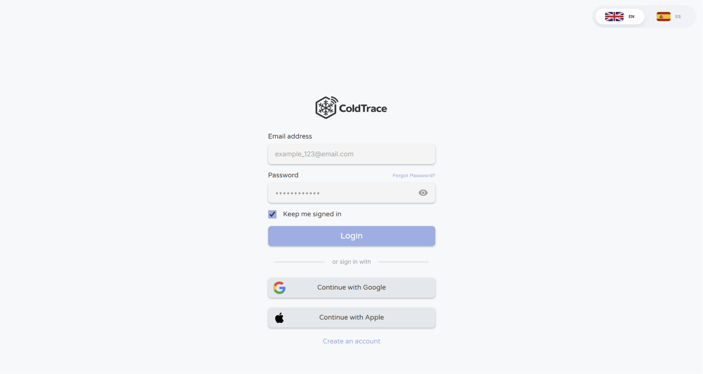
*Figura 5.2.2.5.1: Vista de Inicio de Sesión (Sign-In).*

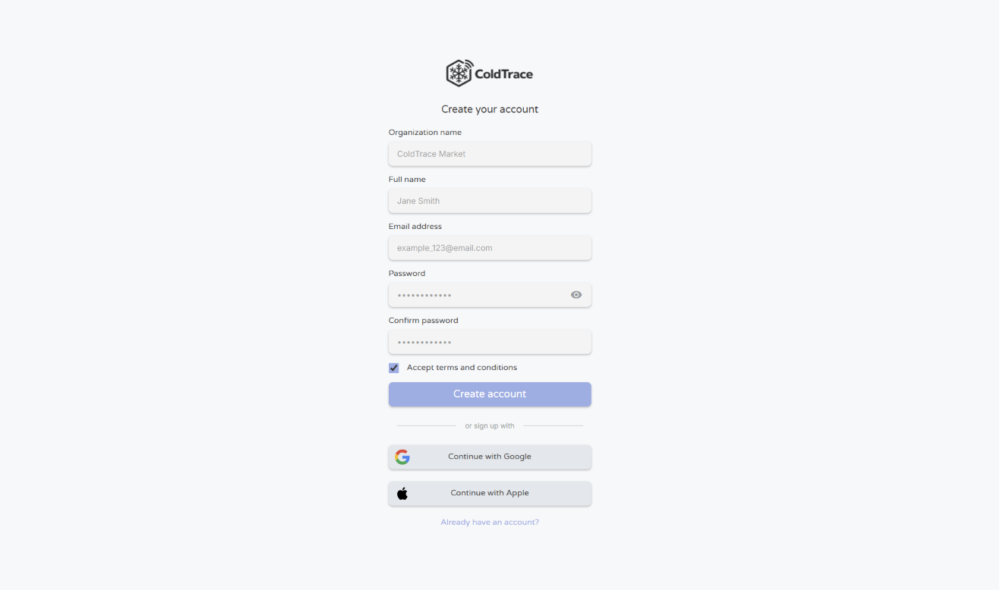
*Figura 5.2.2.5.2: Vista de Registro de Cuenta (Sign-Up).*

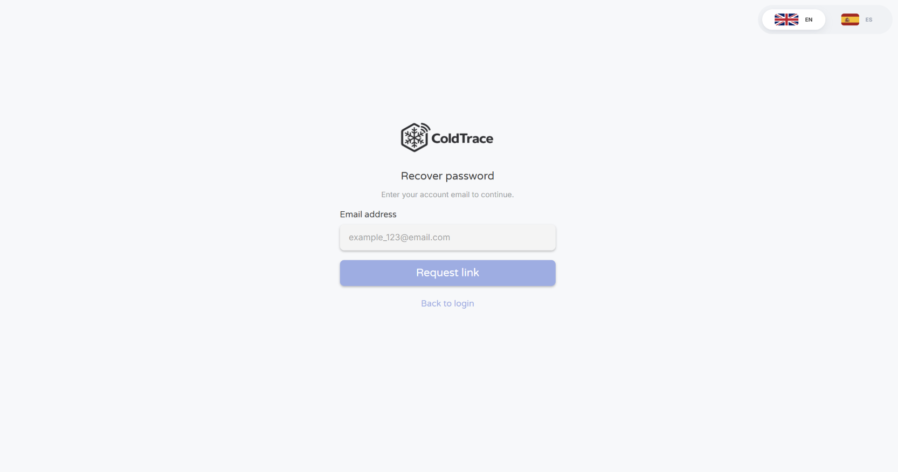
*Figura 5.2.2.5.3: Vista de Recuperación de Contraseña.*

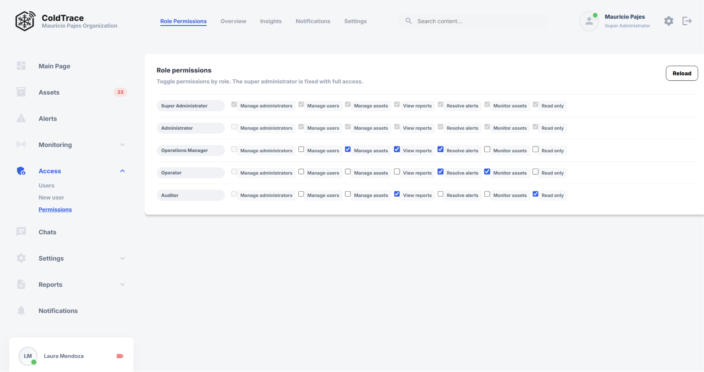
*Figura 5.2.2.5.4: Administración de Roles y Permisos.*

**Asset Management – Gestión de activos e infraestructura IoT**

Se implementó el módulo completo de gestión de activos, incluyendo el registro de cámaras frigoríficas, unidades de transporte, vinculación de sensores IoT, emparejamiento de gateways, calibración y configuración avanzada de parámetros de dispositivos.

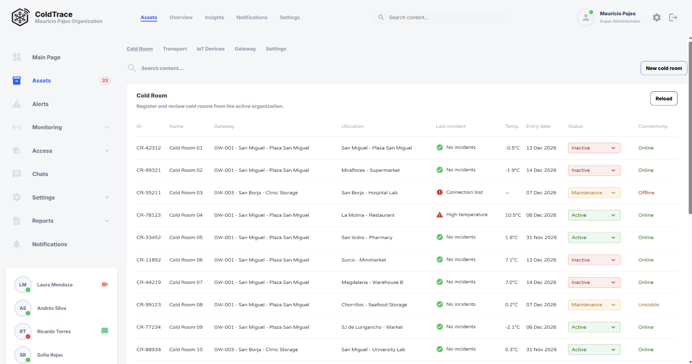
*Figura 5.2.2.5.5: Listado y Gestión de Cámaras Frigoríficas.*

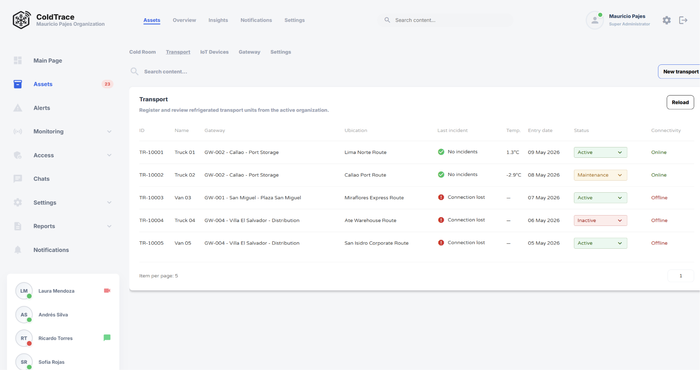
*Figura 5.2.2.5.6: Registro de Unidades de Transporte.*

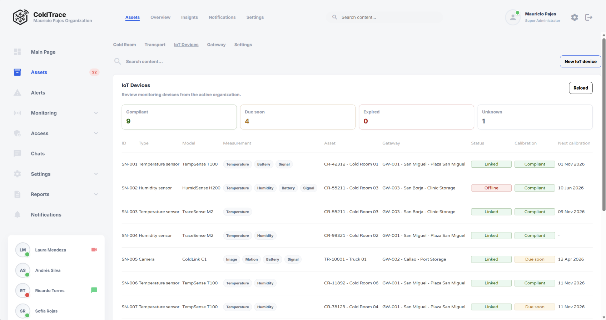
*Figura 5.2.2.5.7: Vinculación de Sensores y Gateways IoT.*

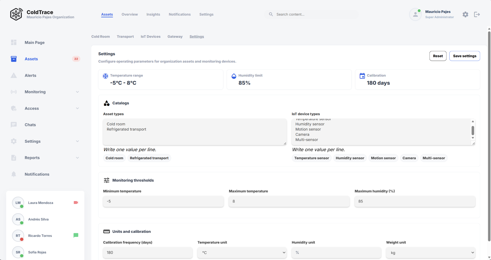
*Figura 5.2.2.5.8: Configuración Avanzada y Parámetros Operativos.*

**Monitoring – Dashboard operacional (US039)**

El dashboard operacional muestra en tiempo real el estado de los activos monitoreados, KPIs de temperatura, alertas activas y telemetría de sensores. Los datos se consumen desde el servidor JSON configurado como backend provisional.

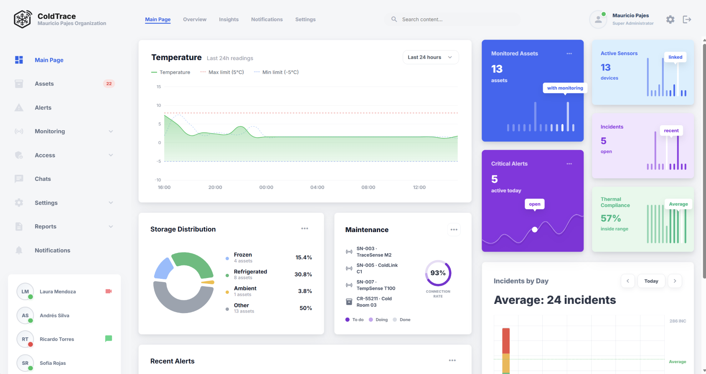
*Figura 5.2.2.5.9: Dashboard Operacional con Telemetría en Tiempo Real.*

**Reports – Reportes y cumplimiento normativo (US029–US034)**

El módulo de reportes incluye seis vistas: bitácora diaria, historial de eventos operacionales, exportación de reportes sanitarios, descarga de reportes mensuales, hallazgos de cumplimiento y evidencia de auditoría.

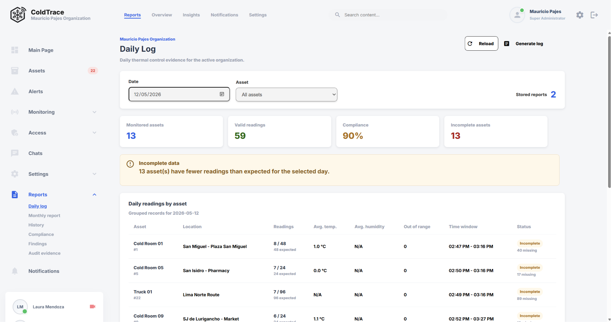
*Figura 5.2.2.5.10: Bitácora Diaria de Operaciones.*

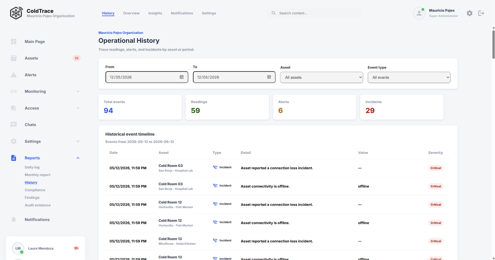
*Figura 5.2.2.5.11: Historial de Eventos Operacionales.*

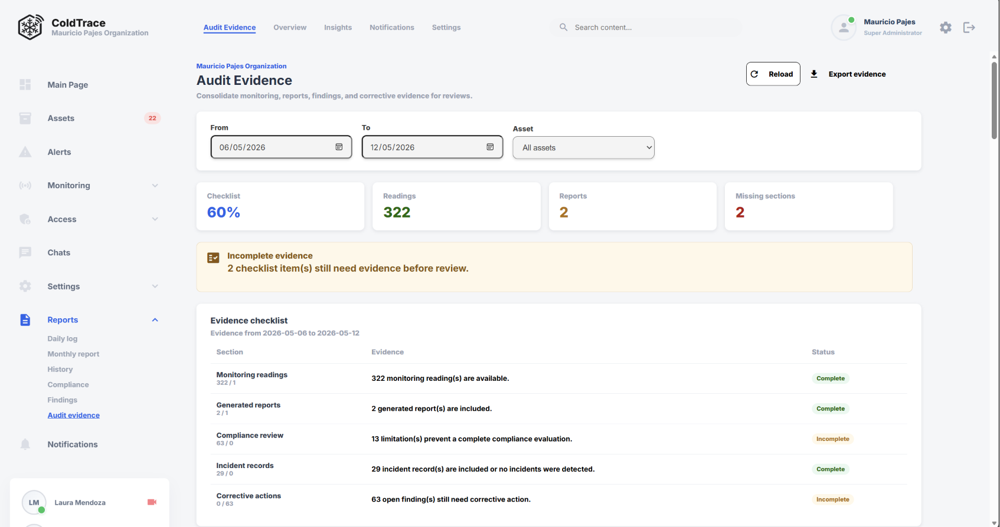
*Figura 5.2.2.5.12: Hallazgos de Cumplimiento y Evidencia de Auditoría.*

**Video de navegación del producto:** [upc-pre-202610-1asi0730-12190-coldtrace-productnav-sprint-02](https://upcedupe-my.sharepoint.com/:v:/g/personal/u202410093_upc_edu_pe/IQAb3T9DE7AmQ7aOxNsIfCAIAaqlY68Kt3syw7uDil2npvk?e=hlq0YC&nav=eyJyZWZlcnJhbEluZm8iOnsicmVmZXJyYWxBcHAiOiJTdHJlYW1XZWJBcHAiLCJyZWZlcnJhbFZpZXciOiJTaGFyZURpYWxvZy1MaW5rIiwicmVmZXJyYWxBcHBQbGF0Zm9ybSI6IldlYiIsInJlZmVycmFsTW9kZSI6InZpZXcifX0%3D)

#### 5.2.2.6. Services Documentation Evidence for Sprint Review

Durante el Sprint 2 no se desplegaron Web Services propios (RESTful API), dado que el alcance del sprint estuvo centrado en la implementación del frontend. Para soportar el funcionamiento de la aplicación en producción, el equipo configuró un servidor JSON hospedado (`json-server`) que actúa como API provisional, permitiendo que el frontend consuma datos estructurados mediante endpoints REST simulados.

A continuación se documentan los principales endpoints del servidor JSON que el frontend consume durante este sprint:

<table border="1" cellpadding="6" cellspacing="0">
  <tr>
    <th>Endpoint</th>
    <th>Verb HTTP</th>
    <th>Descripción</th>
    <th>Ejemplo de Response</th>
  </tr>
  <tr>
    <td>/assets</td>
    <td>GET</td>
    <td>Retorna la lista de activos registrados (cámaras frigoríficas, unidades de transporte)</td>
    <td>{ "id": "1", "name": "Cámara 01", "type": "cold_room", "status": "active" }</td>
  </tr>
  <tr>
    <td>/assets/:id</td>
    <td>GET</td>
    <td>Retorna el detalle de un activo específico por ID</td>
    <td>{ "id": "1", "name": "Cámara 01", "temperature": 4.2, "humidity": 78 }</td>
  </tr>
  <tr>
    <td>/assets</td>
    <td>POST</td>
    <td>Registra un nuevo activo en la plataforma</td>
    <td>{ "id": "5", "name": "Unidad Truck-03", "type": "transport_unit" }</td>
  </tr>
  <tr>
    <td>/gateways</td>
    <td>GET</td>
    <td>Retorna la lista de gateways IoT registrados y su estado de conectividad</td>
    <td>{ "id": "g1", "name": "Gateway A", "status": "connected" }</td>
  </tr>
  <tr>
    <td>/iot-devices</td>
    <td>GET</td>
    <td>Retorna la lista de sensores IoT vinculados a activos</td>
    <td>{ "id": "s1", "assetId": "1", "type": "temperature", "lastReading": 4.2 }</td>
  </tr>
  <tr>
    <td>/telemetry</td>
    <td>GET</td>
    <td>Retorna lecturas de telemetría para el dashboard operacional</td>
    <td>{ "assetId": "1", "temperature": 4.1, "humidity": 79, "timestamp": "2026-05-12T20:00:00Z" }</td>
  </tr>
  <tr>
    <td>/reports/daily-log</td>
    <td>GET</td>
    <td>Retorna entradas de la bitácora diaria de operaciones</td>
    <td>{ "date": "2026-05-12", "asset": "Cámara 01", "event": "Lectura normal", "value": 4.2 }</td>
  </tr>
  <tr>
    <td>/reports/compliance</td>
    <td>GET</td>
    <td>Retorna el reporte de cumplimiento sanitario del periodo</td>
    <td>{ "period": "2026-05", "status": "compliant", "findings": 0 }</td>
  </tr>
  <tr>
    <td>/users</td>
    <td>GET</td>
    <td>Retorna la lista de usuarios registrados en la plataforma</td>
    <td>{ "id": "u1", "name": "Admin", "role": "administrator" }</td>
  </tr>
  <tr>
    <td>/roles</td>
    <td>GET</td>
    <td>Retorna los roles definidos en el sistema y sus permisos asociados</td>
    <td>{ "id": "r1", "name": "operator", "permissions": ["read:assets", "read:reports"] }</td>
  </tr>
</table>

La implementación formal del RESTful API con Spring Boot será abordada en el Sprint 3.

#### 5.2.2.7. Software Deployment Evidence for Sprint Review

Durante el Sprint 2 se realizó el despliegue de los componentes web principales de ColdTrace para validar la solución en un entorno accesible por el equipo. La Frontend Web Application fue publicada en Vercel, mientras que el servicio provisional de datos basado en `json-server` fue desplegado en Render. Esta configuración permitió revisar los flujos implementados desde una URL pública y consumir datos de prueba desde un backend hospedado de forma independiente.

**Pasos realizados para el despliegue:**

1. Se desplegó la Frontend Web Application de ColdTrace en Vercel, generando un entorno de producción con estado `Ready` y dominio público asignado.

2. Se verificó que el dominio de producción del frontend apunte correctamente a la aplicación publicada: [https://coldtrace-frontend-web.vercel.app/](https://coldtrace-frontend-web.vercel.app/).

3. Se desplegó el backend provisional con `json-server` en Render como Web Service, exponiendo los recursos simulados requeridos por la aplicación para el Sprint Review.

4. Se verificó que el servicio de Render se encuentre activo y disponible desde el enlace público: [https://coldtrace-app-web-json-server.onrender.com/](https://coldtrace-app-web-json-server.onrender.com/).

5. Se validó que el `json-server` exponga las rutas de datos utilizadas por ColdTrace, incluyendo `sensor-readings`, `incidents`, `maintenance-schedules`, `technical-service-requests`, `notifications` y `reports`.

**URL de despliegue del frontend:**
[https://coldtrace-frontend-web.vercel.app/](https://coldtrace-frontend-web.vercel.app/)

**URL de despliegue del json-server:**
[https://coldtrace-app-web-json-server.onrender.com/](https://coldtrace-app-web-json-server.onrender.com/)

A continuación se presenta la evidencia del despliegue del frontend en Vercel y del servicio `json-server` en Render:

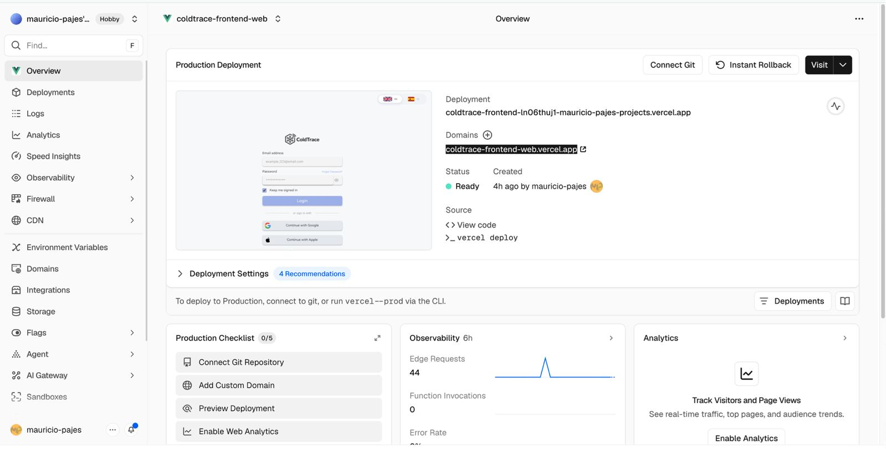
*Figura 5.2.2.7.1: Despliegue de producción de la Frontend Web Application de ColdTrace en Vercel, con estado Ready y dominio coldtrace-frontend-web.vercel.app.*

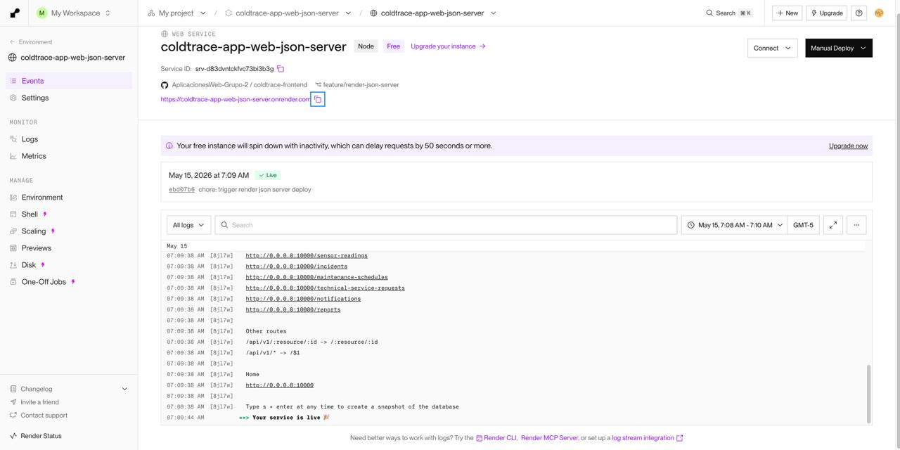
*Figura 5.2.2.7.2: Despliegue del servicio json-server de ColdTrace en Render, con el servicio activo y las rutas de datos disponibles para la aplicación.*


#### 5.2.2.8. Team Collaboration Insights during Sprint

Durante el Sprint 2, el equipo trabajó de forma colaborativa en el repositorio `AplicacionesWeb-Grupo-2 /
coldtrace-frontend`, aplicando GitFlow con ramas `feature/` por cada User Story y fusionando los cambios hacia `develop` mediante Pull Requests revisados. La distribución del trabajo refleja la organización por épicas acordada en el Sprint Planning: Mauricio Pajés lideró la implementación de EP002 (Identity & Access) y EP003 (Asset Management), David Morales encabezó el desarrollo del dashboard operacional de EP004, y Leonardo Cabrera implementó la totalidad del bounded context de reportes EP006 (US029–US034).

A continuación se presenta el resumen de participación por integrante basado en el historial de commits del repositorio:

<table border="1" cellpadding="6" cellspacing="0">
  <tr>
    <th>Integrante</th>
    <th>GitHub Username</th>
    <th>Commits (Sprint 2)</th>
    <th>Épicas / Bounded Contexts trabajados</th>
  </tr>
  <tr>
    <td>Pajés León, Mauricio Luis</td>
    <td>mauricio-pajes</td>
    <td>~33</td>
    <td>EP002 Identity &amp; Access, EP003 Asset Management, EP004 Monitoring, Deployment</td>
  </tr>
  <tr>
    <td>Delgado Arriola, Leonardo Sebastian</td>
    <td>leodev77</td>
    <td>~19</td>
    <td>EP006 Reports &amp; Compliance (US029–US034)</td>
  </tr>
  <tr>
    <td>Vargas Alarcon, Santiago Enrique</td>
    <td>SanVargasAI</td>
    <td>~5</td>
    <td>EP004 Operational Monitoring Dashboard (US039, monitoring dashboard, sidebar)</td>
  </tr>
  <tr>
    <td>Arias Tasayco, Jean Pool</td>
    <td>Jean-AT</td>
    <td>4</td>
    <td>EP007 Operative Configuration &amp; Maintenance (US035–US038)</td>
  </tr>
  <tr>
    <td>Velasquez Laquihuanaco, Eduardo David</td>
    <td>Edu-VLL</td>
    <td>1</td>
    <td>EP005 Alerts &amp; Incidents (US027 – recognize critical alert)</td>
  </tr>
</table>

## 5.3. Validation Interviews

Durante el Sprint 1 no se ejecutaron entrevistas de validación del producto, debido a que el alcance de la iteración estuvo centrado en la construcción y despliegue inicial del Landing Page. Esta actividad queda planificada para una iteración posterior, cuando exista una versión de producto con flujos funcionales suficientes para evaluar con usuarios.

### 5.3.1. Diseño de Entrevistas

El diseño de entrevistas de validación será elaborado en una siguiente iteración, considerando preguntas orientadas a evaluar comprensión de la propuesta de valor, utilidad percibida, claridad visual y facilidad de navegación.

### 5.3.2. Registro de Entrevistas

No se registran entrevistas de validación para Sprint 1.

### 5.3.3. Evaluaciones según heurísticas

No se realizaron evaluaciones heurísticas formales durante Sprint 1. La revisión se enfocó en verificar que la Landing Page cargue correctamente, que las secciones principales sean visibles y que el diseño responda en distintas resoluciones.

## 5.4. Video About-the-Product

El documento fuente no registra un enlace final de video About-the-Product para esta entrega. El video será incorporado cuando se consolide la evidencia audiovisual del producto.
