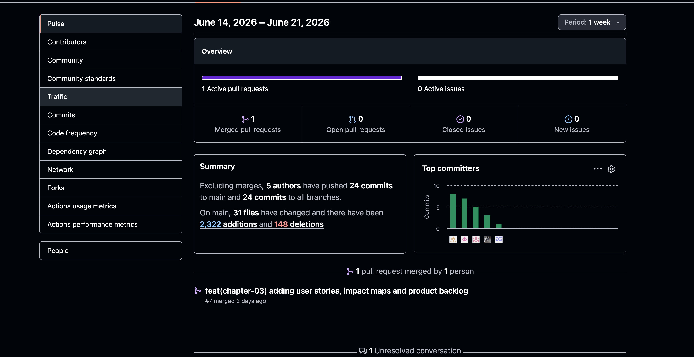
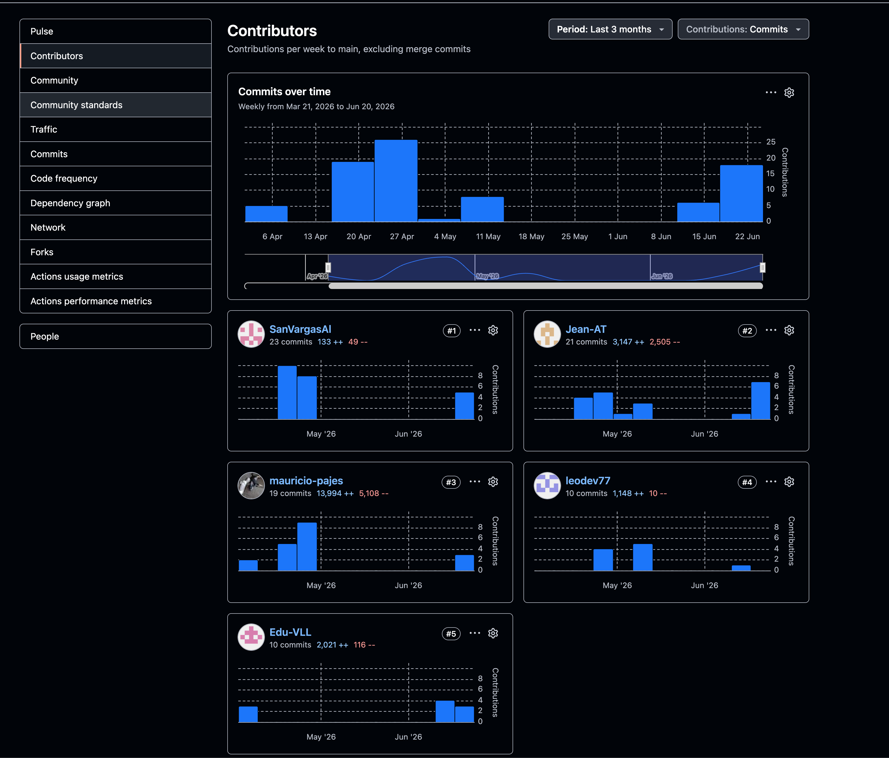

# Project Report Collaboration Insights

**Project Report URL:** [https://github.com/AplicacionesWeb-Grupo-2/informe-del-proyecto](https://github.com/AplicacionesWeb-Grupo-2/informe-del-proyecto)

El presente apartado tiene como finalidad evidenciar el trabajo colaborativo realizado durante la elaboración del informe del proyecto. Para ello, se considera como fuente principal el repositorio oficial del informe, alojado en GitHub bajo la organización del equipo:

[https://github.com/AplicacionesWeb-Grupo-2](https://github.com/AplicacionesWeb-Grupo-2)

A partir de este repositorio, se analiza la participación de los integrantes mediante indicadores como la distribución de tareas, la frecuencia de contribuciones, la revisión de contenidos y la integración progresiva de los entregables desarrollados durante el avance del proyecto.

En el contexto de las entregas AV1 y AV2, el análisis de colaboración permite visualizar el aporte individual de cada miembro del equipo, sustentado en los registros de GitHub, la organización de responsabilidades y la evolución del informe. Este seguimiento busca demostrar una distribución ordenada del trabajo, la consistencia en la documentación y el cumplimiento de las actividades asignadas.

## AV1

Durante el desarrollo de la entrega AV1, el equipo organizó la elaboración del informe mediante la asignación de responsabilidades por secciones. Esta distribución permitió avanzar de manera paralela en actividades relacionadas con investigación, análisis del segmento objetivo, definición de requisitos, diseño UX, modelado del dominio, arquitectura de software y documentación técnica.

El proceso de desarrollo del informe se realizó de forma incremental, incorporando progresivamente los contenidos conforme se consolidaban los artefactos del proyecto. Esto se refleja en el Registro de Versiones del Informe, donde se evidencia la evolución del documento desde su estructura inicial hasta la inclusión de elementos como Lean UX, entrevistas, user stories, impact maps, event storming, bounded contexts, diagramas C4, diagramas de clases, diseño de base de datos y evidencias de implementación.

Asimismo, todos los integrantes participaron activamente en la construcción del informe, realizando aportes continuos que permitieron consolidar una documentación coherente y alineada entre sus distintas secciones. La colaboración se evidencia tanto en la planificación de tareas como en los cambios registrados en el repositorio, los cuales reflejan la participación distribuida del equipo.

  

*Figura 1. Vista general de actividad del repositorio durante el periodo correspondiente a AV1.*

  

*Figura 2. Registro de contribuciones por integrante en el repositorio del informe.*

La coordinación del equipo también permitió mantener una visión compartida del producto ColdTrace, evitando que los entregables se desarrollaran como elementos aislados. De esta manera, los hallazgos de investigación, las decisiones de diseño, el modelado del dominio y la propuesta técnica se articularon dentro de una misma narrativa de producto.

Finalmente, el trabajo colaborativo durante AV1 permitió establecer una base documental sólida para las siguientes etapas del proyecto. Esta base facilita la continuidad del desarrollo, la revisión de decisiones tomadas y la trazabilidad entre los objetivos de negocio, las necesidades de los usuarios y la solución propuesta.

## AV2

Durante la entrega AV2, el trabajo colaborativo se enfocó en consolidar el informe del proyecto con las evidencias correspondientes al backend oficial, el despliegue en Google Cloud, la integración con Cloud SQL, la documentación de servicios mediante Swagger y la actualización de las secciones acumulativas del reporte.

El equipo mantuvo una dinámica de trabajo distribuida, organizando las responsabilidades por capítulos, evidencias de Sprint 3, documentación de despliegue, validaciones y ajustes finales del informe. La actividad registrada en GitHub permite observar que la entrega no dependió de un único integrante, sino de la participación de los cinco miembros del equipo en la actualización y cierre de los contenidos requeridos.

En la vista Pulse del repositorio se evidencia actividad durante la semana del 14 al 21 de junio de 2026. En este periodo se registró un Pull Request fusionado, participación de cinco autores y veinticuatro commits asociados a la rama principal, además de cambios acumulados en múltiples archivos del informe.

  

*Figura 3. Vista general de actividad del repositorio durante el periodo correspondiente a AV2.*

La vista Contributors muestra la continuidad del aporte por integrante durante el periodo del proyecto, incluyendo actividad reciente cercana a la entrega AV2. Se identifican contribuciones de Santiago Vargas, Jean Pool Arias, Mauricio Pajes, Leonardo Delgado y Eduardo Velasquez, lo que refuerza la trazabilidad del trabajo colaborativo y la distribución de responsabilidades en el informe.

  

*Figura 4. Registro de contribuciones por integrante en el repositorio del informe durante el periodo acumulado hacia AV2.*

En conjunto, las evidencias de AV2 muestran que el equipo continuó trabajando de forma incremental sobre el informe, incorporando contenido técnico, evidencias de despliegue y documentación de servicios. Esto permitió mantener trazabilidad entre las tareas ejecutadas, los commits realizados y los entregables exigidos para la revisión de Sprint 3.
